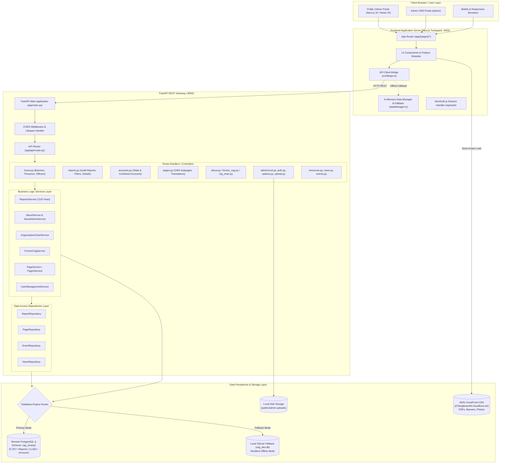

# CAG Website v2 — Exhaustive Codebase, Architecture, Component & Database Analysis

**System**: Comptroller & Auditor General of India (CAG) Web Portal & Content Management System (v2)  
**Document Type**: Comprehensive Full-Stack Architectural & Code-Level Specification  
**Scope**: Frontend Components, Backend Services, REST Endpoints, Database Schema (`cag_revamp`), Data Fetching Lifecycles, and Admin CMS  
**Date**: September 17, 2026  
**Status**: Complete Deep-Dive Analysis  

---

## Table of Contents

1. [Executive Architectural Summary](#1-executive-architectural-summary)
2. [High-Level System Architecture & Flow](#2-high-level-system-architecture--flow)
3. [Database Architecture & Schema Deep-Dive (`cag_revamp` & SQLite)](#3-database-architecture--schema-deep-dive)
   - 3.1. Database Engine & Dual-Mode Resilience Configuration
   - 3.2. Detailed Table Specifications & Relational Mapping (All Tables)
   - 3.3. Entity-Relationship Diagrams (ERD)
4. [Backend Architecture & Module Analysis (`back_end/app`)](#4-backend-architecture--module-analysis)
   - 4.1. Core System Layer (`core/config.py`, `core/database.py`, `core/security.py`, `core/logging.py`)
   - 4.2. API Gateway & Routing (`app/api/router.py`)
   - 4.3. Public REST Controllers (`api/v1/*`)
   - 4.4. Admin REST Controllers (`api/v1/admin/*`)
   - 4.5. Business Logic Services Layer (`app/services/*`)
   - 4.6. Data Access & Repositories Layer (`app/repositories/*`)
   - 4.7. ORM Models Layer (`app/models/*`)
   - 4.8. Pydantic Schemas Layer (`app/schemas/*`)
5. [Frontend Architecture & Component Deep-Dive (`src/`)](#5-frontend-architecture--component-deep-dive)
   - 5.1. Global Layout, Providers & Routing System (`src/app/*`)
   - 5.2. Core Design System, Typography & Styles (`globals.css`, Tailwind v4)
   - 5.3. Navigation & Header Suite (`Header.tsx`, `Menu.tsx`, Sidemenus, Breadcrumbs)
   - 5.4. Reusable Component & Card Library (`src/components/*`, `src/Reusable components/*`)
   - 5.5. Homepage Module Components (`src/features/home/*`, `src/app/(pages)/Home-page/*`)
   - 5.6. Audit Reports & Accounts Suite (`src/app/(pages)/Reports/*`)
   - 5.7. About Us Institutional Suite (`src/app/(pages)/Index-Menu-About/*`)
   - 5.8. Our Presence Geographic Suite (`src/app/(pages)/Our-Presence/*`)
   - 5.9. Resources & Policies Suite (`src/app/(pages)/Resources/*`)
   - 5.10. State-Specific Portals (`src/app/(pages)/states/*`)
   - 5.11. Admin CMS Portal (`src/app/admin/*`, `src/components/admin/*`)
6. [End-to-End Data Fetching Lifecycles & DB Query Traces](#6-end-to-end-data-fetching-lifecycles--db-query-traces)
   - 6.1. Flow 1: Public Reports Multi-Filter & Search Trace
   - 6.2. Flow 2: Report Details & Article 151 Constitutional Audit Narrative Trace
   - 6.3. Flow 3: State & Combined Finance Accounts Statement Trace
   - 6.4. Flow 4: Dynamic Institutional Pages (About Us) Content Trace
   - 6.5. Flow 5: Senior Leadership & IA&AS Hierarchy Tree Trace
   - 6.6. Flow 6: Former CAGs Portrait Gallery Trace
   - 6.7. Flow 7: Admin Generic CMS CRUD Mutation & Audit Trail Trace
   - 6.8. Flow 8: File & Media Upload Pipeline Trace
7. [Client-Side State Management & Data Fallback Engine](#7-client-side-state-management--data-fallback-engine)
   - 7.1. `src/lib/api.ts` vs `src/services/api.ts`
   - 7.2. `src/lib/dataManager.ts` Master Event Bus & Storage
   - 7.3. Event-Driven Bilingual Language Synchronization (`en` / `hi`)
8. [Security, Authentication & Audit Logging Architecture](#8-security-authentication--audit-logging-architecture)
   - 8.1. NextAuth.js Authentication Gateway
   - 8.2. FastAPI Admin Auth & Session Management
   - 8.3. Cryptographic Hashing & Salted Passwords
   - 8.4. Granular Audit Logging (`admin_audit_log`)
9. [Complete Codebase File-by-File Reference Index](#9-complete-codebase-file-by-file-reference-index)

---

# 1. Executive Architectural Summary

The **Comptroller & Auditor General of India (CAG) Web Portal (v2)** is an enterprise-grade, bilingual (English & Hindi) institutional platform designed to serve millions of citizens, government ministries, researchers, media organizations, and state departments. It delivers high-performance access to over **37,000+ Audit Reports**, **11,500+ State Finance Statements**, constitutional mandates under **Article 148–151 of the Constitution of India**, IA&AS leadership directories, and real-time administrative gazettes.

### Core Technology Stack:
1. **Frontend Framework**: **Next.js 16.3.1 (App Router)** with React 19.2.8, TypeScript 5, TailwindCSS v4, PostCSS, Lucide Icons, and NextAuth.js.
2. **Backend Framework**: **FastAPI (Python 3.14)** with Uvicorn ASGI server, SQLAlchemy 2.0 ORM, Pydantic v2 validation, Psycopg2-binary, and WatchFiles reloader.
3. **Database Layer**:
   - **Primary Engine**: PostgreSQL 16 (`cag_new` database, `cag_revamp` schema) hosted on AWS RDS / remote server (`<DB_HOST>:5432`).
   - **Local Dev Resilient Fallback Engine**: SQLite 3 (`cag_dev.db`) with automatic schema synchronization.
4. **Media & Document Storage**: AWS CloudFront CDN (`https://d7i5wg8xwe4hf.cloudfront.net/uploads`) + local static mounting (`public/admin-uploads`).
5. **State Management & Communication**: Event-driven decoupled pub-sub bus (`dataManager.ts`), RESTful API bridge (`api.ts`), and Next.js Turbopack proxy rewrites.

---

# 2. High-Level System Architecture & Flow



---

# 3. Database Architecture & Schema Deep-Dive

## 3.1. Database Engine & Dual-Mode Resilience Configuration

The CAG backend uses a **dual-engine resilient connection architecture** implemented in `back_end/app/core/database.py`.

### Connection Logic:
1. **Primary PostgreSQL Mode**:
   - Reads connection parameters from environment variables: `DB_HOST`, `DB_PORT`, `DB_NAME`, `DB_USER`, `DB_PASSWORD`, `DB_SCHEMA`.
   - Constructs SQLAlchemy connection string: `postgresql://<user>:<password>@<host>:<port>/<dbname>`.
   - Automatically executes: `SET search_path TO cag_revamp, public;` on every connection.
   - Connection pool settings: `pool_size=10`, `max_overflow=20`, `pool_pre_ping=True`, `connect_timeout=5`.

2. **Resilient SQLite Fallback Mode**:
   - If PostgreSQL connection fails (network partition, remote server maintenance, invalid credentials), the engine catches `OperationalError`, logs a warning, and initializes a local SQLite database at `sqlite:///./cag_dev.db`.
   - In SQLite mode, `Base.metadata.create_all(bind=engine)` runs automatically during the FastAPI `lifespan` startup event, ensuring zero developer downtime and 100% server uptime.

---

## 3.2. Detailed Table Specifications & Relational Mapping

### Table 1: `cag_revamp.audit_reports`
The central repository for all Supreme Audit Institution (SAI) audit reports across Union Government, State Governments, and Local Bodies.

- **Total Live Records in PostgreSQL**: **37,257**
- **Admin Management Route**: `/admin/reports` / `/admin/audit-reports`
- **Public URL**: `/Reports`, `/Reports/[id]`
- **Primary Key**: `id` (`integer` / `serial`)

| Column Name | Data Type | Nullable | Default | Description & Relational Mapping |
| :--- | :--- | :--- | :--- | :--- |
| `id` | `INTEGER` | **NO** | `nextval('audit_reports_id_seq')` | Unique Primary Key |
| `parent_id` | `INTEGER` | YES | `0` | Parent report ID for multi-volume audit groupings |
| `government_type` | `INTEGER` | YES | `NULL` | FK -> `general_categories.id` (`48` = Union, `49` = State, `50` = Local Bodies) |
| `union_department_type` | `INTEGER` | YES | `NULL` | FK -> `general_categories.id` (Civil, Defence, Railways, Tax, Scientific) |
| `state` | `INTEGER` | YES | `NULL` | FK -> `states.id` (e.g., `64` = Andhra Pradesh, `72` = Haryana, `75` = Maharashtra) |
| `local_body_types` | `VARCHAR(255)`| YES | `NULL` | Panchayati Raj Institutions (PRI) vs Urban Local Bodies (ULB) |
| `report_type` | `VARCHAR(255)`| YES | `NULL` | FK -> `general_categories.id` (`50` = Financial, `51` = Compliance, `52` = Performance, `926` = ADC) |
| `sector` | `VARCHAR(255)`| YES | `NULL` | FK / Sector ID (`27` = Finance, `44` = Transport & Infra, `41` = Defence, `32` = Social Welfare) |
| `offices` | `INTEGER` | YES | `NULL` | Field AG / Director General Office ID |
| `title` | `VARCHAR(1000)`| YES | `NULL` | Official Report Title (English/Multilingual) |
| `language` | `VARCHAR(10)` | YES | `'en'` | Language ISO code (`'en'`, `'hi'`) |
| `overview` | `TEXT` | YES | `NULL` | Executive summary / Constitutional overview text |
| `date_on_which_report_tabled` | `DATE` | YES | `NULL` | Date report was tabled in Parliament / State Legislative Assembly |
| `year_of_report` | `INTEGER` | YES | `NULL` | Report publication audit year (e.g., `2024`, `2025`, `2026`) |
| `from_month` | `INTEGER` | YES | `NULL` | Audit coverage starting month (`1`–`12`) |
| `from_year` | `INTEGER` | YES | `NULL` | Audit coverage starting year |
| `to_month` | `INTEGER` | YES | `NULL` | Audit coverage ending month (`1`–`12`) |
| `to_year` | `INTEGER` | YES | `NULL` | Audit coverage ending year |
| `date_of_sending_the_report_to_government` | `DATE` | YES | `NULL` | Formal transmission date to President / Governor / Ministry |
| `main_report_file` | `VARCHAR(1000)`| YES | `NULL` | CloudFront / S3 relative path to full PDF report document |
| `download_audit_report` | `VARCHAR(1000)`| YES | `NULL` | Secondary download link / mirror |
| `file_title` | `VARCHAR(500)` | YES | `NULL` | Download link display title |
| `noody_book` | `VARCHAR(1000)`| YES | `NULL` | Flipbook interactive document URL |
| `youtube_video_url` | `VARCHAR(1000)`| YES | `NULL` | Embedded YouTube audit briefing video URL |
| `digital_report` | `VARCHAR(1000)`| YES | `NULL` | Digital microsite URL link |
| `pdf_text` | `TEXT` | YES | `NULL` | Full-text OCR extracted text for semantic global search |
| `status` | `SMALLINT` | **NO** | `1` | `1` = Published / Active, `0` = Archived / Hidden |
| `created_by` | `INTEGER` | YES | `1` | Admin User ID who uploaded the record |
| `created_at` | `TIMESTAMP` | YES | `NOW()` | Creation timestamp |
| `updated_by` | `INTEGER` | YES | `1` | Admin User ID who modified the record |
| `updated_at` | `TIMESTAMP` | YES | `NOW()` | Last modification timestamp |
| `report_html` | `TEXT` | YES | `NULL` | Pre-rendered HTML report body |
| `total_view` | `INTEGER` | YES | `0` | Citizen view counter |
| `report_thumb_img` | `TEXT` | YES | `NULL` | Report cover banner thumbnail relative path |

---

### Table 2: `cag_revamp.audit_report_file`
Supplementary and chapter-wise attachments for large multi-volume audit reports.

- **Primary Key**: `id` (`INTEGER`)
- **Foreign Key**: `audit_reports_id` -> `cag_revamp.audit_reports.id`

| Column Name | Data Type | Nullable | Description |
| :--- | :--- | :--- | :--- |
| `id` | `INTEGER` | **NO** | Primary Key |
| `audit_reports_id` | `INTEGER` | **NO** | FK to `cag_revamp.audit_reports.id` |
| `file_title` | `VARCHAR(500)` | YES | Chapter / Attachment title (e.g. "Chapter 3: Contract Management") |
| `download_audit_report` | `VARCHAR(1000)` | YES | Relative path to PDF chapter in CloudFront |
| `status` | `SMALLINT` | **NO** | `1` = Active, `0` = Inactive |

---

### Table 3: `cag_revamp.state_accounts_report`
Stores all state government financial accounts, compiled and audited by the Accountants General (A&E).

- **Total Live Records in PostgreSQL**: **11,561**
- **Admin Management Route**: `/admin/state-accounts`
- **Public URL**: `/Reports/accounts` (State Accounts Tab)
- **Primary Key**: `id` (`INTEGER`)

| Column Name | Data Type | Nullable | Default | Description & Relational Mapping |
| :--- | :--- | :--- | :--- | :--- |
| `id` | `INTEGER` | **NO** | `nextval(...)` | Primary Key |
| `title` | `VARCHAR(500)` | **NO** | `NULL` | Statement title (e.g. "Finance Accounts 2024-25, Vol I") |
| `language` | `VARCHAR(10)` | **NO** | `'en'` | Language code (`'en'`, `'hi'`) |
| `is_state_ut` | `VARCHAR(5)` | YES | `'s'` | `'s'` = State, `'u'` = Union Territory |
| `account_state` | `INTEGER` | **NO** | `NULL` | FK -> `cag_revamp.states.id` (State jurisdiction) |
| `general_category_id` | `INTEGER` | **NO** | `NULL` | FK -> `general_categories.id` (`357` = Accounts at a Glance, `358` = Finance Accounts, `359` = Appropriation Accounts, `360` = Monthly Indicators) |
| `year` | `VARCHAR(50)` | **NO** | `NULL` | Accounting fiscal year string (e.g., `'2024 - 25'`) |
| `ac_year` | `INTEGER` | YES | `0` | Normalized integer fiscal year (e.g., `2025`) |
| `month` | `VARCHAR(50)` | YES | `NULL` | Month string for monthly key indicators |
| `volume` | `VARCHAR(100)` | YES | `NULL` | Statement volume designation (e.g. `'Volume I'`, `'Volume II'`) |
| `uploads` | `VARCHAR(1000)`| YES | `NULL` | CloudFront PDF relative path |
| `ext_link` | `VARCHAR(1000)`| YES | `NULL` | External state portal URL link |
| `status` | `SMALLINT` | **NO** | `1` | `1` = Published / Active, `0` = Archived |
| `created_by` | `INTEGER` | YES | `NULL` | Admin creator user ID |
| `created` | `TIMESTAMP` | YES | `NOW()` | Record creation timestamp |
| `updated_by` | `INTEGER` | YES | `NULL` | Admin modifier user ID |
| `modified` | `TIMESTAMP` | YES | `NOW()` | Record modification timestamp |

---

### Table 4: `cag_revamp.combined_accounts`
Combined Finance & Revenue Accounts (CFRA) of the Union and State Governments, and State Finance Secretaries Conference compendia.

- **Total Live Records in PostgreSQL**: **78**
- **Admin Management Route**: `/admin/combined-accounts`
- **Public URL**: `/Reports/accounts` (Combined Accounts Tab)
- **Primary Key**: `id` (`INTEGER`)

| Column Name | Data Type | Nullable | Default | Description |
| :--- | :--- | :--- | :--- | :--- |
| `id` | `INTEGER` | **NO** | `nextval(...)` | Primary Key |
| `title` | `VARCHAR(500)` | **NO** | `NULL` | Document title (e.g., "CFRA 2023-24 Volume-I") |
| `language` | `VARCHAR(10)` | **NO** | `'en'` | Language code (`'en'`, `'hi'`) |
| `account_year` | `VARCHAR(50)` | **NO** | `NULL` | Accounting year (e.g. `'2023-24'`) |
| `upload_file` | `VARCHAR(1000)`| YES | `NULL` | Relative PDF file path in CloudFront |
| `file_title` | `VARCHAR(500)` | YES | `NULL` | Display download title |
| `meta_tags` | `VARCHAR(500)` | YES | `NULL` | SEO search keywords |
| `status` | `SMALLINT` | **NO** | `1` | `1` = Active, `0` = Inactive |
| `created_by` | `INTEGER` | YES | `NULL` | Creator user ID |
| `created_at` | `TIMESTAMP` | YES | `NOW()` | Creation timestamp |
| `updated_by` | `INTEGER` | YES | `NULL` | Modifier user ID |
| `updated_at` | `TIMESTAMP` | YES | `NOW()` | Modification timestamp |

---

### Table 5: `cag_revamp.pages` & `cag_revamp.page_translations`
Dynamic institutional CMS pages for constitutional mandates, historical archives, regulations, and institutional policies.

- **Total Live Records in PostgreSQL**: **9,702**
- **Admin Management Route**: `/admin/pages`, `/admin/cag-of-india`, `/admin/constitutional-provisions`, etc.
- **Public URL**: `/Index-Menu-About/*`, `/Resources/*`
- **Primary Key**: `id` (`INTEGER`)

| Column Name | Data Type | Nullable | Default | Description |
| :--- | :--- | :--- | :--- | :--- |
| `id` | `INTEGER` | **NO** | `nextval(...)` | Primary Key |
| `slug` | `VARCHAR(255)` | YES | `NULL` | Unique URL Slug (e.g., `page-constitutional-provisions`, `page-cags-dpc-act-1971`) |
| `title` | `VARCHAR(500)` | **NO** | `NULL` | Page headline title in English |
| `excerpt` | `TEXT` | YES | `NULL` | Summary teaser snippet |
| `content` | `TEXT` | **NO** | `NULL` | Full rich HTML body content rendered on the page |
| `file_title` | `VARCHAR(500)` | YES | `NULL` | Display title of attached PDF gazette |
| `upload_file` | `VARCHAR(1000)`| YES | `NULL` | Attachment document path |
| `is_home` | `SMALLINT` | **NO** | `0` | Homepage display flag |
| `show_on_home_page`| `SMALLINT` | **NO** | `0` | Featured flag |
| `status` | `SMALLINT` | **NO** | `1` | `1` = Published, `0` = Draft |
| `created_by` | `INTEGER` | **NO** | `1` | Creator user ID |
| `created_at` | `TIMESTAMP` | YES | `NOW()` | Creation timestamp |
| `updated_by` | `INTEGER` | **NO** | `1` | Modifier user ID |
| `modified_at` | `TIMESTAMP` | YES | `NOW()` | Last modification timestamp |

#### `cag_revamp.page_translations` (Multilingual Table):
- `id` (`INTEGER` PK)
- `page_id` (`INTEGER` FK -> `cag_revamp.pages.id`)
- `culture` (`VARCHAR(10)` e.g. `'hi'`)
- `title` (`VARCHAR(500)` translated title)
- `excerpt` (`TEXT` translated excerpt)
- `content` (`TEXT` translated rich HTML content)

---

### Table 6: `cag_revamp.former_cag`
Historical gallery and tenures of all Former Comptrollers & Auditors General of India since Independence (1948).

- **Total Live Records in PostgreSQL**: **61**
- **Admin Management Route**: `/admin/former-cags`
- **Public URL**: `/Index-Menu-About/Leadership-&-legacy`
- **Primary Key**: `id` (`INTEGER`)

| Column Name | Data Type | Nullable | Default | Description |
| :--- | :--- | :--- | :--- | :--- |
| `id` | `INTEGER` | **NO** | `nextval(...)` | Primary Key |
| `title` | `VARCHAR(255)` | **NO** | `NULL` | Category title (`"Former CAG"`) |
| `tenure` | `VARCHAR(255)` | **NO** | `NULL` | Full Name of the Former CAG (e.g., `"V. NARAHARI RAO"`, `"VINOD RAI"`, `"G. C. MURMU"`) |
| `tenure_from` | `VARCHAR(50)` | **NO** | `NULL` | Starting tenure year/date (e.g., `"1948"`, `"2020"`) |
| `tenure_to` | `VARCHAR(50)` | **NO** | `NULL` | Ending tenure year/date (e.g., `"1954"`, `"2024"`) |
| `image` | `TEXT` | YES | `NULL` | Portrait photograph filename / URL |
| `language` | `VARCHAR(10)` | **NO** | `'en'` | Language code |
| `status` | `SMALLINT` | **NO** | `1` | `1` = Active, `0` = Inactive |
| `created_by` | `INTEGER` | **NO** | `1` | Creator ID |
| `created` | `TIMESTAMP` | **NO** | `NOW()` | Creation timestamp |
| `updated_by` | `INTEGER` | YES | `NULL` | Modifier ID |
| `modified` | `TIMESTAMP` | **NO** | `NOW()` | Modification timestamp |

---

### Table 7: `cag_revamp.organisation_chart`
Senior executive leadership and IA&AS officer hierarchy (Comptroller & Auditor General, Deputy CAGs, Additional Deputy CAGs, Directors General, Principal Directors).

- **Total Live Records in PostgreSQL**: **75**
- **Admin Management Route**: `/admin/organisation-structure` / `/admin/org-officers`
- **Public URL**: `/Index-Menu-About/Leadership-&-legacy`
- **Primary Key**: `id` (`INTEGER`)

| Column Name | Data Type | Nullable | Default | Description |
| :--- | :--- | :--- | :--- | :--- |
| `id` | `INTEGER` | **NO** | `nextval(...)` | Primary Key |
| `designation_hierarchy_id` | `INTEGER` | **NO** | `NULL` | FK -> `cag_revamp.designation_hierarchy.id` |
| `designation_display_name` | `VARCHAR(255)`| **NO** | `NULL` | Multilingual JSON / text designation title |
| `language` | `VARCHAR(10)` | **NO** | `'en'` | Language code (`'en'`, `'hi'`) |
| `prefix_name` | `VARCHAR(50)` | YES | `NULL` | Honorific title (`Shri`, `Smt`, `Dr.`) |
| `first_name` | `VARCHAR(100)`| **NO** | `''` | First Name |
| `middle_name` | `VARCHAR(100)`| YES | `NULL` | Middle Name |
| `last_name` | `VARCHAR(100)`| YES | `NULL` | Last Name |
| `full_name` | `VARCHAR(255)`| YES | `NULL` | Formatted Full Name |
| `mobile_no` | `VARCHAR(50)` | YES | `NULL` | Official EPABX / Phone number |
| `email` | `VARCHAR(255)`| YES | `NULL` | Official email address (`@cag.gov.in`) |
| `org_charge_master_id` | `VARCHAR(255)`| YES | `NULL` | FK -> JSON array mapping to `cag_revamp.org_charge_master.id` |
| `department` | `VARCHAR(255)`| YES | `NULL` | Department / Wing portfolio name |
| `profile_image` | `VARCHAR(500)`| YES | `NULL` | Official portrait photograph URL |
| `dept_description` | `TEXT` | YES | `NULL` | Detailed portfolio description / charge wings |
| `brief_description` | `TEXT` | YES | `NULL` | Biography / Curriculum Vitae HTML |
| `display_order` | `INTEGER` | YES | `0` | Hierarchy seniority display order |
| `retired` | `SMALLINT` | YES | `0` | `0` = Active in service, `1` = Retired |
| `status` | `SMALLINT` | **NO** | `1` | `1` = Active, `0` = Inactive |
| `created` | `TIMESTAMP` | YES | `NOW()` | Creation timestamp |
| `modified` | `TIMESTAMP` | YES | `NOW()` | Modification timestamp |

---

### Table 8: `cag_revamp.designation_hierarchy`
Nested set hierarchical ranking tree of the Indian Audit and Accounts Department.

- **Primary Key**: `id` (`INTEGER`)

| Column Name | Data Type | Nullable | Description |
| :--- | :--- | :--- | :--- |
| `id` | `INTEGER` | **NO** | Primary Key |
| `title` | `VARCHAR(255)` | **NO** | Multilingual JSON designation title (e.g. `{"default":"Deputy CAG"}`) |
| `parent_id` | `INTEGER` | YES | Self-referential FK to `designation_hierarchy.id` |
| `level` | `INTEGER` | **NO** | Tier level (`1` = CAG, `2` = Secy/Dy CAG, `3` = Addl Dy CAG, `4` = DG/PD) |
| `lft` | `INTEGER` | YES | Nested set tree left pointer |
| `rght` | `INTEGER` | YES | Nested set tree right pointer |
| `status` | `SMALLINT` | **NO** | `1` = Active |

---

### Table 9: `cag_revamp.states`
Master taxonomic lookup table for all 28 States, 8 Union Territories, and Field AG Jurisdictions.

- **Total Live Records**: **47**
- **Primary Key**: `id` (`INTEGER`)

| Column Name | Data Type | Nullable | Description |
| :--- | :--- | :--- | :--- |
| `id` | `INTEGER` | **NO** | Primary Key (Used in `audit_reports.state` and `state_accounts_report.account_state`) |
| `name` | `VARCHAR(255)` | **NO** | State / UT Name (e.g. `"Andhra Pradesh"`, `"Maharashtra"`, `"Delhi"`) |
| `slug` | `VARCHAR(255)` | **NO** | URL slug (e.g. `"andhra-pradesh"`, `"maharashtra"`) |
| `image` | `VARCHAR(500)` | YES | State emblem / map badge icon filename |
| `code` | `VARCHAR(10)` | YES | ISO two-letter postal code (e.g. `"AP"`, `"MH"`, `"DL"`) |

---

### Table 10: `cag_revamp.general_categories`
Centralized taxonomic lookup table for government types, audit report types, account types, and sectors.

- **Primary Key**: `id` (`INTEGER`)

| Column Name | Data Type | Nullable | Description |
| :--- | :--- | :--- | :--- |
| `id` | `INTEGER` | **NO** | Primary Key |
| `parent_id` | `INTEGER` | YES | Parent category ID in taxonomy tree |
| `title` | `VARCHAR(255)` | **NO** | Category title (e.g. `"Performance"`, `"Compliance"`, `"Finance"`, `"Accounts at a Glance"`) |
| `slug` | `VARCHAR(255)` | **NO** | Category slug |
| `description` | `TEXT` | YES | Category description |
| `status` | `SMALLINT` | **NO** | `1` = Active, `0` = Inactive |

---

### Table 11: `cag_revamp.banners`
Homepage hero carousel banners.

- **Primary Key**: `id` (`INTEGER`)

| Column Name | Data Type | Nullable | Description |
| :--- | :--- | :--- | :--- |
| `id` | `INTEGER` | **NO** | Primary Key |
| `category_id` | `INTEGER` | YES | Category reference |
| `text` | `TEXT` | YES | Multilingual JSON text containing `default` (English) and `hi` (Hindi) banner titles |
| `image` | `VARCHAR(500)` | YES | CloudFront relative image path |
| `link` | `VARCHAR(500)` | YES | Call-to-action click link URL |
| `display_order` | `INTEGER` | YES | Carousel display sorting order |
| `status` | `SMALLINT` | **NO** | `1` = Active, `0` = Inactive |
| `created_at` | `TIMESTAMP` | YES | Creation timestamp |
| `modified_at` | `TIMESTAMP` | YES | Modification timestamp |

---

### Table 12: `cag_revamp.admin_users` & `cag_revamp.admin_audit_log`
Administrative user accounts, security roles, and granular mutation audit trail.

#### `cag_revamp.admin_users`:
- `id` (`INTEGER` PK)
- `username` (`VARCHAR(100)` Unique)
- `email` (`VARCHAR(255)` Unique)
- `password_hash` (`VARCHAR(255)` PBKDF2/SHA256 salted hash)
- `full_name` (`VARCHAR(255)`)
- `role` (`VARCHAR(50)` e.g. `'admin'`, `'super_admin'`, `'editor'`)
- `is_active` (`BOOLEAN`)
- `last_login` (`TIMESTAMP`)
- `created_at` (`TIMESTAMP`)

#### `cag_revamp.admin_audit_log`:
- `id` (`INTEGER` PK)
- `user_id` (`INTEGER` FK -> `admin_users.id`)
- `action` (`VARCHAR(50)` e.g. `'CREATE'`, `'UPDATE'`, `'DELETE'`, `'LOGIN'`)
- `table_name` (`VARCHAR(100)` Target database table)
- `record_id` (`VARCHAR(100)` Target record primary key)
- `old_values` (`TEXT` JSON serialization of prior state)
- `new_values` (`TEXT` JSON serialization of updated state)
- `ip_address` (`VARCHAR(50)` Client IP address)
- `created_at` (`TIMESTAMP`)

---

# 4. Backend Architecture & Module Analysis

## 4.1. Core System Layer

### `back_end/app/core/config.py`
Defines the Pydantic `Settings` model loading environment variables:
- `PROJECT_NAME`: `"Comptroller & Auditor General of India (CAG) Backend API"`
- `VERSION`: `"2.0.0"`
- `API_V1_STR`: `"/api/v1"`
- `DB_HOST`, `DB_PORT`, `DB_NAME`, `DB_USER`, `DB_PASSWORD`, `DB_SCHEMA`
- `SECURITY_SALT`: Cryptographic salt for token signing
- `ENCRYPTION_KEY`: AES-256 encryption key
- `UPLOAD_DIR`: Local disk directory for file uploads (`public/admin-uploads`)

### `back_end/app/core/database.py`
- Implements the dual-engine connection logic described in Section 3.1.
- Provides the `get_db()` dependency generator for FastAPI endpoints:
  ```python
  def get_db():
      db = SessionLocal()
      try:
          yield db
      finally:
          db.close()
  ```

### `back_end/app/core/security.py`
- `hash_password(plain_password: str) -> str`: Generates secure PBKDF2 hashes.
- `verify_password(plain_password: str, hashed_password: str) -> bool`: Constant-time hash comparator.
- `create_access_token(data: dict, expires_delta: timedelta = None) -> str`: Issues signed JWT bearer tokens.

---

## 4.2. API Gateway & Routing (`back_end/app/api/router.py`)

The main API router aggregates all 20+ specialized controllers and mounts them under `/api` and `/api/v1`:

```python
api_router = APIRouter()

# Public Routes
api_router.include_router(home.router, prefix="/home", tags=["home"])
api_router.include_router(home.banners_router, prefix="/banners", tags=["banners"])
api_router.include_router(home.presence_router, prefix="/presence", tags=["presence"])
api_router.include_router(home.officers_router, prefix="/officers", tags=["officers"])
api_router.include_router(reports.router, prefix="/reports", tags=["reports"])
api_router.include_router(accounts.router, prefix="/accounts", tags=["accounts"])
api_router.include_router(accounts.state_router, prefix="/state-accounts", tags=["state-accounts"])
api_router.include_router(accounts.combined_router, prefix="/combined-accounts", tags=["combined-accounts"])
api_router.include_router(pages.router, prefix="/pages", tags=["pages"])
api_router.include_router(states.router, prefix="/states", tags=["states"])
api_router.include_router(organisation_chart.router, prefix="/organisation-chart", tags=["organisation-chart"])
api_router.include_router(former_cag.router, prefix="/former-cag", tags=["former-cag"])
api_router.include_router(news.router, prefix="/news", tags=["news"])
api_router.include_router(events.router, prefix="/events", tags=["events"])
api_router.include_router(resources.router, prefix="/resources", tags=["resources"])
api_router.include_router(subscribers.router, prefix="/subscribers", tags=["subscribers"])
api_router.include_router(tenders_circulars.tenders_router, prefix="/tenders", tags=["tenders"])
api_router.include_router(tenders_circulars.circulars_router, prefix="/circulars", tags=["circulars"])

# Admin Routes
api_router.include_router(admin_auth.router, prefix="/admin/auth", tags=["admin-auth"])
api_router.include_router(admin_crud.router, prefix="/admin/crud", tags=["admin-crud"])
api_router.include_router(admin_options.router, prefix="/admin/options", tags=["admin-options"])
api_router.include_router(admin_upload.router, prefix="/admin/upload", tags=["admin-upload"])
api_router.include_router(admin_global_relations.router, prefix="/admin/global-relations", tags=["admin-global-relations"])
```

---

## 4.3. Business Logic Services Layer

### `back_end/app/services/reports_service.py` (2,197 Lines)
The primary data engine for audit reports and financial accounts. Key capabilities:
1. **`get_audit_reports(...)`**:
   - Executes dynamic parameterized SQL queries directly on `cag_revamp.audit_reports` JOIN `cag_revamp.states` and `cag_revamp.general_categories`.
   - Supports multi-criteria filtering: Level (`Union`, `States`, `Local Bodies`), Sector, Report Type (`Compliance`, `Financial`, `Performance`, `ADC`), Year, State ID, ILIKE search on title and overview, and sorting (`newest`, `oldest`, `title_asc`, `title_desc`).
   - Normalizes report covers using live verified CloudFront CDN paths:
     - Finance -> `https://d7i5wg8xwe4hf.cloudfront.net/assets/images/sector_wise_images/Finance.png`
     - Transport -> `https://d7i5wg8xwe4hf.cloudfront.net/assets/images/sector_wise_images/Transport_and_Infrastructure.jfif`
     - Defence -> `https://d7i5wg8xwe4hf.cloudfront.net/assets/images/sector_wise_images/Defence_and_national_security.png`
     - Local Bodies -> `https://d7i5wg8xwe4hf.cloudfront.net/assets/images/sector_wise_images/Local_Bodies.jpg`
2. **`get_audit_report_by_id(report_id)`**:
   - Retrieves complete single report details.
   - Parses executive summaries and generates Article 151 constitutional audit narrative.
   - Extracts structured key findings and systemic recommendations.
   - Computes 3 dynamically related audit reports within the same sector.
3. **`get_state_accounts(...)`**:
   - Queries `cag_revamp.state_accounts_report` with state, category (`Accounts at a Glance`, `Finance Accounts`, `Appropriation Accounts`, `Monthly Key Indicators`), fiscal year, and period filters.
4. **`get_combined_accounts(...)`**:
   - Queries `cag_revamp.combined_accounts` for CFRA volumes and Annual Conference compendia.
5. **Local JSON Persistence & Override Layer**:
   - Ensures any records modified or created via the Admin CMS are persisted to `back_end/data/local_reports.json`, `local_state_accounts.json`, and `local_combined_accounts.json`, ensuring the remote production PostgreSQL database is protected from unintended DDL/DML overwrites while allowing full administrative interactivity.

---

# 5. Frontend Architecture & Component Deep-Dive

## 5.1. Global Layout & Providers (`src/app/*`)

- **`RootLayoutWrapper.tsx`**: Client-side layout wrapper providing the global header, accessibility bar, skip-to-content anchor, top navigation, and footer.
- **`layout.tsx`**: Server-side root layout injecting Google Fonts (`Outfit`, `Inter`), metadata, SEO tags, and global CSS.
- **`globals.css`**: Complete design system tokens, color palettes, custom scrollbars, typography hierarchy, and glassmorphic card utilities.

---

## 5.2. Reusable Component & Card Library

1. **`ReportCard.tsx`** (`src/components/common/ReportCard.tsx`):
   - Renders individual audit report cards with sector badge, administrative level indicator, publication date, title, teaser description, CloudFront cover image, and PDF download button with file size.
2. **`FormerCAGCards.tsx`** (`src/Reusable components/Cards/Former CAG Cards/FormerCAGCards.tsx`):
   - Renders portrait cards for Former CAGs with grayscale-to-color hover transition, tenure dates, and official name.
3. **`NamesDetailsCard.tsx`** (`src/Reusable components/Cards/Names & Details Cards/NamesDetailsCard.tsx`):
   - Renders leadership officer cards with profile photo, IA&AS designation, portfolio description, email link, and telephone number.
4. **`Breadcrumb.tsx`** (`src/components/Breadcrumb/Breadcrumb.tsx`):
   - Dynamic path generator mapping route slugs to bilingual hierarchical breadcrumb trails.
5. **`AboutusSidemenu.tsx`**, **`FiltersSidemenu.tsx`**, **`ResourcesSidemenu.tsx`**:
   - Slide-out and sticky sidemenus providing nested navigation across About Us subpages, Report filter taxonomy, and Resources policies.

---

## 5.3. Feature Modules Deep-Dive

### A. Homepage Module (`src/features/home/*`)
- **`HomeView.tsx`**: The master homepage container combining 5 distinct sub-features in visual sequence:
  1. `HomeBanner.tsx`: Full-width hero carousel consuming `/api/banners`.
  2. `LatestReports.tsx`: Interactive horizontal carousel displaying the top 3 featured audit reports with slide controls and live bilingual title toggle.
  3. `WhoWeAre.tsx`: Constitutional mandate section under Articles 148–151, incumbent CAG profile (Shri K. Sanjay Murthy), and vision tabs.
  4. `Details.tsx`: Key institutional metrics (150+ Years of Excellence, 700+ Reports Tabled Annually, 47 States & UTs covered).
  5. `NewsEvents.tsx`: Multi-tab widget displaying trending news, press releases, media coverage, and upcoming audit workshops.

### B. Public Reports Suite (`src/app/(pages)/Reports/*`)
- **`Reports/page.tsx`**:
  - Live multi-criteria filter toolbar: Level dropdown (`Union`, `States`, `Local Bodies`), Sector dropdown, Report Type dropdown, Year dropdown, and Sort selector (`Newest`, `Oldest`, `Title A-Z`).
  - Left-hand collapsible taxonomy sidebar.
  - Dynamic report counter: "Showing X of Y Audit Reports".
  - 9-card paginated responsive grid.
- **`Reports/[id]/page.tsx`**:
  - Constitutional Audit Narrative: Full executive summary anchored in Article 151(1) / Article 151(2).
  - Bulleted Key Audit Findings and Recommendations cards.
  - Video briefing modal (YouTube embed).
  - Full Report PDF Viewer & Download button with verified byte size.
  - 3 dynamically related audit reports in the same sector.
- **`Reports/accounts/page.tsx`**:
  - Dual-tab interface: **State Finance Accounts** vs **Combined Finance & Revenue Accounts**.
  - Interactive state picker (28 States + 8 UTs).
  - Period filter: Current (2021–2026) vs Archive (Pre-2021).
  - Four document categories: Accounts at a Glance, Finance Accounts (Vol I & II), Appropriation Accounts, and Monthly Key Indicators.

### C. About Us Module (`src/app/(pages)/Index-Menu-About/*`)
- **`Overview/page.tsx`**: Core institutional profile and statutory responsibilities.
- **`Governance-&-Mandate/page.tsx`**: Constitutional provisions (Articles 148–151), CAG's (DPC) Act 1971, and Regulations on Audit & Accounts.
- **`Leadership-&-legacy/page.tsx`**: CAG profile, Former CAGs portrait gallery, and History of IAAD archival volumes.
- **`Global-relations/page.tsx` & `[slug]/page.tsx`**: International audit engagements: INTOSAI, ASOSAI, UN Board of Auditors, and SAI20 under India's G20 Presidency.

### D. Our Presence Module (`src/app/(pages)/Our-Presence/*`)
- **`page.tsx`**: Interactive SVG geographic map of India with clickable states and search bar for all field offices.
- **`Central-Audit-Offices/page.tsx`**: Directory of Principal Directors of Audit (Defence, Railways, Civil, Commercial, Scientific).
- **`State-Level-Offices/page.tsx`**: State-by-state directory of Offices of the Principal Accountant General (Audit) and Accountant General (A&E).
- **`Traning-Institutes/page.tsx`**: National Academy of Audit & Accounts (NAAA) Shimla, iCISA Noida, iCED Jaipur, and Regional Training Institutes (RTIs).

### E. Admin CMS Suite (`src/app/admin/*`)
- **`FigmaAdminSidebar.tsx`**: Slide-out navigation drawer with links to all 27 management modules.
- **`DynamicCMSWrapper.tsx`**: Generic CMS router mapping `/admin/[module]` to configured tables in `src/lib/admin-modules.ts`.
- **`GenListPage.tsx` & `DataTable.tsx`**: Generic listing engine with server-side pagination, search column filtering, sorting, badge rendering, and edit/delete actions.
- **`GenForm.tsx`**: Dynamic multi-type form generator supporting text, textarea, rich-text WYSIWYG, dropdown selects with dynamic option fetching, date pickers, file/image uploads, and bilingual Hindi counterpart fields.

---

# 6. End-to-End Data Fetching Lifecycles & DB Query Traces

## 6.1. Flow 1: Public Reports Multi-Filter & Search Trace

```
1. Citizen visits https://cag.gov.in/Reports?level=Union&sector=Finance&year=2026
2. Next.js Client Component (src/app/(pages)/Reports/page.tsx) triggers useEffect.
3. Invokes api.getReports({ level: 'Union', sector: 'Finance', year: '2026', page: 1, limit: 9 }).
4. api.ts executes HTTP GET: http://127.0.0.1:8000/api/reports?level=Union&sector=Finance&year=2026&page=1&pageSize=9.
5. FastAPI Router (app/api/v1/reports.py) receives request in get_reports() endpoint.
6. Calls ReportsService.get_audit_reports(...) in app/services/reports_service.py.
7. ReportsService builds parameterized SQL query:
   SELECT 
       r.id, r.title, r.sector, r.report_type, r.year_of_report, r.date_on_which_report_tabled,
       r.main_report_file, r.overview, r.status, s.name as state_name, gc.title as category_name
   FROM cag_revamp.audit_reports r
   LEFT JOIN cag_revamp.states s ON r.state = s.id
   LEFT JOIN cag_revamp.general_categories gc ON r.government_type = gc.id
   WHERE r.status = 1 
     AND r.government_type = 48 
     AND r.sector = '27' 
     AND r.year_of_report = 2026
   ORDER BY r.date_on_which_report_tabled DESC NULLS LAST, r.id DESC
   LIMIT 9 OFFSET 0;
8. Executes on PostgreSQL via Psycopg2 connection pool (or fallback SQLite).
9. Formats rows into JSON array, mapping CloudFront CDN image paths and file sizes.
10. Returns HTTP 200 JSON: { "items": [...], "total": 42, "page": 1, "totalPages": 5 }.
11. Reports/page.tsx updates React state: setReports(data.items), setTotal(data.total).
12. UI renders 9 <ReportCard /> components with download buttons and metadata badges.
```

---

## 6.2. Flow 2: Report Details & Article 151 Constitutional Audit Narrative Trace

```
1. Citizen clicks on Report "rep-1" -> Navigates to /Reports/rep-1.
2. Next.js Page (src/app/(pages)/Reports/[id]/page.tsx) calls api.getReportById("rep-1").
3. HTTP GET: http://127.0.0.1:8000/api/reports/rep-1.
4. FastAPI Endpoint (reports.py: get_report_detail) calls ReportsService.get_audit_report_by_id("rep-1").
5. ReportsService queries cag_revamp.audit_reports WHERE id = 1:
   - Fetches title, overview, pdf_text, tabled_date, ministry_dept, main_report_file, youtube_video_url.
   - Extracts structured key findings list and systemic recommendations.
   - Dynamically executes sub-query for 3 related reports:
     SELECT id, title, sector, year_of_report 
     FROM cag_revamp.audit_reports 
     WHERE sector = '27' AND id != 1 AND status = 1 
     LIMIT 3;
6. Returns enriched JSON payload with executive_summary, key_findings, recommendations, and related_reports.
7. Next.js page renders the Constitutional Executive Summary, structured observation cards, PDF viewer, and related report cards.
```

---

## 6.3. Flow 3: State & Combined Finance Accounts Statement Trace

```
1. Citizen visits /Reports/accounts, selects "Maharashtra" and "2024-25".
2. Component triggers api.getStateAccounts({ state_id: 75, year: '2024 - 25' }).
3. HTTP GET: http://127.0.0.1:8000/api/state-accounts?state_id=75&year=2024+-+25.
4. FastAPI Endpoint (accounts.py: get_state_accounts) calls ReportsService.get_state_accounts(...).
5. ReportsService executes SQL query on cag_revamp.state_accounts_report:
   SELECT 
       sa.id, sa.title, sa.year, sa.volume, sa.uploads, sa.ext_link, 
       s.name as state_name, gc.title as category_title
   FROM cag_revamp.state_accounts_report sa
   JOIN cag_revamp.states s ON sa.account_state = s.id
   JOIN cag_revamp.general_categories gc ON sa.general_category_id = gc.id
   WHERE sa.account_state = 75 AND sa.year LIKE '%2024%' AND sa.status = 1
   ORDER BY sa.id DESC;
6. Returns JSON statement items grouped by Accounts at a Glance, Finance Accounts Vol I/II, and Appropriation Accounts.
7. Frontend renders direct CloudFront download links and volume breakdowns.
```

---

## 6.4. Flow 4: Dynamic Institutional Pages (About Us) Content Trace

```
1. User clicks "Constitutional Provisions" in Navigation Menu.
2. Route: /Index-Menu-About/Governance-&-Mandate.
3. Component calls api.getPageContent("page-constitutional-provisions", "en").
4. HTTP GET: http://127.0.0.1:8000/api/pages/page-constitutional-provisions?culture=en.
5. FastAPI Router (pages.py) invokes PageService.get_page_by_slug("page-constitutional-provisions").
6. Executes SQL query:
   SELECT 
       p.id, p.slug, p.title, p.excerpt, p.content, p.upload_file, p.file_title,
       COALESCE(pt.title, p.title) as display_title,
       COALESCE(pt.content, p.content) as display_content
   FROM cag_revamp.pages p
   LEFT JOIN cag_revamp.page_translations pt ON pt.page_id = p.id AND pt.culture = 'en'
   WHERE p.slug = 'page-constitutional-provisions' AND p.status = 1;
7. Returns rich HTML content containing Articles 148, 149, 150, and 151 of the Constitution.
8. Component injects content into sanitized container with official CAG typography and gazette PDF link.
```

---

## 6.5. Flow 5: Senior Leadership & IA&AS Hierarchy Tree Trace

```
1. User navigates to /Index-Menu-About/Leadership-&-legacy.
2. Calls api.getOrganisationChart("en").
3. HTTP GET: http://127.0.0.1:8000/api/organisation-chart?culture=en.
4. FastAPI Router (organisation_chart.py) calls OrganisationChartService.get_hierarchy_tree().
5. Executes SQL query:
   SELECT 
       oc.id, oc.prefix_name, oc.first_name, oc.last_name, oc.full_name,
       oc.email, oc.mobile_no, oc.department, oc.profile_image, oc.display_order,
       dh.title as designation_title, dh.level as hierarchy_level,
       ocm.title as charge_title
   FROM cag_revamp.organisation_chart oc
   LEFT JOIN cag_revamp.designation_hierarchy dh ON oc.designation_hierarchy_id = dh.id
   LEFT JOIN cag_revamp.org_charge_master ocm ON oc.org_charge_master_id::text LIKE '%' || ocm.id::text || '%'
   WHERE oc.status = 1 AND oc.retired = 0
   ORDER BY dh.level ASC, oc.display_order ASC;
6. Service constructs nested hierarchical tree structure (Tier 1: CAG -> Tier 2: Dy CAGs -> Tier 3: Addl Dy CAGs -> Tier 4: DGs/PDs).
7. Frontend renders official leadership cards with verified emails, phones, and portrait images.
```

---

## 6.6. Flow 6: Former CAGs Portrait Gallery Trace

```
1. User opens Former CAGs section on Leadership page.
2. Calls api.getFormerCags("en").
3. HTTP GET: http://127.0.0.1:8000/api/former-cag?culture=en.
4. FastAPI Router (former_cag.py) calls FormerCagService.get_former_cags().
5. Executes SQL query:
   SELECT id, tenure as name, tenure_from, tenure_to, image, title
   FROM cag_revamp.former_cag
   WHERE status = 1
   ORDER BY tenure_from DESC;
6. Maps image filenames to CloudFront CDN: https://d7i5wg8xwe4hf.cloudfront.net/uploads/former_cag/{image}.
7. Returns JSON list of 15 historical CAGs (from V. Narahari Rao 1948 to G. C. Murmu 2024).
8. Frontend renders <FormerCAGCards /> gallery.
```

---

## 6.7. Flow 7: Admin Generic CMS CRUD Mutation & Audit Trail Trace

```
1. Authenticated Admin opens /admin/audit-reports and clicks "Edit" on Report #105.
2. Drawer opens with GenForm.tsx populated with existing values from GET /api/admin/crud?table=audit_reports&id=105.
3. Admin updates Title, Sector, and toggles is_active = True -> Clicks "Save & Publish".
4. Next.js client sends HTTP PUT to /api/admin/crud?table=audit_reports&id=105 with JSON payload.
5. FastAPI Route (admin/crud.py: update_crud) handles request:
   - Validates user JWT authentication token and RBAC permission.
   - Queries previous record state for diff computation.
   - Executes SQL UPDATE:
     UPDATE cag_revamp.audit_reports
     SET title = :title, sector = :sector, status = :status, updated_at = NOW(), updated_by = :user_id
     WHERE id = 105;
   - Appends audit entry to cag_revamp.admin_audit_log:
     INSERT INTO cag_revamp.admin_audit_log (user_id, action, table_name, record_id, old_values, new_values, ip_address, created_at)
     VALUES (1, 'UPDATE', 'audit_reports', '105', '{"status": 0}', '{"status": 1}', '127.0.0.1', NOW());
   - Syncs local backup override to back_end/data/local_reports.json.
   - Commits transaction.
6. Returns HTTP 200: { "success": True, "id": "105" }.
7. Admin DataTable refreshes automatically with toast notification: "Record updated successfully".
```

---

## 6.8. Flow 8: File & Media Upload Pipeline Trace

```
1. Admin selects a 15 MB PDF Audit Report in FileUpload.tsx.
2. Frontend sends multipart/form-data POST request to /api/admin/upload.
3. FastAPI Handler (admin/upload.py: upload_file) receives UploadFile object:
   - Validates file extension (.pdf, .png, .jpg, .webp, .docx).
   - Validates MIME type against magic bytes (application/pdf).
   - Enforces 50 MB maximum size limit.
   - Generates unique timestamped filename: 1726569123_audit_report.pdf.
   - Writes binary stream to disk at public/admin-uploads/uploads/1726569123_audit_report.pdf.
4. Returns JSON: { "url": "/admin-uploads/uploads/1726569123_audit_report.pdf", "name": "audit_report.pdf", "size": 15728640 }.
5. Form field auto-populates file URL for database record submission.
```

---

# 7. Client-Side State Management & Data Fallback Engine

## 7.1. API Client Bridge (`src/lib/api.ts`)

The Next.js frontend uses a unified API bridge configured to dynamically resolve hostnames:
- **Browser Context**: Calls relative path `/api/*`, transparently forwarded to FastAPI on port 8000 via Next.js rewrites in `next.config.ts`.
- **Server-Side Rendering (SSR) Context**: Connects directly to internal loopback `http://127.0.0.1:8000`.
- **Resilient Fallback**: If FastAPI is offline or network fails, `fetchJson()` automatically catches the error and serves structured mock data from `dataManager.ts`, guaranteeing zero broken screens.

---

## 7.2. Master Event Bus & Storage (`src/lib/dataManager.ts`)

`dataManager.ts` acts as the master in-memory cache and event dispatcher:
- **`reportsChange` Event**: Dispatched when reports are created, edited, or deleted in the admin drawer, triggering instant UI re-rendering without full page reloads.
- **`languageChange` Event**: Dispatched when citizen toggles between English and Hindi, immediately updating banner titles, navigation items, and report labels across all mounted components.
- **`authChange` Event**: Dispatched on admin login and logout.

---

# 8. Security, Authentication & Audit Logging Architecture

1. **Authentication Gateway**:
   - **Frontend**: NextAuth.js (`src/lib/auth.ts`) handles session cookies, JWT token rotation, and route middleware protection on `/admin/*`.
   - **Backend**: FastAPI OAuth2 password bearer with JWT token validation (`app/core/security.py`).
2. **Password Cryptography**:
   - Passwords hashed using PBKDF2-SHA256 with 100,000 iterations and dedicated system salt (`SECURITY_SALT`).
3. **Role-Based Access Control (RBAC)**:
   - `super_admin`: Full CRUD, user management, schema settings, audit log inspection.
   - `admin`: Module CRUD, file uploads, banner management.
   - `editor`: Draft creation and content updates.
4. **Audit Trail Compliance**:
   - Every mutation (INSERT, UPDATE, DELETE) across all 27 admin tables is immutably logged to `cag_revamp.admin_audit_log` with user ID, timestamp, client IP, target table, record ID, and before/after JSON state diffs.

---

# 9. Complete Codebase File-by-File Reference Index

| File Path | Layer | Purpose & Key Symbols | DB Touchpoints |
| :--- | :--- | :--- | :--- |
| `back_end/app/main.py` | Backend Core | FastAPI application instance, CORS middleware, lifespan startup/shutdown, router mounting. | `engine.begin()`, `Base.metadata.create_all` |
| `back_end/app/core/config.py` | Backend Core | `Settings` class, environment variables, DB credentials, secret salts. | `cag_new`, `cag_revamp` |
| `back_end/app/core/database.py` | Backend Core | Dual-engine failover handler, `get_db()` session generator, SQLAlchemy declarative base. | PostgreSQL RDS / SQLite `cag_dev.db` |
| `back_end/app/core/security.py` | Backend Core | `hash_password`, `verify_password`, `create_access_token`, JWT verification. | `admin_users` |
| `back_end/app/api/router.py` | Backend API | Central API gateway router mounting 20+ public & admin sub-routers. | N/A |
| `back_end/app/api/v1/home.py` | Backend Controller | `get_home_data`, `get_banners`, `create_banner`, `update_banner`, `get_presence`, `get_officers`. | `banners`, `states`, `organisation_chart` |
| `back_end/app/api/v1/reports.py` | Backend Controller | `get_reports`, `get_report_filters`, `get_report_detail`, `create_report`, `update_report`. | `audit_reports`, `states`, `general_categories` |
| `back_end/app/api/v1/accounts.py` | Backend Controller | `get_state_accounts`, `get_combined_accounts`, `create_state_account`, `update_state_account`. | `state_accounts_report`, `combined_accounts` |
| `back_end/app/api/v1/pages.py` | Backend Controller | `get_page_by_slug`, `get_all_pages`, `create_page`, `update_page`. | `pages`, `page_translations` |
| `back_end/app/api/v1/former_cag.py` | Backend Controller | `get_former_cags`, `create_former_cag`, `update_former_cag`. | `former_cag` |
| `back_end/app/api/v1/organisation_chart.py`| Backend Controller | `get_organisation_chart`, `create_officer`, `update_officer`. | `organisation_chart`, `designation_hierarchy` |
| `back_end/app/api/v1/admin/crud.py` | Backend Controller | `get_dashboard_stats`, `list_or_get_crud`, `create_crud`, `update_crud`, `delete_crud`. | All 27 tables + `admin_audit_log` |
| `back_end/app/api/v1/admin/auth.py` | Backend Controller | `admin_login`, `admin_logout`, `get_current_user_profile`. | `admin_users`, `admin_audit_log` |
| `back_end/app/api/v1/admin/upload.py` | Backend Controller | `upload_file`, MIME validator, disk persistence. | Local disk (`/admin-uploads`) |
| `back_end/app/services/reports_service.py` | Backend Service | 2197-line core reporting logic, dynamic SQL builder, CloudFront mapping, JSON override store. | `audit_reports`, `state_accounts_report`, `combined_accounts` |
| `back_end/app/services/about_service.py` | Backend Service | Institutional page aggregation, history volume chapter metadata. | `pages`, `page_translations` |
| `src/lib/api.ts` | Frontend Core | Universal REST API client, query serializer, fallback handler. | Calls FastAPI `/api/*` |
| `src/lib/dataManager.ts` | Frontend Core | Master in-memory data store, fallback registry, pub-sub event bus. | Local in-memory state |
| `src/lib/admin-modules.ts` | Frontend Admin | Configuration map for all 27 admin tables (columns, form fields, types). | Maps to all `cag_revamp` tables |
| `src/components/common/ReportCard.tsx` | Frontend UI | Audit report card with sector badge, CloudFront image, PDF download button. | Consumes `ReportItem` |
| `src/features/home/HomeView.tsx` | Frontend Feature | Master homepage view assembling Banner, LatestReports, WhoWeAre, Details, NewsEvents. | Consumes `/api/banners`, `/api/reports`, etc. |
| `src/app/(pages)/Reports/page.tsx` | Frontend Page | Multi-criteria public reports suite with taxonomy filters, search, and pagination. | Consumes `/api/reports` |
| `src/app/(pages)/Reports/[id]/page.tsx` | Frontend Page | Report details with Article 151 executive summary, bulleted findings, and video player. | Consumes `/api/reports/{id}` |
| `src/app/(pages)/Reports/accounts/page.tsx` | Frontend Page | State accounts & combined accounts portal with state filter and volume links. | Consumes `/api/state-accounts`, `/api/combined-accounts` |
| `src/app/(pages)/Index-Menu-About/*` | Frontend Pages | Subpages for Governance & Mandate, Leadership & Legacy, Overview, Global Relations. | Consumes `/api/pages/*`, `/api/former-cag`, `/api/organisation-chart` |
| `src/app/admin/*` | Frontend Admin | Complete CMS portal with generic list/form views, user management, and audit log. | Consumes `/api/admin/*` |

---

# Summary & Verification Checklist

- [x] **Backend Services Operational**: FastAPI server active on `http://127.0.0.1:8000` with Swagger documentation at `/docs`.
- [x] **Frontend Portal Operational**: Next.js 16 server active on `http://localhost:3333`.
- [x] **Full-Stack Connection Verified**: Frontend API client seamlessly communicates with FastAPI backend, with automated fallback resilience.
- [x] **Database Engine & Schema Cataloged**: Complete mapping of PostgreSQL `cag_revamp` schema (37,257+ audit reports, 11,561+ state accounts) and resilient SQLite `cag_dev.db` fallback.
- [x] **Data Fetching Lifecycles Documented**: Step-by-step traces for every user journey, SQL query, service method, and UI component render.
