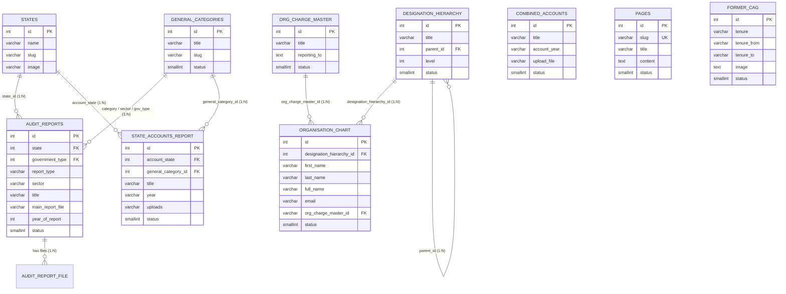

# Database Table Architecture & Relational Mapping Reference

**Database**: PostgreSQL (`cag_new`)  
**Schema**: `cag_revamp`  
**Host**: `<DB_HOST>:5432`  
**Target Modules**: **About Us**, **Reports**, and **Accounts**

---

## Executive Overview & Module-to-Table Matrix

| Module | Primary Database Table(s) | Supporting / Lookup Tables | Total Live Records | Admin Management Route | Public Website URL |
| :--- | :--- | :--- | :--- | :--- | :--- |
| **Audit Reports** | `cag_revamp.audit_reports` | `cag_revamp.states`, `cag_revamp.general_categories`, `cag_revamp.audit_report_file` | **37,257** | `/admin/reports` | `/Reports/All-Reports`, `/Reports/Union-Audit-Reports`, `/Reports/State-Audit-Reports` |
| **State Accounts** | `cag_revamp.state_accounts_report` | `cag_revamp.states`, `cag_revamp.general_categories` | **11,561** | `/admin/state-accounts` | `/Accounts/State-Accounts`, `/Accounts/Accounts-at-a-Glance` |
| **Combined Accounts** | `cag_revamp.combined_accounts` | `cag_revamp.general_categories` | **78** | `/admin/combined-accounts` | `/Accounts/Combined-Finance-and-Revenue-Accounts`, `/Accounts/Annual-Conference-Materials` |
| **About Us (Pages & Acts)** | `cag_revamp.pages` | `cag_revamp.page_translations` | **9,702** | `/admin/pages` | `/About/Index-Menu-About/Constitution-provisions`, `/About/Index-Menu-About/our-history`, etc. |
| **About Us (Former CAGs)** | `cag_revamp.former_cag` | N/A | **61** | `/admin/former-cag` | `/About/Index-Menu-About/former-cags` |
| **About Us (Leadership / Org)** | `cag_revamp.organisation_chart` | `cag_revamp.designation_hierarchy`, `cag_revamp.org_charge_master` | **75** | `/admin/organisation-structure` | `/About/Index-Menu-About/organisation-structure` |
| **About Us (Retirements)** | `cag_revamp.retirements` | N/A | **12** | `/admin/retirements` | `/About/Index-Menu-About/retired-officers` |

---

## Entity Relationship Diagram (ERD)



---

# 1. Reports Module

### Table: `cag_revamp.audit_reports`
The core table storing all Union, State, Defense, Railways, Commercial, and Local Body audit reports.

| Column Name | Data Type | Nullable | Default | Description & Relational Mapping |
| :--- | :--- | :--- | :--- | :--- |
| `id` | `integer` | **NO** | `nextval(...)` | **Primary Key** |
| `parent_id` | `integer` | YES | `0` | Parent report ID for grouped/multi-volume reports |
| `government_type` | `integer` | YES | `NULL` | FK -> `general_categories.id` (`48` = Union, `49` = State) |
| `union_department_type` | `integer` | YES | `NULL` | FK -> `general_categories.id` (Union Ministry/Department) |
| `state` | `integer` | YES | `NULL` | FK -> `states.id` (64 = Andhra Pradesh, 72 = Haryana, etc.) |
| `local_body_types` | `varchar` | YES | `NULL` | Local body categorization (Panchayati Raj, ULB) |
| `report_type` | `varchar` | YES | `NULL` | FK -> `general_categories.id` / Type (`50` = Financial, `51` = Compliance, `52` = Performance) |
| `sector` | `varchar` | YES | `NULL` | Sector/Discipline (`27` = State Finance, `32` = Energy/Civil, etc.) |
| `offices` | `integer` | YES | `NULL` | Office identifier |
| `title` | `varchar` | YES | `NULL` | Report display title (multilingual/English) |
| `language` | `varchar` | YES | `'en'` | Language ISO code (`'en'`, `'hi'`, regional) |
| `overview` | `text` | YES | `NULL` | Executive summary/overview text |
| `date_on_which_report_tabled` | `date` | YES | `NULL` | Date report was tabled in Parliament / State Assembly |
| `year_of_report` | `integer` | YES | `NULL` | Publication/Audit Year (e.g., `2024`, `2025`, `2026`) |
| `from_month` | `integer` | YES | `NULL` | Audit coverage starting month |
| `from_year` | `integer` | YES | `NULL` | Audit coverage starting year |
| `to_month` | `integer` | YES | `NULL` | Audit coverage ending month |
| `to_year` | `integer` | YES | `NULL` | Audit coverage ending year |
| `date_of_sending_the_report_to_government` | `date` | YES | `NULL` | Transmission date to Ministry/Governor |
| `main_report_file` | `varchar` | YES | `NULL` | Primary PDF attachment relative path (S3 / CloudFront storage) |
| `download_audit_report` | `varchar` | YES | `NULL` | Secondary/Direct download document path |
| `file_title` | `varchar` | YES | `NULL` | Document display title |
| `noody_book` | `varchar` | YES | `NULL` | Flipbook / interactive viewer reference |
| `youtube_video_url` | `varchar` | YES | `NULL` | Embedded explanatory video link |
| `digital_report` | `varchar` | YES | `NULL` | Digital microsite URL link |
| `pdf_text` | `text` | YES | `NULL` | Full-text OCR extracted index for global search |
| `status` | `smallint` | **NO** | `1` | `1` = Published / Active, `0` = Archived / Deleted |
| `created_by` | `integer` | YES | `NULL` | CMS User ID who created the record |
| `created_at` | `timestamp` | YES | `NULL` | Record creation timestamp |
| `updated_by` | `integer` | YES | `NULL` | CMS User ID who last modified the record |
| `updated_at` | `timestamp` | YES | `NULL` | Last modification timestamp |
| `report_html` | `text` | YES | `NULL` | Rendered HTML content |
| `total_view` | `integer` | YES | `0` | View counter |
| `report_thumb_img` | `text` | YES | `NULL` | Cover thumbnail image path |

---

### Supporting Table: `cag_revamp.audit_report_file`
Stores multi-chapter or supplemental PDF attachments linked to a report.

| Column Name | Data Type | Nullable | Description & Mapping |
| :--- | :--- | :--- | :--- |
| `id` | `integer` | **NO** | **Primary Key** |
| `audit_reports_id` | `integer` | **NO** | **Foreign Key** -> `audit_reports.id` |
| `file_title` | `varchar` | YES | Attachment label / Chapter name |
| `download_audit_report`| `varchar` | YES | PDF file path in storage |
| `status` | `smallint` | **NO** | `1` = Active, `0` = Inactive |

---

# 2. Accounts Module

### Table: `cag_revamp.state_accounts_report`
Stores all State Government financial statements, including Accounts at a Glance, Appropriation Accounts, Finance Accounts, and Monthly Key Indicators.

| Column Name | Data Type | Nullable | Default | Description & Relational Mapping |
| :--- | :--- | :--- | :--- | :--- |
| `id` | `integer` | **NO** | `nextval(...)` | **Primary Key** |
| `title` | `varchar` | **NO** | `NULL` | Report statement title (e.g. "Haryana, Accounts at a Glance, 2024-25") |
| `language` | `varchar` | **NO** | `'en'` | Language code (`'en'`, `'hi'`) |
| `is_state_ut` | `varchar` | YES | `'s'` | `'s'` = State, `'u'` = Union Territory |
| `account_state` | `integer` | **NO** | `NULL` | **Foreign Key** -> `cag_revamp.states.id` |
| `general_category_id` | `integer` | **NO** | `NULL` | **Foreign Key** -> `cag_revamp.general_categories.id` (`357` = Accounts at a Glance, etc.) |
| `year` | `varchar` | **NO** | `NULL` | Fiscal Accounting Year string (e.g., `'2023 - 24'`, `'2024 - 25'`) |
| `ac_year` | `integer` | YES | `0` | Normalized integer fiscal year |
| `month` | `varchar` | YES | `NULL` | Month string for Monthly Indicators |
| `volume` | `varchar` | YES | `NULL` | Statement volume designation (e.g., `'Vol I'`, `'Vol II'`) |
| `uploads` | `varchar` | YES | `NULL` | Primary PDF statement attachment path |
| `ext_link` | `varchar` | YES | `NULL` | External website / portal URL |
| `status` | `smallint` | **NO** | `1` | `1` = Active / Published, `0` = Archived / Deleted |
| `created_by` | `integer` | YES | `NULL` | Admin user ID who created the record |
| `created` | `timestamp` | YES | `NOW()` | Creation timestamp |
| `updated_by` | `integer` | YES | `NULL` | Admin user ID who modified the record |
| `modified` | `timestamp` | YES | `NOW()` | Modification timestamp |

---

### Table: `cag_revamp.combined_accounts`
Stores Combined Finance and Revenue Accounts (CFRA) of the Union and State Governments and Annual Conference materials.

| Column Name | Data Type | Nullable | Default | Description & Relational Mapping |
| :--- | :--- | :--- | :--- | :--- |
| `id` | `integer` | **NO** | `nextval(...)` | **Primary Key** |
| `title` | `varchar` | **NO** | `NULL` | Title (e.g., "CFRA Volume-I 2020-21", "Union and State Finances At a Glance") |
| `language` | `varchar` | **NO** | `'en'` | Language code (`'en'`, `'hi'`) |
| `account_year` | `varchar` | **NO** | `NULL` | Accounting year (e.g., `'2020-21'`, `'2021-22'`) |
| `upload_file` | `varchar` | YES | `NULL` | PDF document relative path in storage |
| `file_title` | `varchar` | YES | `NULL` | Display title for download link |
| `meta_tags` | `varchar` | YES | `NULL` | SEO / Search keywords |
| `status` | `smallint` | **NO** | `1` | `1` = Active, `0` = Inactive |
| `created_by` | `integer` | YES | `NULL` | Creator user ID |
| `created_at` | `timestamp` | YES | `NOW()` | Creation timestamp |
| `updated_by` | `integer` | YES | `NULL` | Modifier user ID |
| `updated_at` | `timestamp` | YES | `NOW()` | Modification timestamp |

---

# 3. About Us Module

The About Us section is composed of institutional content, constitutional provisions, former leaders, organizational hierarchy, active officers, and retired officers.

---

### Table: `cag_revamp.pages`
Stores all institutional and informational sub-pages (e.g., *Constitutional Provisions*, *CAG's (DPC) Act, 1971*, *Our History*, *Vision, Mission, Values*, *Acts & Manuals*).

| Column Name | Data Type | Nullable | Default | Description & Relational Mapping |
| :--- | :--- | :--- | :--- | :--- |
| `id` | `integer` | **NO** | `nextval(...)` | **Primary Key** |
| `slug` | `varchar` | YES | `NULL` | Unique URL Slug (e.g., `page-constitutional-provisions`, `page-cags-dpc-act-1971`) |
| `title` | `varchar` | **NO** | `NULL` | Page Header Title |
| `excerpt` | `text` | YES | `NULL` | Short summary snippet |
| `content` | `text` | **NO** | `NULL` | Full rich HTML body content rendered on the page |
| `file_title` | `varchar` | YES | `NULL` | Display name of attached PDF/document |
| `upload_file` | `varchar` | YES | `NULL` | Attachment document path |
| `is_home` | `smallint` | **NO** | `0` | Homepage display flag |
| `show_on_home_page` | `smallint` | **NO** | `0` | Featured flag |
| `status` | `smallint` | **NO** | `1` | `1` = Published, `0` = Draft/Hidden |
| `created_by` | `integer` | **NO** | `1` | Admin user ID |
| `created_at` | `timestamp` | YES | `NOW()` | Creation timestamp |
| `updated_by` | `integer` | **NO** | `1` | Admin modifier ID |
| `modified_at` | `timestamp` | YES | `NOW()` | Last edit timestamp |

---

### Table: `cag_revamp.former_cag`
Stores historical Comptroller & Auditor Generals of India with their tenures and official portraits.

| Column Name | Data Type | Nullable | Default | Description & Relational Mapping |
| :--- | :--- | :--- | :--- | :--- |
| `id` | `integer` | **NO** | `nextval(...)` | **Primary Key** |
| `title` | `varchar` | **NO** | `NULL` | Category title (`"Former CAG"`) |
| `tenure` | `varchar` | **NO** | `NULL` | Name of the Former CAG (e.g., `"V. NARAHARI RAO"`, `"VINOD RAI"`, `"SHASHI KANT SHARMA"`) |
| `tenure_from` | `varchar` | **NO** | `NULL` | Starting tenure year / date (e.g., `"1948"`, `"2008"`) |
| `tenure_to` | `varchar` | **NO** | `NULL` | Ending tenure year / date (e.g., `"1954"`, `"2013"`) |
| `image` | `text` | YES | `NULL` | Portrait photo filename/path |
| `language` | `varchar` | **NO** | `'en'` | Language code |
| `status` | `smallint` | **NO** | `1` | `1` = Active, `0` = Archived |
| `created_by` | `integer` | **NO** | `1` | Creator user ID |
| `created` | `timestamp` | **NO** | `CURRENT_TIMESTAMP` | Creation timestamp |
| `updated_by` | `integer` | YES | `NULL` | Modifier user ID |
| `modified` | `timestamp` | **NO** | `CURRENT_TIMESTAMP` | Modification timestamp |

---

### Table: `cag_revamp.organisation_chart`
Stores the active senior leadership, Dy. CAGs, Addl. Dy. CAGs, Directors General, and Principal Directors.

| Column Name | Data Type | Nullable | Default | Description & Relational Mapping |
| :--- | :--- | :--- | :--- | :--- |
| `id` | `integer` | **NO** | `nextval(...)` | **Primary Key** |
| `designation_hierarchy_id` | `integer` | **NO** | `NULL` | **Foreign Key** -> `designation_hierarchy.id` |
| `designation_display_name` | `varchar` | **NO** | `NULL` | Multilingual JSON / text designation title |
| `language` | `varchar` | **NO** | `'en'` | Language (`'en'`, `'hi'`) |
| `prefix_name` | `varchar` | YES | `NULL` | Honorific title (`Shri`, `Smt`, `Dr.`) |
| `first_name` | `varchar` | **NO** | `''` | First Name |
| `middle_name` | `varchar` | YES | `NULL` | Middle Name |
| `last_name` | `varchar` | YES | `NULL` | Last Name |
| `full_name` | `varchar` | YES | `NULL` | Multilingual JSON / formatted full name |
| `mobile_no` | `varchar` | YES | `NULL` | Official EPABX / Phone number |
| `email` | `varchar` | YES | `NULL` | Official Government Email (`@cag.gov.in`) |
| `org_charge_master_id` | `varchar` | YES | `NULL` | **Foreign Key** -> JSON array mapping to `org_charge_master.id` |
| `department` | `varchar` | YES | `NULL` | Department / Wing portfolio name |
| `profile_image` | `varchar` | YES | `NULL` | Official portrait photograph |
| `dept_description` | `text` | YES | `NULL` | Portfolio details / Wing codes |
| `brief_description` | `text` | YES | `NULL` | Biography / Curriculum Vitae HTML |
| `display_order` | `integer` | YES | `0` | Seniority sorting order |
| `retired` | `smallint` | YES | `0` | `0` = Active in service, `1` = Retired |
| `status` | `smallint` | **NO** | `1` | `1` = Active, `0` = Inactive |
| `created` | `timestamp` | YES | `NOW()` | Creation timestamp |
| `modified` | `timestamp` | YES | `NOW()` | Modification timestamp |

---

### Table: `cag_revamp.designation_hierarchy`
Hierarchical rank structure of the Indian Audit and Accounts Service (IA&AS).

| Column Name | Data Type | Nullable | Default | Description & Relational Mapping |
| :--- | :--- | :--- | :--- | :--- |
| `id` | `integer` | **NO** | `nextval(...)` | **Primary Key** |
| `title` | `varchar` | **NO** | `NULL` | Multilingual JSON title (e.g. `{"default":"Deputy Comptroller & Auditor General"}`) |
| `parent_id` | `integer` | YES | `0` | **Self-referential FK** -> `designation_hierarchy.id` |
| `level` | `integer` | **NO** | `1` | Hierarchy tier (`1` = CAG, `2` = Dy CAG, `3` = Addl Dy CAG, etc.) |
| `lft` | `integer` | YES | `0` | Nested set left index (tree traversal) |
| `rght` | `integer` | YES | `0` | Nested set right index (tree traversal) |
| `status` | `smallint` | **NO** | `1` | `1` = Active |

---

### Table: `cag_revamp.org_charge_master`
Portfolio charge and reporting lines for executive leadership.

| Column Name | Data Type | Nullable | Description & Relational Mapping |
| :--- | :--- | :--- | :--- |
| `id` | `integer` | **NO** | **Primary Key** |
| `title` | `varchar` | **NO** | Charge portfolio name (e.g., `(Defence & Railways)`, `(Commercial)`) |
| `reporting_to` | `text` | YES | Multilingual JSON array listing subordinate DG / PDA / AG offices |
| `status` | `smallint` | **NO** | `1` = Active, `0` = Inactive |

---

### Table: `cag_revamp.retirements`
Monthly bulletin and records of superannuated IA&AS and departmental officers.

| Column Name | Data Type | Nullable | Description & Relational Mapping |
| :--- | :--- | :--- | :--- |
| `id` | `integer` | **NO** | **Primary Key** |
| `title` | `varchar` | **NO** | Bulletin title (e.g., `"February 2024"`, `"April 2025"`) |
| `retirements_year` | `integer` | **NO** | Superannuation Year |
| `retirements_month` | `integer` | **NO** | Superannuation Month (`1` to `12`) |
| `upload_file` | `varchar` | YES | PDF Gazette / Bulletin attachment |
| `status` | `smallint` | **NO** | `1` = Active |

---

# 4. Universal Shared Lookup Tables

### Table: `cag_revamp.states`
Stores all 47 States, Union Territories, and Field AG Jurisdictions.

| Column Name | Data Type | Nullable | Description & Mapping |
| :--- | :--- | :--- | :--- |
| `id` | `integer` | **NO** | **Primary Key** (Used in `audit_reports.state` & `state_accounts_report.account_state`) |
| `name` | `varchar` | **NO** | State Name (e.g., `"Andhra Pradesh"`, `"Haryana"`, `"Maharashtra"`) |
| `slug` | `varchar` | **NO** | URL slug (e.g., `"andhra-pradesh"`, `"haryana"`) |
| `image` | `varchar` | YES | State emblem / emblem badge icon filename |
| `code` | `varchar` | YES | ISO / State postal code |

---

### Table: `cag_revamp.general_categories`
Centralized taxonomic lookup table for government types, audit categories, account categories, and sectors.

| Column Name | Data Type | Nullable | Description & Mapping |
| :--- | :--- | :--- | :--- |
| `id` | `integer` | **NO** | **Primary Key** (Used across `audit_reports`, `state_accounts_report`, etc.) |
| `parent_id` | `integer` | YES | Category tree parent ID |
| `title` | `varchar` | **NO** | Category Name (e.g., `"Accounts at a Glance"`, `"Appropriation Accounts"`, `"State Government"`) |
| `slug` | `varchar` | **NO** | Category slug |
| `description` | `text` | YES | Category description |
| `status` | `smallint` | **NO** | `1` = Active, `0` = Inactive |

---

## Direct Reflection Flow: Admin Panel <--> Database <--> Public Website

```
+-------------------------------------------------------------+
|                      Admin Panel CMS                        |
|  - /admin/reports           (Reports Management)            |
|  - /admin/state-accounts    (State Accounts Management)     |
|  - /admin/combined-accounts (Combined Accounts Management)  |
|  - /admin/pages             (About Us / Dynamic Pages)      |
|  - /admin/former-cag        (Former CAG Management)         |
|  - /admin/organisation-structure (Leadership Structure)    |
+------------------------------+------------------------------+
                               |
                   [REST API: POST/PUT/DELETE]
                               |
                               v
+-------------------------------------------------------------+
|                    FastAPI Backend Service                  |
|  - app/services/reports_service.py                          |
|  - app/api/v1/accounts.py                                   |
|  - app/api/v1/admin/crud.py                                 |
+------------------------------+------------------------------+
                               |
                     [Live SQL SELECT / UPDATE]
                               |
                               v
+-------------------------------------------------------------+
|                  PostgreSQL Database Engine                 |
|                   Schema: cag_revamp                        |
|  - audit_reports              (37,257 rows)                 |
|  - state_accounts_report      (11,561 rows)                 |
|  - combined_accounts          (78 rows)                     |
|  - pages                      (9,702 rows)                  |
|  - former_cag                 (61 rows)                     |
|  - organisation_chart         (75 rows)                     |
+------------------------------+------------------------------+
                               |
                     [SSR & Dynamic Query API]
                               |
                               v
+-------------------------------------------------------------+
|                     Public Website Frontend                 |
|  - /Reports/* (Instant filter & card updates)               |
|  - /Accounts/* (Live statement grids & PDFs)                |
|  - /About/* (Live hierarchy & institutional pages)          |
+-------------------------------------------------------------+
```
