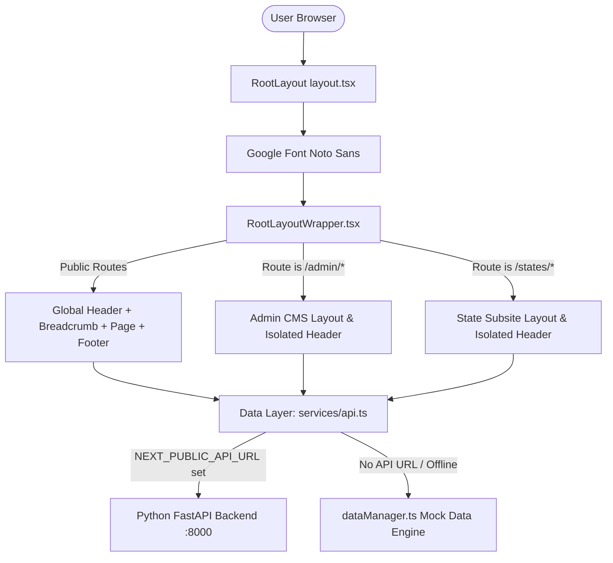

# CAG Website Frontend Architecture Guide

> **Project:** Comptroller and Auditor General of India (CAG) Web Portal (v2)  
> **Tech Stack:** Next.js 16 (App Router + Turbopack), React 19, TypeScript 5, Tailwind CSS v4, Vanilla CSS  
> **Design Reference:** Figma Custom Design System with bilingual (English ↔ हिन्दी) support  

---

## 1. High-Level Directory Overview (`src/`)

```
src/
├── app/                  # Next.js App Router (Layouts, Pages, Serverless API)
│   ├── (auth)/           # Authentication routes (Login, Register)
│   ├── (pages)/          # Public portal routes (Home, About, Reports, etc.)
│   ├── admin/            # Metadata-driven Admin CMS Panel
│   ├── api/              # API Route Handlers (Auth proxy, Admin endpoints)
│   ├── Assets/           # App-level SVG / Image assets
│   ├── RootLayoutWrapper.tsx # Route-aware layout dispatcher
│   ├── layout.tsx        # Global HTML shell, metadata, and Noto Sans font setup
│   ├── page.tsx          # Root page forwarding to Home-page
│   └── globals.css       # Global styles, Figma tokens, CSS resets
├── components/           # Shared global UI components
│   ├── Header/           # Main Header with accessibility tools, language toggle, search
│   ├── Footer/           # Global Footer with compliance links & visitor counter
│   ├── Menu/             # Multi-column mega menus
│   ├── Breadcrumb/       # Dynamic breadcrumb navigation
│   ├── admin/            # Generic Admin components (GenListPage, GenFormPage, Sidebar)
│   ├── cards/            # Generic card components
│   ├── hero/             # Hero banner components
│   ├── navigation/       # Navbar and routing elements
│   └── DualFlagStand.tsx # Dual bilateral flag stand SVG component
├── features/             # Feature-specific modular slices
│   └── home/             # Home page modular widgets (WhoWeAre, Details, etc.)
├── Reusable components/  # Atomic UI primitives
│   ├── Cards/            # Reusable card UI widgets
│   └── Side Menu/        # Reusable sidebar menu UI widgets
├── lib/                  # Core library utilities and engines
│   ├── dataManager.ts    # Centralized state engine, bilingual sync, and fallback datasets
│   ├── admin-modules.ts  # Metadata schemas and table definitions for Admin CMS
│   ├── admin-list-factory.ts # Factory helpers for Admin data grids
│   ├── api.ts            # Frontend API client methods
│   ├── auth.ts           # Authentication helpers
│   ├── auth.config.ts    # NextAuth configuration
│   ├── axios.ts          # Axios client instance configuration
│   └── utils.ts          # Utility functions (clsx, tailwind-merge)
├── services/             # API service layer with mock fallback handling
│   └── api.ts            # Fetch wrapper with automatic Mock/FastAPI switching
├── config/               # Application configuration
│   ├── site.config.ts    # Site properties and metadata
│   └── site.ts           # Navigation structure and static configurations
└── types/                # TypeScript interface and type declarations
    └── index.ts          # Core domain models (Reports, News, Offices, Menus)
```

---

## 2. Core Architecture & System Flow

### A. Architectural Workflow



---

### B. Shell & Layout Scoping (`src/app/RootLayoutWrapper.tsx`)

1. **Font & Metadata Loading (`src/app/layout.tsx`)**:
   - Loads Google **Noto Sans** with Latin and Devanagari subsets.
   - Configures site title, description, and base styling.

2. **Conditional Header/Footer Dispatching (`src/app/RootLayoutWrapper.tsx`)**:
   - Inspects `usePathname()`.
   - **Admin (`/admin/*`) & State Subsites (`/states/*`)**: Render in isolation without the main CAG header and footer.
   - **Public Pages**: Render the global Header, conditional Breadcrumb bar, and Footer.

```tsx
'use client';

import React from 'react';
import { usePathname } from 'next/navigation';
import Header from '@/components/Header/Header';
import Footer from '@/components/Footer/Footer';
import Breadcrumb from '@/components/Breadcrumb/Breadcrumb';

export default function RootLayoutWrapper({ children }: { children: React.ReactNode }) {
  const pathname = usePathname();
  const isAdmin = pathname?.startsWith('/admin');
  const isStateSubsite = pathname?.startsWith('/states');

  if (isAdmin || isStateSubsite) {
    return <main className="min-h-screen bg-white">{children}</main>;
  }

  const isReports = pathname?.startsWith('/Reports');
  const isHome = pathname === '/' || pathname?.startsWith('/Home-page');
  const isOurPresence = pathname?.toLowerCase().includes('our-presence');
  const showGlobalBreadcrumbWrapper =
    !isHome &&
    !isReports &&
    !isOurPresence &&
    !pathname?.toLowerCase().includes('global-relations');

  return (
    <div className="min-h-screen flex flex-col justify-between">
      <div>
        <Header />
        {showGlobalBreadcrumbWrapper && (
          <div className="max-w-[1440px] mx-auto px-4 sm:px-6 lg:px-[64px] pt-6 pb-0">
            <Breadcrumb />
          </div>
        )}
        <main className="flex-grow">{children}</main>
      </div>
      <Footer />
    </div>
  );
}
```

---

### C. Dynamic Route Parameter Unwrapping (Next.js 16 / React 19)

In Next.js 16+, route `params` are asynchronous Promises. They are unwrapped using:
* **Client Components**: `React.use(params)`
* **Server Components**: `await params`

```tsx
// Example Client Component Dynamic Route
'use client';

import React from 'react';

export default function DynamicRoutePage({ params }: { params: Promise<{ slug: string }> }) {
  const resolvedParams = React.use(params);
  const slug = decodeURIComponent(resolvedParams.slug).toLowerCase();

  return <div>Viewing: {slug}</div>;
}
```

---

## 3. Public Route Structure (`src/app/(pages)/`)

| Route Path | Directory / File | Key Features |
| :--- | :--- | :--- |
| `/` | `src/app/page.tsx` | Re-exports `(pages)/Home-page/page.tsx`. |
| `/Home-page` | `src/app/(pages)/Home-page/` | Modular sections: `Banner`, `Latest Audit Reports & Accounts`, `Who We Are`, `Details` (Message from CAG), and `News & Events`. |
| `/About/*` | `src/app/(pages)/About/` & `Index-Menu-About/` | Institutional information, Mandate, Constitutional provisions, Former CAGs, and Organizational hierarchy. |
| `/About/.../Global-relations/[slug]` | `src/app/(pages)/Index-Menu-About/Global-relations/[slug]/page.tsx` | Dedicated pages for **INTOSAI**, **ASOSAI**, **Multilateral Forums (BRICS, SCO, SAI20)**, and a 24-country interactive SVG flag grid for **Bilateral Relations**. |
| `/Reports` | `src/app/(pages)/Reports/page.tsx` | Faceted search catalog (Year, Ministry, Sector, Level: Union / State / Local Bodies, Type: Performance / Compliance / Financial). |
| `/Reports/[id]` | `src/app/(pages)/Reports/[id]/page.tsx` | Full report view: Executive summary, findings, recommendations, tabling dates, and embedded PDF viewer. |
| `/Reports/accounts` | `src/app/(pages)/Reports/accounts/page.tsx` | Combined Finance and Revenue Accounts with categorized downloads. |
| `/Our-Presence` | `src/app/(pages)/Our-Presence/` | Interactive India map with State AG Office directory. |
| `/states/[slug]` | `src/app/(pages)/states/[slug]/page.tsx` | Isolated localized microsites for individual State Accountant General offices. |
| `/Career-Engagement` | `src/app/(pages)/Career-Engagement/` | Recruitment notices, internships, apprentice schemes, and tenders. |
| `/Resources` | `src/app/(pages)/Resources/` | Acts, rules, manuals, guidelines, and RTI disclosures. |

---

## 4. State Management & Internationalization Engine (`src/lib/dataManager.ts`)

`dataManager` provides centralized reactive state and fallback data management across the entire application:

### A. Bilingual Synchronization (English ↔ हिन्दी)
* Stores active language in `localStorage` with memory fallback.
* Dispatches custom `'languageChange'` browser event on update.
* Components listen for this event in a `useEffect` hook to synchronize UI text without reloading the page.

```tsx
// Hook pattern used across components
const [lang, setLang] = useState<'English' | 'हिन्दी'>('English');

useEffect(() => {
  setLang(dataManager.getLanguage());
  const handleLangChange = () => setLang(dataManager.getLanguage());
  window.addEventListener('languageChange', handleLangChange);
  return () => window.removeEventListener('languageChange', handleLangChange);
}, []);
```

### B. High-Contrast Accessibility Mode
* Toggles `.high-contrast` class on `document.documentElement`.
* Inverts contrast and enforces accessible color ratios for low-vision users.

---

## 5. API Client & Dual-Mode Data Layer

### `src/services/api.ts` & `src/lib/api.ts`
The application can run in **Standalone Mode** (using built-in mock data) or **Connected Mode** (using FastAPI backend):

```typescript
async function fetchJson<T>(path: string, options?: RequestInit): Promise<T | null> {
  const useMock = !process.env.NEXT_PUBLIC_API_URL;
  if (useMock) {
    const mock = getMockData(path);
    if (mock !== null) return mock as T;
  }

  try {
    const res = await fetch(`${getApiBaseUrl()}${path}`, {
      cache: 'no-store',
      ...options,
    });
    if (!res.ok) {
      console.error(`API Error: ${res.status} on ${path}`);
      return getMockData(path) as T;
    }
    return await res.json() as T;
  } catch (err) {
    return getMockData(path) as T;
  }
}
```

---

## 6. Metadata-Driven Admin CMS (`src/app/admin/`)

The admin panel is constructed using a **dynamic schema generator**:

1. **Schema Definitions (`src/lib/admin-modules.ts`)**:
   - Registers all manageable entities: `news`, `reports`, `audit-logs`, `events`, `pages`, `users`, `organisation-chart`, `former-cag`.
   - Defines table columns, search indices, sort orders, and form input schemas.

2. **Dynamic Route Handler (`src/app/admin/[module]/page.tsx`)**:
   - Reads `params.module`.
   - Looks up metadata config in `ADMIN_MODULES`.
   - Renders `GenListPage` with server-side pagination, search, status filtering, and sorting.

3. **Admin UI Components (`src/components/admin/`)**:
   - `GenListPage.tsx`: Generic data table with action buttons (Edit, View, Delete, Toggle Status).
   - `GenFormPage.tsx`: Schema-driven create/edit form with file upload support.
   - `AdminSidebar.tsx`: Navigation bar with role-based access links.
   - `AdminHeader.tsx`: Admin profile, notification badges, and sign-out controls.

---

## 7. Design System & Styling Tokens

### Color Palette
* **Primary Maroon:** `#751639` (Brand color, active navigation items, buttons)
* **Secondary Blue:** `#0D61AE` (Hyperlinks, action items)
* **Dark Neutral:** `#2A2A2A` / `#2E2E31` (Headings, primary body copy)
* **Muted Neutral:** `#565656` (Subtitles, breadcrumbs, metadata)
* **Border Gray:** `#E6E6E6` / `#D7D7D7` (Card borders, dividers)
* **Background Light:** `#F8F9FA` / `#FFFFFF` (Page background, card background)

### Typography
* **Primary Font:** Google `Noto Sans` (Weights: 300, 400, 500, 600, 700, 800)
* **Language Support:** Full glyph support for English and Devanagari (Hindi).
