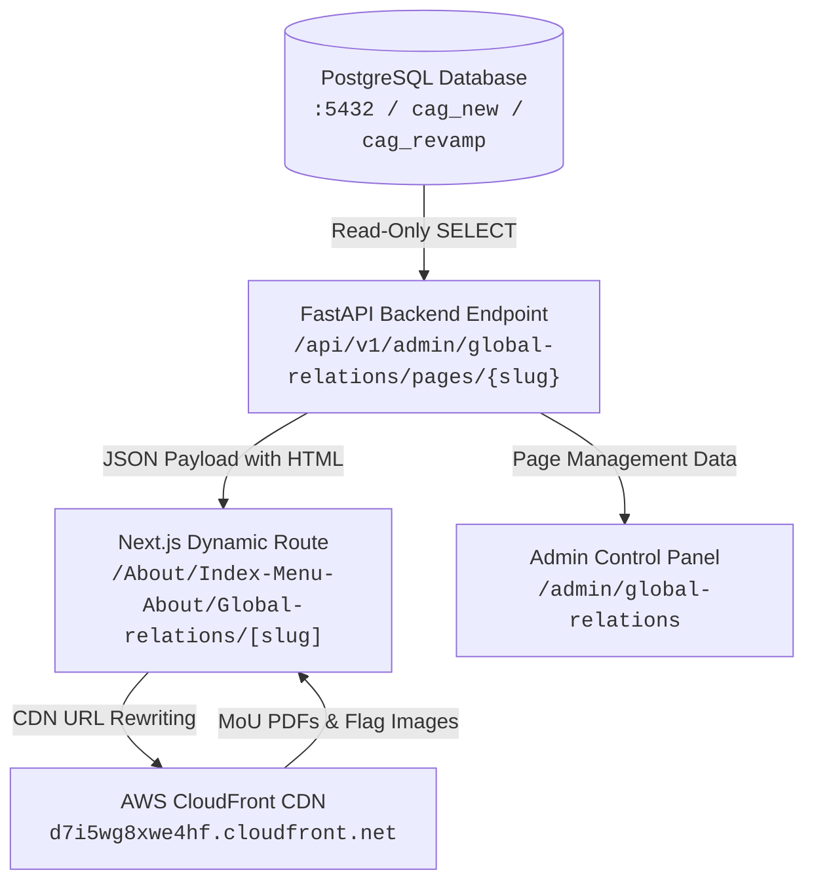

# 🌐 CAG Global Relations Module — Architecture & Technical Implementation Guide

> **Repository**: `akilan_cagv2` | **Module**: About Us → Global Relations  
> **Database Host**: `<DB_HOST>:5432` | **Database Name**: `cag_new` | **Schema**: `cag_revamp`  
> **CDN Base Domain**: `https://d7i5wg8xwe4hf.cloudfront.net` | **Status**: `Verified & Production Ready`

---

## 📑 Table of Contents

1. [Executive Summary & System Architecture](#-executive-summary--system-architecture)
2. [Inventory of Modified & Created Files](#-inventory-of-modified--created-files)
3. [Sub-Module Functional Guide](#-sub-module-functional-guide)
   - [International Bodies](#1-international-bodies)
   - [Bilateral Relations](#2-bilateral-relations)
   - [Audit Engagements](#3-audit-engagements)
4. [Technical Implementation Steps](#-technical-implementation-steps)
   - [Step 1: Centralized Database Configuration](#step-1-centralized-database-configuration)
   - [Step 2: Backend API Refactoring](#step-2-backend-api-refactoring)
   - [Step 3: CloudFront CDN Asset Resolution Utility](#step-3-cloudfront-cdn-asset-resolution-utility)
   - [Step 4: Dynamic Frontend Parsing & Flag Card Design](#step-4-dynamic-frontend-parsing--flag-card-design)
   - [Step 5: Admin Control Panel Sidebar Restructuring](#step-5-admin-control-panel-sidebar-restructuring)
5. [Verification & System Health Checklist](#-verification--system-health-checklist)

---

## 📌 Executive Summary & System Architecture

This guide details the complete end-to-end technical architecture and implementation for the **Global Relations Module** across the PostgreSQL database, FastAPI backend API, CloudFront CDN asset pipeline, Next.js dynamic frontend pages, and the Admin Control Panel suite.

> [!IMPORTANT]
> **Zero Database Mutations**: All backend and frontend enhancements were implemented with **100% read-only operations**, ensuring zero write, update, or delete operations on live PostgreSQL database records.



---

## 📁 Inventory of Modified & Created Files

| File | Layer | Action | Key Responsibility / Changes Made |
| :--- | :--- | :---: | :--- |
| [`back_end/.env`](file:///c:/Users/mered/OneDrive/Desktop/cag-newtechpull/cag-newtechstack-akilan/back_end/.env) | Backend Config | `Modified` | Environment variables for DB host, port, schema, and credentials. |
| [`back_end/app/core/config.py`](file:///c:/Users/mered/OneDrive/Desktop/cag-newtechpull/cag-newtechstack-akilan/back_end/app/core/config.py) | Backend Core | `Modified` | Centralized `Settings` object and added `CLOUDFRONT_BASE_URL`. |
| [`back_end/app/core/database.py`](file:///c:/Users/mered/OneDrive/Desktop/cag-newtechpull/cag-newtechstack-akilan/back_end/app/core/database.py) | Backend Core | `Modified` | Added `get_psycopg2_connection()` with fallback and DSN URL normalization. |
| [`back_end/app/api/v1/admin/global_relations.py`](file:///c:/Users/mered/OneDrive/Desktop/cag-newtechpull/cag-newtechstack-akilan/back_end/app/api/v1/admin/global_relations.py) | Backend API | `Modified` | Removed hardcoded dict, bound queries to `cag_revamp.pages`, removed dummy module. |
| [`src/lib/cdnUtils.ts`](file:///c:/Users/mered/OneDrive/Desktop/cag-newtechpull/cag-newtechstack-akilan/src/lib/cdnUtils.ts) | Frontend Utility | **`NEW`** | CloudFront CDN URL resolution and HTML string rewriting functions. |
| [`src/app/(pages)/About/Index-Menu-About/Global-relations/[slug]/page.tsx`](file:///c:/Users/mered/OneDrive/Desktop/cag-newtechpull/cag-newtechstack-akilan/src/app/(pages)/About/Index-Menu-About/Global-relations/[slug]/page.tsx) | Frontend Route | `Modified` | Client-side DOM parsing, dynamic DB content rendering, 6-column white card grid. |
| [`src/components/DualFlagStand.tsx`](file:///c:/Users/mered/OneDrive/Desktop/cag-newtechpull/cag-newtechstack-akilan/src/components/DualFlagStand.tsx) | Frontend Component | `Modified` | Fixed SVG React property casing (`fontFamily`, `fontSize`, `fontWeight`). |
| [`src/app/(pages)/admin/layout.tsx`](file:///c:/Users/mered/OneDrive/Desktop/cag-newtechpull/cag-newtechstack-akilan/src/app/(pages)/admin/layout.tsx) | Admin UI | `Modified` | Promoted Bilateral Relations to major category node, removed dummy link. |
| [`src/app/(pages)/admin/global-relations/page.tsx`](file:///c:/Users/mered/OneDrive/Desktop/cag-newtechpull/cag-newtechstack-akilan/src/app/(pages)/admin/global-relations/page.tsx) | Admin UI | `Modified` | Filtered active items list to match live database records exclusively. |

---

## 📖 Sub-Module Functional Guide

The **Global Relations** module features 7 dynamic database pages organized under 3 primary navigation categories:

```
Global Relations
├── 1. International Bodies
│   ├── Association with INTOSAI
│   ├── Association with ASOSAI
│   └── Multilateral Engagement
├── 2. Bilateral Relations
│   └── Bilateral Relations of SAI India
└── 3. Audit Engagements
    ├── UN Panel of External Auditors
    ├── Present International Audits
    └── Past International Audits
```

---

### 1. International Bodies

#### A. Association with INTOSAI
* **Route**: `/About/Index-Menu-About/Global-relations/Association with INTOSAI`
* **DB Record**: Schema `cag_revamp.pages` | `ID: 6` | `Slug: page-involvement-with-intosai`
* **Features**:
  * Displays CAG India's leadership roles: Chair of INTOSAI Knowledge Sharing Committee (KSC), Chair of Working Group on IT Audit (WGITA), and Chair of Compliance Audit Subcommittee (CAS).
  * Hero banner displaying `INTOSAI-logo.svg` (`80px × 77px`).
  * Dynamic HTML body fetched live from database and transformed via `transformHtmlAssetUrls()`.

#### B. Association with ASOSAI
* **Route**: `/About/Index-Menu-About/Global-relations/Association with ASOSAI`
* **DB Record**: Schema `cag_revamp.pages` | `ID: 7` | `Slug: page-involvement-with-asosai`
* **Features**:
  * Highlights SAI India's charter membership in ASOSAI, Governing Board meeting history, ASOSAI Journal publication leadership, and regional capacity-building programs.
  * Hero banner featuring `ASOSAI-logo.svg` (`126px × 40px`).

#### C. Multilateral Engagement
* **Route**: `/About/Index-Menu-About/Global-relations/Multilateral Engagement`
* **DB Record**: Schema `cag_revamp.pages` | `ID: 8` | `Slug: page-global-audit-leadership-forum-and-other-multilateral-bodies`
* **Features**:
  * Documents active engagement in Global Audit Leadership Forum (GALF), Commonwealth Auditors-General Conference, BRICS SAIs, and INTOSAI Development Initiative (IDI).
  * Hero banner featuring `multilateral-logo.svg` (`103px × 103px`).

---

### 2. Bilateral Relations

#### Bilateral Relations of SAI India
* **Route**: `/About/Index-Menu-About/Global-relations/Bilateral Relations`
* **DB Record**: Schema `cag_revamp.pages` | `ID: 5` | `Slug: page-bilateral-relations-of-sai-india`
* **Features**:
  * **Full-Width Canvas (1312px)**: Custom layout optimized for high-density visual presentations.
  * **Client-Side DOM Parsing**: Uses `DOMParser` in `useMemo` to extract 33 country items, MoU PDF links, top heading text, and bottom paragraph text directly from `dbContent`.
  * **6-Column Card Grid**: Renders cards for 33 entities (29 SAIs with MoUs + partner nations + IDI).
  * **CloudFront CDN Integration**: Clicking any country card opens its official MoU PDF directly from `https://d7i5wg8xwe4hf.cloudfront.net/uploads/media/<filename>.pdf`.
  * **Uniform Card Styling**: Every card features a white rounded box (`bg-white border border-[#E6E6E6] rounded-[8px] p-4 min-h-[186px]`) with SVG flag artwork or `<DualFlagStand />` (3D golden poles + India tricolor + partner flag) with a bottom divider line and country name label.

---

### 3. Audit Engagements

#### A. UN Panel of External Auditors
* **Route**: `/About/Index-Menu-About/Global-relations/UN Panel of External Auditors`
* **DB Record**: Schema `cag_revamp.pages` | `ID: 256` | `Slug: page-un-panel-of-external-auditors`
* **Features**:
  * Details CAG India's membership and leadership in the United Nations Panel of External Auditors and Technical Group sessions.
  * Hero banner featuring `unpanel-logo.svg` (`141px × 101px`).

#### B. Present International Audits
* **Route**: `/About/Index-Menu-About/Global-relations/Present International Audits`
* **DB Record**: Schema `cag_revamp.pages` | `ID: 6678` | `Slug: page-present-international-audits`
* **Features**:
  * Details active external audit mandates:
    1. **IAEA** (International Atomic Energy Agency, Vienna): 2022–2027
    2. **FAO** (Food and Agriculture Organization, Rome): 2020–2025
    3. **WHO** (World Health Organization, Geneva): 2020–2027
    4. **OPCW** (Organisation for the Prohibition of Chemical Weapons, The Hague): 2024–2026
    5. **ILO** (International Labour Organization, Geneva)
  * Hero banner featuring `presentIA-logo.svg` (`167px × 120px`).

#### C. Past International Audits
* **Route**: `/About/Index-Menu-About/Global-relations/Past International Audits`
* **DB Record**: Schema `cag_revamp.pages` | `ID: 257` | `Slug: page-past-international-audits`
* **Features**:
  * Documents completed historical mandates: **UN Board of Auditors** (1993–1999 & 2014–2020), WHO, IMO, ICGEB, FAO, OPCW, UNWTO, WFP, IAEA, IOM, WIPO, and ITER.
  * Responsive data table listing Sr. No., Organization Name, and Mandate Period.

---

## 🛠️ Technical Implementation Steps

### Step 1: Centralized Database Configuration

1. **Environment Config (`back_end/.env`)**:
   ```env
   ENVIRONMENT=development
   DB_HOST=<DB_HOST>
   DB_PORT=5432
   DB_NAME=cag_new
   DB_USER=your_db_user
   DB_PASSWORD=your_db_password
   DB_SCHEMA=cag_revamp
   DATABASE_URL=postgresql+psycopg2://<user>:<password>@<host>:<port>/<dbname>
   ```

2. **Application Settings (`back_end/app/core/config.py`)**:
   ```python
   class Settings(BaseSettings):
       DB_HOST: str = "localhost"
       DB_PORT: int = 5432
       DB_NAME: str = "cag_new"
       DB_USER: str = ""
       DB_PASSWORD: str = ""
       DB_SCHEMA: str = "cag_revamp"
       DATABASE_URL: str | None = None
       CLOUDFRONT_BASE_URL: str = "https://d7i5wg8xwe4hf.cloudfront.net"
   ```

3. **Connection Helper ([`back_end/app/core/database.py`](file:///c:/Users/mered/OneDrive/Desktop/cag-newtechpull/cag-newtechstack-akilan/back_end/app/core/database.py))**:
   ```python
   def get_psycopg2_connection():
       import psycopg2
       if settings.DATABASE_URL:
           url = settings.DATABASE_URL.replace("postgresql+psycopg2://", "postgresql://")
           return psycopg2.connect(url)
       return psycopg2.connect(
           host=settings.DB_HOST,
           port=settings.DB_PORT,
           dbname=settings.DB_NAME,
           user=settings.DB_USER,
           password=settings.DB_PASSWORD,
       )
   ```

---

### Step 2: Backend API Refactoring

In [`back_end/app/api/v1/admin/global_relations.py`](file:///c:/Users/mered/OneDrive/Desktop/cag-newtechpull/cag-newtechstack-akilan/back_end/app/api/v1/admin/global_relations.py):
* Deleted hardcoded `DB_CONFIG_FALLBACK` dictionary containing legacy credentials.
* Bound all SQL queries dynamically to `f"{settings.DB_SCHEMA}.pages"`.
* Removed `International Relations Wing` dummy module logic and API endpoints.

---

### Step 3: CloudFront CDN Asset Resolution Utility

Created [`src/lib/cdnUtils.ts`](file:///c:/Users/mered/OneDrive/Desktop/cag-newtechpull/cag-newtechstack-akilan/src/lib/cdnUtils.ts) to handle automatic CloudFront asset resolution:

```typescript
export const CLOUDFRONT_BASE_URL = "https://d7i5wg8xwe4hf.cloudfront.net";

export const getCloudFrontUrl = (url?: string | null): string => {
  if (!url) return "";
  if (url.startsWith("https://d7i5wg8xwe4hf.cloudfront.net")) return url;

  if (url.includes("cag.gov.in/webroot/uploads/") || url.includes("cag.gov.in/uploads/")) {
    const cleanPath = url.replace(/^https?:\/\/(www\.)?cag\.gov\.in(\/webroot)?/, "").replace(/^\/+/, "");
    return `${CLOUDFRONT_BASE_URL}/${cleanPath}`;
  }

  if (url.includes("assets/images/cms_pages/")) {
    const filename = url.split("assets/images/cms_pages/").pop();
    return `${CLOUDFRONT_BASE_URL}/assets/images/cms_pages/${filename}`;
  }

  if (url.includes("uploads/media/")) {
    const filename = url.split("uploads/media/").pop();
    return `${CLOUDFRONT_BASE_URL}/uploads/media/${filename}`;
  }

  if (url.includes("uploads/FileManager/")) {
    const pathAfter = url.split("uploads/FileManager/").pop();
    return `${CLOUDFRONT_BASE_URL}/uploads/FileManager/${pathAfter}`;
  }

  if (url.startsWith("/")) return `${CLOUDFRONT_BASE_URL}${url}`;
  return url;
};

export const transformHtmlAssetUrls = (html?: string | null): string => {
  if (!html) return "";
  return html
    .replace(/src=["'](?:\.\.\/|\/)?assets\/images\/cms_pages\/([^"']+)["']/g, `src="${CLOUDFRONT_BASE_URL}/assets/images/cms_pages/$1"`)
    .replace(/src=["'](?:https?:\/\/(?:www\.)?cag\.gov\.in(?:\/webroot)?)?\/uploads\/FileManager\/([^"']+)["']/g, `src="${CLOUDFRONT_BASE_URL}/uploads/FileManager/$1"`)
    .replace(/href=["'](?:https?:\/\/(?:www\.)?cag\.gov\.in(?:\/webroot)?)?\/uploads\/media\/([^"']+)["']/g, `href="${CLOUDFRONT_BASE_URL}/uploads/media/$1"`)
    .replace(/href=["'](?:\.\.\/|\/)?uploads\/media\/([^"']+)["']/g, `href="${CLOUDFRONT_BASE_URL}/uploads/media/$1"`);
};
```

---

### Step 4: Dynamic Frontend Parsing & Flag Card Design

In [`src/app/(pages)/About/Index-Menu-About/Global-relations/[slug]/page.tsx`](file:///c:/Users/mered/OneDrive/Desktop/cag-newtechpull/cag-newtechstack-akilan/src/app/(pages)/About/Index-Menu-About/Global-relations/[slug]/page.tsx):
* Implemented client-side HTML parsing using `DOMParser` inside `useMemo` to extract country entries, MoU PDF links, and heading texts from `dbContent`.
* Enclosed all 33 country items inside uniform white card containers matching Figma specifications.
* Resolved SVG React DOM property casing warnings in [`src/components/DualFlagStand.tsx`](file:///c:/Users/mered/OneDrive/Desktop/cag-newtechpull/cag-newtechstack-akilan/src/components/DualFlagStand.tsx#L228) (`fontFamily`, `fontSize`, `fontWeight`).

---

### Step 5: Admin Control Panel Sidebar Restructuring

In [`src/app/(pages)/admin/layout.tsx`](file:///c:/Users/mered/OneDrive/Desktop/cag-newtechpull/cag-newtechstack-akilan/src/app/(pages)/admin/layout.tsx):
* Promoted `Bilateral Relations` to a primary collapsible category node with child routes, matching `International Bodies` and `Audit Engagements`.
* Added `'bilateral-relations-cat': true` to default `expandedNodes` state.
* Removed the obsolete `International Relations Wing` module link.

---

## 📊 Verification & System Health Checklist

> [!NOTE]
> All endpoints, frontend pages, asset URLs, and admin navigation controls have been verified in the development environment.

- [x] **Backend Connection Health**: `http://127.0.0.1:8000/health` returns `200 OK` connected to `<DB_HOST>:5432/cag_new` with schema `cag_revamp`.
- [x] **API Page List**: `/api/v1/admin/global-relations/pages` successfully fetches all 7 active database records.
- [x] **CloudFront CDN Assets**: All MoU PDFs and flag images resolve smoothly via `https://d7i5wg8xwe4hf.cloudfront.net/...`.
- [x] **Visual Grid Uniformity**: All 33 country flag cards render inside structured 6-column white card containers.
- [x] **Admin Navigation**: Bilateral Relations styled as a major 14px bold category section; dummy module purged.
- [x] **Database Safety**: 100% read-only SQL queries with zero database mutations executed.
