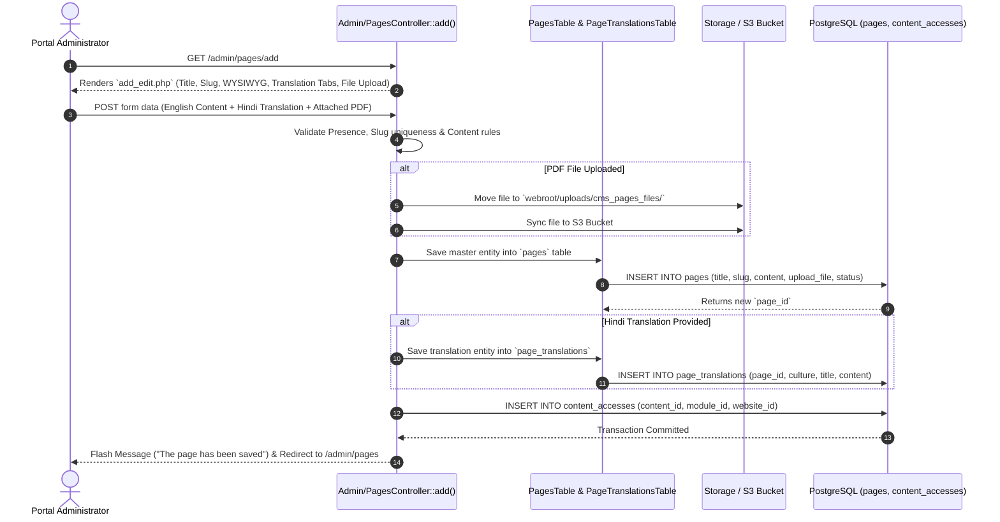
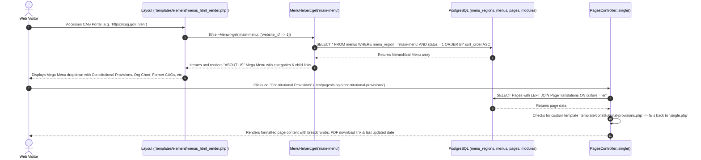
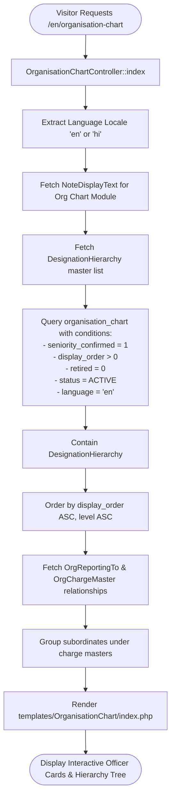

# About Us Module: Complete Architecture, Technical Workflow & DB Specification

This document provides an exhaustive, end-to-end technical reference for the **About Us** module and all its constituent sub-modules across the Comptroller and Auditor General of India (CAG) portal. It details the Admin Panel management, CakePHP 5 backend logic, database tables and schemas, data querying mechanisms, and frontend rendering pipelines.

---

## 1. Executive Summary & Architectural Overview

In the CAG portal ecosystem, **"About Us"** is a composite umbrella module comprising core institutional CMS pages and specialized sub-modules. It is engineered with:
- **Backend Framework:** CakePHP 5 (MVC Architecture) on PHP 8+.
- **Database Engine:** PostgreSQL with relational integrity, JSON-based i18n support, and multi-tenant scoping.
- **Content Tenancy:** Scoped across the National Main Portal (`website_id = 1`) and regional state/department subsites via the `content_accesses` matrix.
- **Multilingual Support:** Native English (`en`) and Hindi (`hi`) dual-publishing with automatic fallback.

```
+---------------------------------------------------------------------------------------------------+
|                                      CAG ADMIN CONTROL PANEL                                      |
+---------------------------------------------------------------------------------------------------+
|                                       ABOUT US SUB-MODULES                                        |
|                                                                                                   |
|  [1. CMS Pages]       [2. Org Chart & Hierarchy]    [3. Former CAGs]     [4. CAG Speeches]        |
|  - Vision / Mission   - Officer Profiles            - Portraits          - Addresses / Keynotes   |
|  - Constitutional     - Hierarchy Tree              - Tenures            - PDF Presentations      |
|  - DPC Act / Mandate  - Subsite Org Structure       - Biographies        - What's New Sync        |
|                                                                                                   |
|  [5. YPP Programme]   [6. Internship Programme]     [7. Rajbhasha Cadre] [8. Board / Committees]  |
|  - Guidelines / Docs  - Student Internships         - Hindi Cadre & Circulars - AAB & GASAB       |
|                                                                                                   |
|  [9. Collaborations]  [10. Welfare Activities]      [11. Admin Info]     [12. Alumni Network]     |
|  - MOUs & Pacts       - Sports / Cultural           - Gradation Lists    - Retired Officers       |
+---------------------------------------------------------------------------------------------------+
                                                  │
                                      CakePHP ORM & Base Table
                                                  │
                                                  ▼
+---------------------------------------------------------------------------------------------------+
|                                       POSTGRESQL DATABASE                                         |
|  [pages] [page_translations] [organisation_chart] [org_charge_master] [org_reporting_to]          |
|  [designation_hierarchy] [former_cag] [speeches] [young_professional_programme]                   |
|  [student_internship_programme] [rajbhasha_cadre] [board_committees] [collaborations] [welfare]   |
|  [administrative_information] [content_accesses] [note_display_text]                              |
+---------------------------------------------------------------------------------------------------+
                                                  │
                                                  ▼
+---------------------------------------------------------------------------------------------------+
|                                         PUBLIC FRONTEND                                           |
|  - Mega Menu Navigation (`templates/element/menus_html_render.php`)                               |
|  - Dynamic Page Router (`PagesController::single` -> `templates/Pages/single.php`)                |
|  - Hierarchy Visualization (`OrganisationChartController` -> `view_hierarchy.php`)                |
|  - Dedicated Module Views (`FormerCag/`, `Speeches/`, `YPP/`, `SIP/`, `Rajbhasha/`, etc.)         |
+---------------------------------------------------------------------------------------------------+
```

---

## 2. Complete Breakdown of About Us Sub-Modules

### 2.1 Sub-Module 1: CMS Institutional Pages
- **Admin Controller:** `src/Controller/Admin/PagesController.php`
- **Public Controller:** `src/Controller/PagesController.php`
- **Tables:** `pages`, `page_translations`, `content_accesses`
- **Purpose:** Governs static institutional knowledge pages:
  1. *Our Vision, Mission & Core Values*
  2. *Constitutional Provisions (Articles 148-151)*
  3. *CAG's (Duties, Powers and Conditions of Service) Act, 1971*
  4. *History of IA&AD*
  5. *Mandate and Legal Framework*
  6. *International Relations & Role in INTOSAI/ASOSAI*
- **Admin Capabilities:** Rich HTML content editor (CKEditor), file attachment upload (`/uploads/cms_pages_files/`), slug generation, SEO metadata, and per-language translation tabs (`PageTranslations`).
- **Frontend URL:** `/{lang}/pages/single/{slug_or_id}` or friendly route `/about-us/{slug}`.

---

### 2.2 Sub-Module 2: Organisation Structure & Hierarchy Chart
- **Admin Controllers:**
  - `src/Controller/Admin/OrganisationChartController.php` (Officer profiles & chart assignments)
  - `src/Controller/Admin/OrgChargeMasterController.php` (Charge/Wing master definitions)
  - `src/Controller/Admin/OrgReportingToController.php` (Supervisor-subordinate reporting matrix)
  - `src/Controller/Admin/SubsiteOrgDesigHierarchyController.php` (Subsite designation ordering)
  - `src/Controller/Admin/SubsitesOrgStructController.php` (Field office structure)
- **Public Controllers:**
  - `src/Controller/OrganisationChartController.php`
  - `src/Controller/SubsitesOrgStructController.php`
- **Tables:** `organisation_chart`, `org_charge_master`, `org_reporting_to`, `designation_hierarchy`, `subsites_org_struct`, `subsite_org_desig_hierarchy`, `note_display_text`
- **Purpose:** Renders the dynamic organizational tree of the CAG Headquarters and regional field offices.
- **Admin Capabilities:**
  - Officer Profile Management: Name prefix, first/middle/last name, cadre, designation, email, office phone, bio, photo upload (`/uploads/cag_emp_profile_pic/`).
  - Seniority & Display Order sequencing (`seniority_confirmed`, `display_order`).
  - Active/Retired status toggle.
  - Interactive reporting tree configuration.
- **Frontend Views:**
  - Directory View: `templates/OrganisationChart/index.php`
  - Interactive Hierarchy View: `templates/OrganisationChart/view_hierarchy.php`
  - Officer Profile Card: `templates/OrganisationChart/officer_profile.php`

---

### 2.3 Sub-Module 3: Former CAGs
- **Admin Controller:** `src/Controller/Admin/FormerCagController.php`
- **Public Controller:** `src/Controller/FormerCagController.php`
- **Table:** `former_cag`
- **Purpose:** Chronicles all past Comptrollers and Auditors General of India since independence (from V. Narahari Rao to immediate predecessor).
- **Admin Capabilities:** Title/Name, tenure dates (`tenure_from`, `tenure_to`), tenure summary text, biographical narrative, portrait upload (`/uploads/former_cag/`).
- **Frontend View:** `templates/FormerCag/index.php` (Chronological cards ordered by `tenure_from DESC`).

---

### 2.4 Sub-Module 4: Speeches of CAG
- **Admin Controller:** `src/Controller/Admin/SpeechesController.php`
- **Public Controller:** `src/Controller/SpeechesController.php`
- **Table:** `speeches`
- **Purpose:** Archives keynote speeches, addresses, and presentations delivered by the CAG at national and international summits.
- **Admin Capabilities:** Speech title, speech date (`speech_date`), transcript description, PDF speech document upload (`/uploads/cag_speeches/`), and What's New integration toggle (`show_in_whats_new`).
- **Frontend View:** `templates/Speeches/index.php` with 5-year active filter and archive toggle (`?arch=1`).

---

### 2.5 Sub-Module 5: Young Professional Programme (YPP)
- **Admin Controller:** `src/Controller/Admin/YoungProfessionalProgrammeController.php`
- **Public Controller:** `src/Controller/YoungProfessionalProgrammeController.php`
- **Table:** `young_professional_programme`
- **Purpose:** Publishes guidelines, eligibility criteria, annual notifications, and application documents for hiring Young Professionals in CAG.
- **Admin Capabilities:** Title, body text, date of issue (`date_of_issue`), document file upload (`/uploads/young_professional_programme/`), What's New toggle.
- **Frontend View:** `templates/YoungProfessionalProgramme/index.php` with keyword search and 5-year archive filter.

---

### 2.6 Sub-Module 6: Student Internship Programme (SIP)
- **Admin Controller:** `src/Controller/Admin/StudentInternshipProgrammeController.php`
- **Public Controller:** `src/Controller/StudentInternshipProgrammeController.php`
- **Table:** `student_internship_programme`
- **Purpose:** Manages internship schemes for postgraduate students in law, economics, public policy, and computer science.
- **Admin Capabilities:** Scheme descriptions, notification date, PDF guidelines/application uploads, status toggles.
- **Frontend View:** `templates/StudentInternshipProgramme/index.php`.

---

### 2.7 Sub-Module 7: Rajbhasha Cadre
- **Admin Controller:** `src/Controller/Admin/RajbhashaCadreController.php`
- **Public Controller:** `src/Controller/RajbhashaCadreController.php`
- **Table:** `rajbhasha_cadre`
- **Purpose:** Publishes Official Language policy compliance, Hindi magazine/circular releases, and cadre allocation lists.
- **Admin Capabilities:** Title, file title, document upload, language selector, multi-site content access.
- **Frontend View:** `templates/RajbhashaCadre/index.php`.

---

### 2.8 Sub-Module 8: Board / Committees (AAB & GASAB)
- **Admin Controller:** `src/Controller/Admin/BoardCommitteesController.php`
- **Public Controller:** `src/Controller/BoardCommitteesController.php`
- **Table:** `board_committees`
- **Purpose:** Showcases specialized governance bodies including the Audit Advisory Board (AAB) and Governmental Accounting Standards Advisory Board (GASAB).
- **Admin Capabilities:** Committee name, meeting date, member list, composition, file attachments, external links, display order.
- **Frontend View:** `templates/BoardCommittees/index.php`.

---

### 2.9 Sub-Module 9: Collaborations & MOUs
- **Admin Controller:** `src/Controller/Admin/CollaborationsController.php`
- **Public Controller:** `src/Controller/CollaborationsController.php`
- **Table:** `collaborations`
- **Purpose:** Catalogs bilateral agreements with foreign Supreme Audit Institutions (SAIs) and academic collaborations (e.g., IITs, IIMs).
- **Admin Capabilities:** Partner organization, MOU title, signing date, document upload.
- **Frontend View:** `templates/Collaborations/index.php`.

---

### 2.10 Sub-Module 10: Welfare Activities
- **Admin Controller:** `src/Controller/Admin/WelfareController.php`
- **Public Controller:** `src/Controller/WelfareController.php`
- **Table:** `welfare`
- **Purpose:** Disseminates staff welfare policies, sports & cultural events, and employee grievance redressal mechanisms.
- **Admin Capabilities:** Activity title, description, event date, circular upload.
- **Frontend View:** `templates/Welfare/index.php`.

---

### 2.11 Sub-Module 11: Administrative Information
- **Admin Controller:** `src/Controller/Admin/AdministrativeInformationController.php`
- **Public Controller:** `src/Controller/AdministrativeInformationController.php`
- **Table:** `administrative_information`
- **Purpose:** Publishes sanctioned staff positions, gradation lists, and administrative orders.
- **Admin Capabilities:** Title, file attachment, language selection, display order.
- **Frontend View:** `templates/AdministrativeInformation/index.php`.

---

## 3. Database Schema & Entity Relationships

### 3.1 Entity Relationship Diagram (ERD)

```mermaid
erDiagram
    WEBSITES ||--o{ CONTENT_ACCESSES : "scopes content"
    MODULES ||--o{ CONTENT_ACCESSES : "module_id"
    
    PAGES ||--o{ PAGE_TRANSLATIONS : "has translations (page_id)"
    PAGES ||--o{ CONTENT_ACCESSES : "content_id"
    
    ORGANISATION_CHART }|--|| DESIGNATION_HIERARCHY : "belongs to (designation_id)"
    ORGANISATION_CHART ||--o{ ORG_REPORTING_TO : "reports to relation"
    ORG_CHARGE_MASTER ||--o{ ORG_REPORTING_TO : "charge binding"
    
    FORMER_CAG {
        int id PK
        string title
        string language
        string image
        string tenure
        date tenure_from
        date tenure_to
        text description
        int status
        datetime created
        datetime modified
    }

    PAGES {
        int id PK
        string title
        string slug UK
        string excerpt
        text content
        string file_title
        string upload_file
        int is_home
        int status
        datetime created_at
        datetime modified_at
        int created_by
        int updated_by
    }

    PAGE_TRANSLATIONS {
        int id PK
        int page_id FK
        string culture
        string title
        string excerpt
        text content
        string file_title
        string upload_file
        datetime created_at
        datetime modified_at
    }

    ORGANISATION_CHART {
        int id PK
        string language
        string prefix_name
        string first_name
        string middle_name
        string last_name
        string full_name
        int designation_id FK
        string email
        string office_phone
        string profile_image
        int seniority_confirmed
        int display_order
        int retired
        int status
        datetime created_at
        datetime modified_at
    }

    DESIGNATION_HIERARCHY {
        int id PK
        json title
        int level
        int status
        int display_order
    }

    SPEECHES {
        int id PK
        string title
        string language
        text description
        string cag_speech_title
        string cag_speech
        date speech_date
        int show_in_whats_new
        int status
        datetime created_at
        datetime updated_at
    }

    YOUNG_PROFESSIONAL_PROGRAMME {
        int id PK
        string title
        string language
        text body
        string file_title
        string document
        date date_of_issue
        int show_in_whats_new
        int status
        datetime created_at
        datetime updated_at
    }

    STUDENT_INTERNSHIP_PROGRAMME {
        int id PK
        string title
        string language
        text body
        string file_title
        string document
        date date_of_issue
        int show_in_whats_new
        int status
        datetime created_at
        datetime updated_at
    }

    RAJBHASHA_CADRE {
        int id PK
        string title
        string language
        string file_title
        string upload_file
        int status
        datetime created_at
    }

    BOARD_COMMITTEES {
        int id PK
        string name
        string language
        string content_type
        date date
        string file_title
        string uploads
        string link
        int display_order
        int status
        datetime created_at
    }

    CONTENT_ACCESSES {
        int id PK
        int content_id
        int module_id FK
        int website_id FK
    }
```



---

### 3.2 Database Table Dictionary & Field Specifications

#### 1. `pages` & `page_translations` Tables
| Table | Column | Type | Nullable | Key / Constraint | Description |
| :--- | :--- | :--- | :--- | :--- | :--- |
| `pages` | `id` | `INTEGER` (SERIAL) | No | **PK** | Primary page identifier. |
| `pages` | `slug` | `VARCHAR(255)` | No | **UNIQUE** | URL slug (e.g. `constitutional-provisions`, `cags-dpc-act`). |
| `pages` | `title` | `VARCHAR(65535)` | No | - | Default English title. |
| `pages` | `content` | `TEXT` | No | - | Default HTML content formatted from WYSIWYG editor. |
| `pages` | `upload_file` | `VARCHAR(255)` | Yes | - | Attached PDF filename in `uploads/cms_pages_files/`. |
| `pages` | `is_home` | `SMALLINT` | No | Default `0` | Home page toggle flag. |
| `pages` | `status` | `SMALLINT` | No | Default `1` | Publish status (`1` = Published, `0` = Draft). |
| `page_translations` | `page_id` | `INTEGER` | No | **FK -> pages(id)** | Associated master page record. |
| `page_translations` | `culture` | `VARCHAR(5)` | No | - | Language code (e.g. `hi`). |
| `page_translations` | `title` | `VARCHAR(65535)` | Yes | - | Translated title in Hindi. |
| `page_translations` | `content` | `TEXT` | Yes | - | Translated HTML content in Hindi. |

---

#### 2. `organisation_chart` Table
| Column | Type | Nullable | Key / Constraint | Description |
| :--- | :--- | :--- | :--- | :--- |
| `id` | `INTEGER` (SERIAL) | No | **PK** | Unique officer profile ID. |
| `prefix_name` | `VARCHAR(50)` | Yes | - | Title prefix (e.g., Shri, Smt, Dr.). |
| `first_name` | `VARCHAR(100)` | No | - | Officer first name. |
| `last_name` | `VARCHAR(100)` | Yes | - | Officer last name. |
| `designation_id` | `INTEGER` | No | **FK -> designation_hierarchy(id)** | Functional designation level. |
| `email` | `VARCHAR(255)` | Yes | - | Official email address. |
| `office_phone` | `VARCHAR(50)` | Yes | - | Official EPABX / Direct telephone. |
| `profile_image` | `VARCHAR(255)` | Yes | - | Profile photograph (`uploads/cag_emp_profile_pic/`). |
| `seniority_confirmed`| `SMALLINT` | No | Default `1` | Seniority approval indicator for chart rendering. |
| `display_order` | `INTEGER` | No | Default `0` | Sequence order within designation level. |
| `retired` | `SMALLINT` | No | Default `0` | Retirement status flag (`0` = Serving, `1` = Retired). |
| `status` | `SMALLINT` | No | Default `1` | Active status. |

---

#### 3. `former_cag` Table
| Column | Type | Nullable | Key / Constraint | Description |
| :--- | :--- | :--- | :--- | :--- |
| `id` | `INTEGER` (SERIAL) | No | **PK** | Unique identifier. |
| `title` | `VARCHAR(255)` | No | - | Name of the Former CAG. |
| `language` | `VARCHAR(5)` | No | - | Language locale (`en`, `hi`). |
| `image` | `VARCHAR(255)` | Yes | - | Official portrait photo in `uploads/former_cag/`. |
| `tenure` | `VARCHAR(100)` | Yes | - | Formatted tenure text (e.g. `1948 - 1954`). |
| `tenure_from` | `DATE` | No | - | Exact start date of term (used for ordering `DESC`). |
| `tenure_to` | `DATE` | No | - | Exact end date of term. |
| `description` | `TEXT` | Yes | - | Biographical overview and key achievements. |
| `status` | `SMALLINT` | No | Default `1` | Visibility toggle. |

---

#### 4. `speeches` Table
| Column | Type | Nullable | Key / Constraint | Description |
| :--- | :--- | :--- | :--- | :--- |
| `id` | `INTEGER` (SERIAL) | No | **PK** | Unique speech record ID. |
| `title` | `VARCHAR(500)` | No | - | Speech event title. |
| `language` | `VARCHAR(5)` | No | - | Language locale. |
| `speech_date` | `DATE` | No | - | Date when the speech was delivered. |
| `cag_speech` | `VARCHAR(255)` | Yes | - | Attached PDF file in `uploads/cag_speeches/`. |
| `description` | `TEXT` | Yes | - | Speech transcript / summary. |
| `show_in_whats_new` | `SMALLINT` | No | Default `0` | Automatically syndicates to homepage ticker if `1`. |
| `status` | `SMALLINT` | No | Default `1` | Published status. |

---

#### 5. `young_professional_programme` & `student_internship_programme` Tables
| Column | Type | Nullable | Key / Constraint | Description |
| :--- | :--- | :--- | :--- | :--- |
| `id` | `INTEGER` (SERIAL) | No | **PK** | Primary key. |
| `title` | `VARCHAR(500)` | No | - | Scheme notification headline. |
| `language` | `VARCHAR(5)` | No | - | Language locale (`en`, `hi`). |
| `body` | `TEXT` | Yes | - | Detailed terms, eligibility, and instructions. |
| `document` | `VARCHAR(255)` | Yes | - | Uploaded PDF document/proforma. |
| `date_of_issue` | `DATE` | No | - | Notification release date. |
| `show_in_whats_new` | `SMALLINT` | No | Default `0` | Ticker syndication flag. |
| `status` | `SMALLINT` | No | Default `1` | Active status. |

---

## 4. End-to-End Execution Workflows

### 4.1 Workflow A: Admin Publishing & Multi-Language CMS Page Creation



---

### 4.2 Workflow B: Frontend Public Navigation & Mega Menu Resolution



---

### 4.3 Workflow C: Dynamic Organisation Chart Data Fetching



---

## 5. Where & How About Us Reflects in the Frontend

| Sub-Module / Page | Frontend Route & URL | View Template Location | Frontend Presentation & UI Elements |
| :--- | :--- | :--- | :--- |
| **Mega Menu Header** | Global across all pages | `templates/element/menus_html_render.php` | Top navigation dropdown listing all About Us categories and links. |
| **Vision, Mission & Core Values** | `/en/pages/single/our-vision-mission-and-core-values` | `templates/Pages/single.php` or `template/our-vision...` | Rich content, iconographic value cards, bilingual text. |
| **Constitutional Provisions** | `/en/pages/single/constitutional-provisions` | `templates/Pages/single.php` | Articles 148, 149, 150, 151 tabs, downloadable Gazette PDF. |
| **CAG's DPC Act, 1971** | `/en/pages/single/cags-dpc-act-1971` | `templates/Pages/single.php` | Legal sections, amendments history, downloadable Act PDF. |
| **History of IA&AD** | `/en/history` or `/en/pages/single/history` | `templates/Pages/single.php` | Historical timeline starting from 1858 (Lord Canning era). |
| **Organisation Structure** | `/en/organisation-chart` | `templates/OrganisationChart/index.php` | Interactive grid of officers with photos, charges, phone, email. |
| **Hierarchy Chart** | `/en/organisation-chart/view-hierarchy` | `templates/OrganisationChart/view_hierarchy.php` | Graphical tree diagram showing hierarchical reporting flow. |
| **Officer Profile Card** | `/en/organisation-chart/officer-profile/{id}` | `templates/OrganisationChart/officer_profile.php` | Modal / standalone profile with officer biography and portfolio. |
| **Former CAGs** | `/en/former-cag` | `templates/FormerCag/index.php` | Grid of portraits, tenure badges (From - To), and biographies. |
| **Speeches of CAG** | `/en/speeches` | `templates/Speeches/index.php` | Table/Cards with date, title, summary transcript, and PDF link. |
| **Young Professional Programme**| `/en/young-professional-programme` | `templates/YoungProfessionalProgramme/index.php` | Notification list with PDF download button and 5-year archive filter. |
| **Student Internship Programme**| `/en/student-internship-programme` | `templates/StudentInternshipProgramme/index.php` | Internship announcements, eligibility, proforma download. |
| **Rajbhasha Cadre** | `/en/rajbhasha-cadre` | `templates/RajbhashaCadre/index.php` | Official language circulars, cadre allocation documents. |
| **Board / Committees** | `/en/board-committees` | `templates/BoardCommittees/index.php` | List of AAB and GASAB committees, members, and minutes. |
| **Collaborations / MOUs** | `/en/collaborations` | `templates/Collaborations/index.php` | International & national MOU registry with document downloads. |
| **Welfare** | `/en/welfare` | `templates/Welfare/index.php` | Welfare officer contacts, sports and cultural event updates. |

---

## 6. Summary Checklist of Backend & Frontend Files

### Backend Admin Controllers:
- [`PagesController.php`](file:///c:/Users/yokes/OneDrive/Desktop/new%20Analysis/CAG_Website_Test/src/Controller/Admin/PagesController.php)
- [`OrganisationChartController.php`](file:///c:/Users/yokes/OneDrive/Desktop/new%20Analysis/CAG_Website_Test/src/Controller/Admin/OrganisationChartController.php)
- [`FormerCagController.php`](file:///c:/Users/yokes/OneDrive/Desktop/new%20Analysis/CAG_Website_Test/src/Controller/Admin/FormerCagController.php)
- [`SpeechesController.php`](file:///c:/Users/yokes/OneDrive/Desktop/new%20Analysis/CAG_Website_Test/src/Controller/Admin/SpeechesController.php)
- [`YoungProfessionalProgrammeController.php`](file:///c:/Users/yokes/OneDrive/Desktop/new%20Analysis/CAG_Website_Test/src/Controller/Admin/YoungProfessionalProgrammeController.php)
- [`StudentInternshipProgrammeController.php`](file:///c:/Users/yokes/OneDrive/Desktop/new%20Analysis/CAG_Website_Test/src/Controller/Admin/StudentInternshipProgrammeController.php)
- [`RajbhashaCadreController.php`](file:///c:/Users/yokes/OneDrive/Desktop/new%20Analysis/CAG_Website_Test/src/Controller/Admin/RajbhashaCadreController.php)
- [`BoardCommitteesController.php`](file:///c:/Users/yokes/OneDrive/Desktop/new%20Analysis/CAG_Website_Test/src/Controller/Admin/BoardCommitteesController.php)
- [`CollaborationsController.php`](file:///c:/Users/yokes/OneDrive/Desktop/new%20Analysis/CAG_Website_Test/src/Controller/Admin/CollaborationsController.php)
- [`WelfareController.php`](file:///c:/Users/yokes/OneDrive/Desktop/new%20Analysis/CAG_Website_Test/src/Controller/Admin/WelfareController.php)
- [`AdministrativeInformationController.php`](file:///c:/Users/yokes/OneDrive/Desktop/new%20Analysis/CAG_Website_Test/src/Controller/Admin/AdministrativeInformationController.php)

### Public Frontend Controllers:
- [`PagesController.php`](file:///c:/Users/yokes/OneDrive/Desktop/new%20Analysis/CAG_Website_Test/src/Controller/PagesController.php)
- [`OrganisationChartController.php`](file:///c:/Users/yokes/OneDrive/Desktop/new%20Analysis/CAG_Website_Test/src/Controller/OrganisationChartController.php)
- [`FormerCagController.php`](file:///c:/Users/yokes/OneDrive/Desktop/new%20Analysis/CAG_Website_Test/src/Controller/FormerCagController.php)
- [`SpeechesController.php`](file:///c:/Users/yokes/OneDrive/Desktop/new%20Analysis/CAG_Website_Test/src/Controller/SpeechesController.php)
- [`YoungProfessionalProgrammeController.php`](file:///c:/Users/yokes/OneDrive/Desktop/new%20Analysis/CAG_Website_Test/src/Controller/YoungProfessionalProgrammeController.php)
- [`StudentInternshipProgrammeController.php`](file:///c:/Users/yokes/OneDrive/Desktop/new%20Analysis/CAG_Website_Test/src/Controller/StudentInternshipProgrammeController.php)
- [`RajbhashaCadreController.php`](file:///c:/Users/yokes/OneDrive/Desktop/new%20Analysis/CAG_Website_Test/src/Controller/RajbhashaCadreController.php)
- [`BoardCommitteesController.php`](file:///c:/Users/yokes/OneDrive/Desktop/new%20Analysis/CAG_Website_Test/src/Controller/BoardCommitteesController.php)
- [`CollaborationsController.php`](file:///c:/Users/yokes/OneDrive/Desktop/new%20Analysis/CAG_Website_Test/src/Controller/CollaborationsController.php)
- [`WelfareController.php`](file:///c:/Users/yokes/OneDrive/Desktop/new%20Analysis/CAG_Website_Test/src/Controller/WelfareController.php)
- [`AdministrativeInformationController.php`](file:///c:/Users/yokes/OneDrive/Desktop/new%20Analysis/CAG_Website_Test/src/Controller/AdministrativeInformationController.php)

### Public Frontend Templates & Elements:
- Mega Menu Render: [`menus_html_render.php`](file:///c:/Users/yokes/OneDrive/Desktop/new%20Analysis/CAG_Website_Test/templates/element/menus_html_render.php)
- Menu Helper: [`MenuHelper.php`](file:///c:/Users/yokes/OneDrive/Desktop/new%20Analysis/CAG_Website_Test/src/View/Helper/MenuHelper.php)
