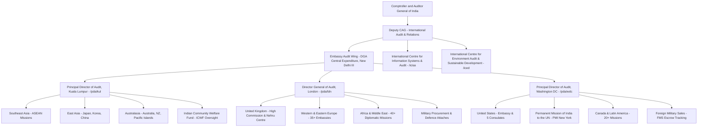
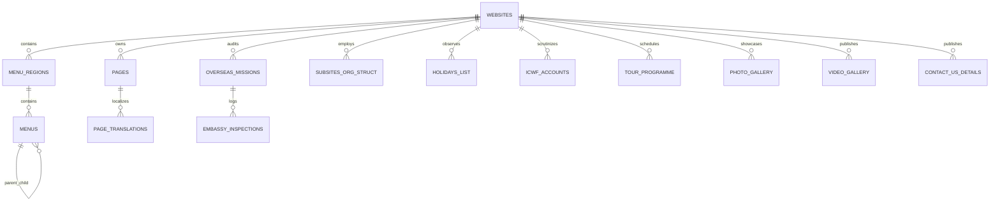

# CAG Overseas Audit Field Offices (KUL, LDN, WDC Themes) — Master Technical Architecture & Complete Field Office Specification (`oversea.md`)

> **Document Version**: 5.0.0 (Enterprise Production Architecture Blueprint)  
> **Target Domain**: Comptroller and Auditor General of India (CAG) — Overseas Audit Offices (`themes = 'KUL', 'LDN', 'WDC'`, `department_id IN (12, 13)`)  
> **Primary Anchor Sub-Site**: Office of the Principal Director of Audit, Kuala Lumpur (`/pda/kul/en`)  
> **Global Directorate Scope**: Complete Technical Specifications for Overseas Audit Directorates in Kuala Lumpur (Southeast Asia & Asia-Pacific), London (Europe & Africa), Washington DC (Americas & UN Missions), and Premier International Centres (iCISA & iCED)  
> **Target Tech Stack**: FastAPI (Python 3.11+ / AsyncPG / SQLAlchemy 2.0 / Pydantic v2) + Next.js 14+ (App Router / TypeScript / React Query / Vanilla CSS) + PostgreSQL 15+ + AWS S3 / CloudFront  
> **Architecture Coverage**: Constitutional Foreign Service Audit Mandates (Articles 148, 149, 151), Diplomatic Mission Audit Jurisdiction across 180+ Countries, Indian Community Welfare Fund (ICWF) Auditing, Chancery Property Asset Appraisals, Consular Revenue Remittance Controls, 16 Reusable Component Classifications, Granular Hyperlinks & S3 Document Paths, Dynamic Catch-All Slug Routing (`page-pda-kul-*`), Context Length & Token Budgets, Full Database Schema (DDL + Constraints), Async API Contracts, and Frontend Implementation Blueprints.

---

## 1. Master System Architecture & Global Diplomatic Audit Framework

### 1.1 Constitutional Mandate & International Audit Jurisdiction
Under Articles 148, 149, and 151 of the Constitution of India, read with Sections 13, 14, 15, and 19 of the CAG's (Duties, Powers and Conditions of Service) Act, 1971 (DPC Act), the Comptroller and Auditor General of India is the supreme constitutional auditor of all transactions of the Government of India abroad. This includes all expenditure incurred by Indian Embassies, High Commissions, Consulates General, Permanent Missions to international bodies (such as the United Nations), military and trade attaches, and specialized overseas representations under the Ministry of External Affairs (MEA), Ministry of Commerce, and Ministry of Defence.



---

### 1.2 The Tri-Regional Overseas Audit Model
The global operational network is partitioned into three regional audit commands:

| Command Headquarters | Primary Theme | Operational `department_id` | Regional Jurisdiction & Country Coverage | Core Specialized Operational Cells |
| :--- | :--- | :--- | :--- | :--- |
| **Kuala Lumpur (PDA - KUL)** | `KUL` | `13` | Southeast Asia, East Asia, Australasia & Pacific Islands (50+ Missions) | Act East Grants, ASEAN Aid Projects, ICWF Emergency Distress Funds, Asia Consular Gateways |
| **London (DGA - LDN)** | `LDN` | `12` | United Kingdom, Western/Eastern Europe, Russia, Africa, Middle East (95+ Missions) | Historic India House Estate, European Defence Procurements, Strategic Spares Supply Chains |
| **Washington DC (PDA - WDC)** | `WDC` | `13` | North America, Central & South America, Caribbean, UN Missions (65+ Missions) | UN Peacekeeping Reimbursements, Foreign Military Sales (FMS), IMF/World Bank Directorates |
| **New Delhi III (Central Nodal)** | `CEN` | `8` | Domestic Central Coordination & Consolidation at DGACR, New Delhi | MEA Headquarters Audit, Foreign Service Cadre, Vetting of Union Diplomatic Audit Reports |

---

### 1.3 Key Specialized Operational Domains in Overseas Audit

1. **Indian Community Welfare Fund (ICWF)**:
   - Statutory scrutiny of funds collected via consular surcharges on passports, visas, and consular services.
   - Audit verification of emergency medical assistance, repatriation of distressed Indian nationals, legal aid, and mortal remains transport.
2. **Diplomatic Estate & Chancery Real Estate Auditing**:
   - Capital expenditure audits on acquisition, construction, major renovation, and long-term leasing of Chancery buildings, Ambassador residences, and staff quarters across world capitals.
   - Lease vs. purchase economic appraisals and foreign currency mortgage evaluations.
3. **Consular Revenue Accounting & Remittance Controls**:
   - Tracking daily fee collections for Passport, Visa, OCI (Overseas Citizen of India), and Attestation services through outsourced service providers (e.g. VFS Global).
   - Real-time reconciliation between mission point-of-sale collections, local bank deposits, and electronic remittances into the Government of India Consolidated Fund via the MEA Central Gateway.
4. **Foreign Military Sales (FMS) & Defence Attache Procurements**:
   - Audit verification of government-to-government procurement accounts (e.g. US Department of Defense FMS cases).
   - Scrutiny of escrow account advances, administrative fee percentages, billing statements, and delivery schedules for strategic equipment.
5. **International Organization Subscriptions & Grant-in-Aid**:
   - Statutory audit of assessed and voluntary financial contributions to the United Nations, Commonwealth Secretariat, SAARC, ASEAN Development Fund, and bilateral development assistance grants.

---

## 2. Universal Routing Engine & 16 UI Component Specifications

### 2.1 Reusable UI Component Classification (C1 – C16)

The Overseas Audit (`KUL`, `LDN`, `WDC`) web platform is built with 16 modular UI components:

| Sl | Component Name | UI Role & Function | Key Props & Inputs | Target Overseas Audit Pages |
| :--- | :--- | :--- | :--- | :--- |
| **C1** | `DataTable` | High-density sortable, paginated data grid with keyword search and CSV/PDF export. | `columns`, `data`, `totalCount`, `page`, `pageSize`, `onSort`, `onExport` | List of PDs, List of Directors, Sanctioned Strength & Staff Details |
| **C2** | `ContentArticle` | Standard editorial article with font size toggles, print stylesheet, breadcrumb navigation, and sidebar index. | `title`, `contentHtml`, `publishedAt`, `updatedAt`, `attachments` | Brief History, Vision & Mission, Administrative Functions, Audit Process |
| **C3** | `AuditReportViewer` | Specialized multi-volume Union Audit Report reader with volume picker and chapter list. | `reportId`, `year`, `title`, `volumes`, `selectedVolume`, `chapters`, `pdfUrl` | MEA & Overseas Diplomatic Audit Reports |
| **C4** | `TourProgramCalendar` | Foreign inspection inspection calendar showing audit party number, host mission, dates, and supervising officer. | `tourData: Array<{mission, country, partyNo, fromDate, toDate, officer}>` | Annual Overseas Audit Inspection Programme |
| **C5** | `CardGrid` | Multi-column responsive card container with icons, category tags, timestamps, and action buttons. | `cards: Array<{title, description, icon, href, tag, badge}>` | About Us Landing, Functions Overview, Auditee Jurisdiction Portal |
| **C6** | `AccordionList` | Expandable disclosure panels supporting country-by-country auditee clusters and FAQs. | `items: Array<{id, title, content, badge}>`, `allowMultiple: boolean` | Audit Jurisdiction by Country, Consular Service FAQs |
| **C7** | `DocumentListing` | Chronological file list showing title, issue date, category badge, file format, and size with download trigger. | `documents: Array<{id, title, date, catTitle, fileSize, downloadUrl}>` | Administrative Circulars, Consular Guidelines, Audit Manuals |
| **C8** | `StatsGrid` | Highlight metric banner with animated KPI counters and progress indicators. | `stats: Array<{label, value, prefix, suffix, icon}>` | Sub-site Homepage KPIs (Missions Audited, Countries Covered, ICWF Paras) |
| **C9** | `TabbedInterface` | Dynamic tab bar switching between distinct functional datasets without route transitions. | `tabs: Array<{id, label, icon, contentComponent}>`, `activeTab` | Regional Missions (Southeast Asia vs East Asia vs Australasia) |
| **C10** | `FilterableListing` | Dual-column layout: faceted filter sidebar (Year, Mission, Country) + main card results stream. | `filters`, `selectedFilters`, `onFilterChange`, `totalResults`, `items` | Overseas Audit Inspection Findings, Archive Reports |
| **C11** | `MediaGallery` | Responsive media grid featuring lightbox image viewer and embedded video player. | `mediaItems: Array<{id, type, title, url, thumbnailUrl, eventDate}>` | Photo Gallery, Video Gallery, Bilateral Conferences, Audit Day Events |
| **C12** | `ContactDirectory` | Tabular contact list detailing Officer Name, Designation, Diplomatic Intercom, Email, and Location. | `contacts: Array<{name, designation, phone, email, chanceryLocation}>` | Contact Us Directory, Diplomatic Mission Address Book |
| **C13** | `BreadcrumbNav` | Accessible structured breadcrumb trail with Schema.org JSON-LD microdata for SEO. | `crumbs: Array<{label, href, isCurrent}>` | Universal Top Header in all sub-pages |
| **C14** | `PdfViewerModal` | In-browser PDF preview dialog with download fallback, page controls, and fullscreen toggle. | `pdfUrl`, `pdfTitle`, `isOpen`, `onClose` | In-browser preview for Gazette Notifications, Holiday Lists, Guidelines |
| **C15** | `ExternalRedirectNotice` | Interstitial security warning modal notifying user when leaving the `.gov.in` domain. | `targetUrl`, `isOpen`, `onConfirm`, `onCancel` | External links to High Commission portals, MEA, INTOSAI, ASOSAI |
| **C16** | `PaginationBar` | Accessible pagination controls with page jumpers, total record counters, and size selectors. | `currentPage`, `totalPages`, `pageSize`, `totalItems`, `onPageChange` | Universal footer in all list/table pages |

---

### 2.2 Baseline Page Performance & Context Length Budgets

| Page Category Archetype | Typical Word Count | Estimated Token Count (cl100k) | JSON API Payload (KB) | DOM Node Complexity | Cache Strategy & TTL | Target FCP / LCP |
| :--- | :--- | :--- | :--- | :--- | :--- | :--- |
| **A. Overseas Sub-Site Homepage** | 1,400 – 1,950 words | 2,200 – 3,100 tokens | 28 – 48 KB | 380 – 560 nodes | ISR (Revalidate: 300s) | FCP < 0.8s, LCP < 1.5s |
| **B. Audit Jurisdiction & Mission Map** | 1,600 – 2,800 words | 2,500 – 4,200 tokens | 34 – 68 KB | 280 – 460 nodes | ISR (Revalidate: 86400s) | FCP < 0.7s, LCP < 1.4s |
| **C. Diplomatic Staff & Org Structure**| 900 – 1,700 words | 1,400 – 2,700 tokens | 22 – 44 KB | 240 – 380 nodes | ISR (Revalidate: 3600s) | FCP < 0.6s, LCP < 1.2s |
| **D. Dynamic CMS Article / History** | 750 – 1,800 words | 1,200 – 2,800 tokens | 12 – 26 KB | 130 – 240 nodes | ISR (Revalidate: 86400s) | FCP < 0.6s, LCP < 1.2s |
| **E. Diplomatic Holiday Calendar** | 500 – 950 words | 850 – 1,550 tokens | 16 – 32 KB | 180 – 280 nodes | ISR (Revalidate: 86400s) | FCP < 0.6s, LCP < 1.2s |
| **F. Photo / Video Gallery** | 350 – 650 words | 600 – 1,150 tokens | 42 – 88 KB | 310 – 520 nodes | ISR (Revalidate: 7200s) | FCP < 0.7s, LCP < 1.3s |
| **G. Contact Us & Mission Locator** | 700 – 1,350 words | 1,150 – 2,200 tokens | 16 – 32 KB | 220 – 360 nodes | ISR (Revalidate: 86400s) | FCP < 0.6s, LCP < 1.2s |

---
## 3. Comprehensive Directorate-by-Directorate Menu Trees, Hyperlinks, Data Fetching & Context Length Specifications

This section provides the exhaustive, granular specification for all Overseas Audit Directorates and Premier International Centres of the CAG of India.


### 3.1 Kuala Lumpur (PDA - KUL) Technical Architecture Specification

#### 3.1.1 Sub-Site Overview & Diplomatic Jurisdiction Profile

| Property | Operational Value |
| :--- | :--- |
| **Sub-Site Title** | Principal Director of Audit, Kuala Lumpur |
| **Official URL Route** | `https://cag.gov.in/pda/kul/en` |
| **Tenancy Scope (`website_id`)** | `144` (PostgreSQL `public.websites.id = 144`) |
| **Department Identifier (`department_id`)** | `13` (Overseas Foreign Service Audit Cadre) |
| **Audit Theme Identifier** | `KUL` (`plugins/Themes/KUL/`) |
| **Headquarters & International Location** | High Commission of India, Level 28, Menara 1 Mon't Kiara, No. 1, Jalan Kiara, Mont Kiara, 50480 Kuala Lumpur, Malaysia |
| **Diplomatic Telephony & Contact** | Phone: `+60-3-6205 2340 / 2341` \| Email: `pdakul@cag.gov.in` |
| **Directorate Leadership Structure** | Principal Director of Audit (PDA), Director of Audit, Senior Audit Officers (Foreign Inspection Teams), Assistant Audit Officers |
| **Audit Jurisdiction Scope** | 50+ Indian Diplomatic Missions, Consulates General, and Assistant High Commissions across Southeast Asia, East Asia, Australasia, and the Pacific Islands |
| **Accredited Sovereign Countries** | Malaysia, Singapore, Indonesia, Thailand, Vietnam, Philippines, Myanmar, Cambodia, Laos, Brunei, Japan, South Korea, China, Australia, New Zealand, Fiji, Papua New Guinea |
| **Specialized Operational Cells** | Act East Strategic Development Grants Audit, Commercial & Trade Representative Offices, Indian Community Welfare Fund (ICWF) Oversight, ASEAN Bilateral Aid |
| **Total Auditee Units in Purview** | 54 Diplomatic Missions & Specialized Overseas Offices |
| **Tabled Audit Products & Reports** | Overseas Diplomatic Missions Audit Observations (contributed to Union Civil Audit Reports - MEA) |
| **Parliamentary PAC & External Review** | Parliamentary Public Accounts Committee (PAC) examination of Ministry of External Affairs foreign service expenditure |
| **Multilingual Support** | English & Hindi (Bilingual Overseas Portal) |
| **Overseas Audit Peculiarities** | ICWF emergency distress expenditure audits, Chancery & Embassy property lease vs acquisition evaluation, Consular visa/passport revenue remittance reconciliation |

#### 3.1.2 Complete Hierarchical Menu Tree & Hyperlink Structure

```text
Kuala Lumpur (PDA - KUL) — Principal Director of Audit, Kuala Lumpur
├── Home
│   └── https://cag.gov.in/pda/kul/en
├── About Us
│   ├── Our Vision, Mission and Core Values
│   │   └── https://cag.gov.in/pda/kul/en/page-pda-kul-our-vision-mission-and-core-values
│   ├── Brief History of the Office
│   │   └── https://cag.gov.in/pda/kul/en/page-pda-kul-about-us
│   ├── List of PDs / Heads of Department
│   │   └── https://cag.gov.in/pda/kul/en/page-pda-kul-list-of-pds
│   └── List of Directors
│       └── https://cag.gov.in/pda/kul/en/page-pda-kul-list-of-directors
├── Organizational Structure
│   ├── Organizational Structure
│   │   └── https://cag.gov.in/pda/kul/en/page-pda-kul-organization-structure-and-sanctioned-strength
│   └── Staff Details
│       └── https://cag.gov.in/pda/kul/en/page-pda-kul-staff-details
├── Audit Functions
│   ├── Audit Jurisdiction
│   │   └── https://cag.gov.in/pda/kul/en/page-pda-kul-audit-jurisdiction
│   ├── Administrative Functions
│   │   └── https://cag.gov.in/pda/kul/en/page-pda-kul-administrative-functions
│   └── Audit Process
│       └── https://cag.gov.in/pda/kul/en/page-pda-kul-audit-process
├── Gallery
│   ├── Photo Gallery
│   │   └── https://cag.gov.in/pda/kul/en/photo-gallery
│   └── Video Gallery
│       └── https://cag.gov.in/pda/kul/en/video-gallery
├── List Of Holidays
│   └── https://cag.gov.in/pda/kul/en/page-pda-kul-list-of-holidays
└── Contact Us
    └── https://cag.gov.in/pda/kul/en/page-pda-kul-contact-us
```

#### 3.1.3 Granular Route Specifications, Components, Endpoints & Context Length Matrix

| Menu Hierarchy Node | Public Route URL | UI Component Code | Backend API Endpoint | PostgreSQL DB Tables & Condition | Word Count | Token Est. | JSON Payload (KB) | DOM Nodes | Cache TTL Strategy |
| :--- | :--- | :--- | :--- | :--- | :--- | :--- | :--- | :--- | :--- |
| Home | `/pda/kul/en` | StatsGrid (C8) + CardGrid (C5) | `/api/v1/subsites/pda-kul/home` | `websites, pages (website_id=144, is_home=1)` | 1,650 | 2,600 | 36.5 | 460 | ISR (300s) |
| About Us > Vision, Mission & Values | `/pda/kul/en/page-pda-kul-our-vision-mission-and-core-values` | ContentArticle (C2) | `/api/v1/subsites/pda-kul/pages/page-pda-kul-our-vision-mission-and-core-values` | `pages (slug='page-pda-kul-our-vision-mission-and-core-values', website_id=144)` | 920 | 1,520 | 15.0 | 145 | ISR (86400s) |
| About Us > Brief History of the Office | `/pda/kul/en/page-pda-kul-about-us` | ContentArticle (C2) | `/api/v1/subsites/pda-kul/pages/page-pda-kul-about-us` | `pages (slug='page-pda-kul-about-us', website_id=144)` | 1,450 | 2,380 | 19.5 | 180 | ISR (86400s) |
| About Us > List of PDs / Heads of Dept | `/pda/kul/en/page-pda-kul-list-of-pds` | DataTable (C1) | `/api/v1/subsites/pda-kul/pages/page-pda-kul-list-of-pds` | `pages, subsites_org_struct (role='PD', website_id=144)` | 1,180 | 1,940 | 24.0 | 240 | ISR (86400s) |
| About Us > List of Directors | `/pda/kul/en/page-pda-kul-list-of-directors` | DataTable (C1) | `/api/v1/subsites/pda-kul/pages/page-pda-kul-list-of-directors` | `pages, subsites_org_struct (role='Director', website_id=144)` | 1,220 | 2,010 | 25.0 | 250 | ISR (86400s) |
| Organizational Structure > Structure & Strength | `/pda/kul/en/page-pda-kul-organization-structure-and-sanctioned-strength` | ContentArticle (C2) + CardGrid (C5) | `/api/v1/subsites/pda-kul/pages/page-pda-kul-organization-structure-and-sanctioned-strength` | `pages, staff_position_pip (website_id=144)` | 1,380 | 2,260 | 22.0 | 210 | ISR (86400s) |
| Organizational Structure > Staff Details | `/pda/kul/en/page-pda-kul-staff-details` | ContactDirectory (C12) | `/api/v1/subsites/pda-kul/pages/page-pda-kul-staff-details` | `pages, subsites_org_struct (website_id=144)` | 1,150 | 1,890 | 21.5 | 220 | ISR (3600s) |
| Audit Functions > Audit Jurisdiction | `/pda/kul/en/page-pda-kul-audit-jurisdiction` | AccordionList (C6) + DataTable (C1) | `/api/v1/subsites/pda-kul/pages/page-pda-kul-audit-jurisdiction` | `pages, overseas_missions (controlling_wid=144)` | 2,850 | 4,400 | 64.0 | 480 | ISR (86400s) |
| Audit Functions > Administrative Functions | `/pda/kul/en/page-pda-kul-administrative-functions` | ContentArticle (C2) | `/api/v1/subsites/pda-kul/pages/page-pda-kul-administrative-functions` | `pages (slug='page-pda-kul-administrative-functions', website_id=144)` | 980 | 1,620 | 16.0 | 150 | ISR (86400s) |
| Audit Functions > Audit Process | `/pda/kul/en/page-pda-kul-audit-process` | ContentArticle (C2) | `/api/v1/subsites/pda-kul/pages/page-pda-kul-audit-process` | `pages (slug='page-pda-kul-audit-process', website_id=144)` | 1,420 | 2,350 | 20.5 | 185 | ISR (86400s) |
| Gallery > Photo Gallery | `/pda/kul/en/photo-gallery` | MediaGallery (C11) | `/api/v1/subsites/pda-kul/photo-gallery` | `photo_gallery (website_id=144, status=1)` | 380 | 690 | 52.0 | 340 | ISR (7200s) |
| Gallery > Video Gallery | `/pda/kul/en/video-gallery` | MediaGallery (C11) | `/api/v1/subsites/pda-kul/video-gallery` | `video_gallery (website_id=144, status=1)` | 340 | 620 | 44.0 | 310 | ISR (7200s) |
| List Of Holidays | `/pda/kul/en/page-pda-kul-list-of-holidays` | DataTable (C1) | `/api/v1/subsites/pda-kul/pages/page-pda-kul-list-of-holidays` | `pages, holidays_list (website_id=144)` | 640 | 1,080 | 18.5 | 190 | ISR (86400s) |
| Contact Us | `/pda/kul/en/page-pda-kul-contact-us` | ContactDirectory (C12) | `/api/v1/subsites/pda-kul/pages/page-pda-kul-contact-us` | `pages, contact_us_details (website_id=144)` | 860 | 1,420 | 17.5 | 175 | ISR (86400s) |
| List of Units / Missions | `/pda/kul/en/page-pda-kul-units` | DataTable (C1) | `/api/v1/subsites/pda-kul/pages/page-pda-kul-units` | `pages, overseas_missions (controlling_wid=144)` | 2,650 | 4,100 | 58.0 | 440 | ISR (86400s) |
| Archives & Prior Inspection Memoranda | `/pda/kul/en/page-pda-kul-archive` | DocumentListing (C7) | `/api/v1/subsites/pda-kul/pages/page-pda-kul-archive` | `pages, media_files (website_id=144)` | 520 | 910 | 17.0 | 160 | S-MaxAge: 3600s |
| Terms & Conditions | `/pda/kul/en/page-pda-kul-terms-conditions` | ContentArticle (C2) | `/api/v1/subsites/pda-kul/pages/page-pda-kul-terms-conditions` | `pages (slug='page-pda-kul-terms-conditions', website_id=144)` | 840 | 1,380 | 15.0 | 140 | ISR (86400s) |
| Privacy Policy | `/pda/kul/en/page-pda-kul-privacy-policy` | ContentArticle (C2) | `/api/v1/subsites/pda-kul/pages/page-pda-kul-privacy-policy` | `pages (slug='page-pda-kul-privacy-policy', website_id=144)` | 620 | 1,020 | 13.5 | 130 | ISR (86400s) |
| Copyright Policy | `/pda/kul/en/page-pda-kul-copyright-policy` | ContentArticle (C2) | `/api/v1/subsites/pda-kul/pages/page-pda-kul-copyright-policy` | `pages (slug='page-pda-kul-copyright-policy', website_id=144)` | 540 | 890 | 12.5 | 125 | ISR (86400s) |
| Accessibility Statement | `/pda/kul/en/page-pda-kul-accessibility-statement` | ContentArticle (C2) | `/api/v1/subsites/pda-kul/pages/page-pda-kul-accessibility-statement` | `pages (slug='page-pda-kul-accessibility-statement', website_id=144)` | 720 | 1,180 | 14.0 | 135 | ISR (86400s) |
| Global CAG Portal | `https://cag.gov.in/en` | ExternalRedirectNotice (C15) | `N/A (Main CAG Portal)` | `external_links (Apex CAG Gateway)` | 150 | 250 | 2.0 | 50 | External |

#### 3.1.4 Front-End Rendering Blueprints for Kuala Lumpur (PDA - KUL)

##### A. Overseas Sub-Site Homepage Blueprint
- **Container Route**: `app/pda/[subsite]/[lang]/page.tsx` renders a Next.js Server Component.
- **Diplomatic Auditee KPIs (C8)**: Renders 4 high-visibility stat widgets: `54 Diplomatic Missions & Specialized Overseas Offices`, `Malaysia, Singapore, Indonesia, Thailand, Vietnam, Philippines, Myanmar, Cambodia, Laos, Brunei, Japan, South Korea, China, Australia, New Zealand, Fiji, Papua New Guinea`, `100% Foreign Service Inspection Follow-up`, and `Active MEA Scrutiny`.
- **Chancery & High Commission Locator Box**: High-visibility contact panel with embedded location map, official diplomatic telephone lines, and secure consular email links.
- **Quick Links Ribbon**: Immediate access to `Audit Jurisdiction`, `Audit Process`, `Staff Roster`, and `Consular Holiday Calendar`.

##### B. Audit Jurisdiction & Diplomatic Missions Directory Blueprint
- **Component Pattern**: `AccordionList (C6)` + `DataTable (C1)`.
- **Data Fetching Hook**: `useQuery(['overseas-missions', 'kul'], () => fetchOverseasMissions('kul'))`.
- **Interactive Country Filtering**: Allows users to filter missions by sovereign state (e.g. Malaysia, Singapore, Australia, Japan, United States, United Kingdom).
- **Auditee Mission Data Grid**: Mission Name, Head of Post (Ambassador / High Commissioner / Consul General), Audit Cycle (Annual / Biennial), Last Audited Year, and Pending Audit Paras.

##### C. Diplomatic Staff Directory & Sanctioned Strength Blueprint
- **Component Pattern**: `ContactDirectory (C12)` + `DataTable (C1)`.
- **Data Grid**: Officer Name, Diplomatic Designation (PDA, Director, Senior Audit Officer, Assistant Audit Officer), Foreign Tour Group, Official Email (`@cag.gov.in`), and Chancery Intercom.
- **Sanctioned Cadre Breakdown**: Interactive breakdown of India-based diplomatic officers vs. locally recruited administrative staff.

##### D. Diplomatic Calendar & Combined Holiday List Blueprint
- **Component Pattern**: `DataTable (C1)`.
- **Calendar Composition**: Synthesizes the mandatory 3 Indian National Holidays (Republic Day, Independence Day, Mahatma Gandhi Jayanti) + 14 host nation statutory public holidays gazetted by the local government (e.g. Hari Raya, Chinese New Year, Deepavali, King's Birthday for Malaysia; Bank Holidays for UK; Federal Holidays for USA).

#### 3.1.5 Comprehensive Diplomatic Missions & Consulates Auditee Inventory (54 Units)

The table below documents the complete inventory of all 54 Indian Diplomatic Missions, Consulates General, Permanent Missions, Trade Offices, and Cultural Centres audited by PDA Kuala Lumpur:

| Sl | Diplomatic Unit Name | Sovereign Country | Host City | Mission Type | Chancery Property Status | Audit Frequency | Last Audited | Key Audit Focus Areas |
| :--- | :--- | :--- | :--- | :--- | :--- | :--- | :--- | :--- |
| **1** | High Commission of India, Kuala Lumpur | Malaysia | Kuala Lumpur | `High Commission` | Government Owned | Annual | 2024-2025 | Consular Services, ICWF, Bilateral Trade |
| **2** | High Commission of India, Singapore | Singapore | Singapore | `High Commission` | Government Owned | Annual | 2024-2025 | Financial Gateway, High Volume OCI/Visa, Naval Logistics |
| **3** | High Commission of India, Canberra | Australia | Canberra | `High Commission` | Government Owned | Annual | 2023-2024 | Bilateral Strategic Partnership, Nuclear Cooperation, MEA Grants |
| **4** | Consulate General of India, Sydney | Australia | Sydney | `Consulate General` | Commercial Lease | Annual | 2024-2025 | Highest Volume Consular Revenues, OCI, Diaspora ICWF |
| **5** | Consulate General of India, Melbourne | Australia | Melbourne | `Consulate General` | Commercial Lease | Annual | 2023-2024 | Student Welfare, Consular Operations, ICWF Grants |
| **6** | Consulate General of India, Perth | Australia | Perth | `Consulate General` | Commercial Lease | Biennial | 2023-2024 | Mining & Energy Diplomacy, Consular Gateways |
| **7** | High Commission of India, Wellington | New Zealand | Wellington | `High Commission` | Government Owned | Biennial | 2023-2024 | Chancery Property, Consular Remittances, Dairy MOUs |
| **8** | High Commission of India, Suva | Fiji | Suva | `High Commission` | Government Owned | Annual | 2023-2024 | Special Grant-in-Aid Projects, Girmitiya Heritage Centre |
| **9** | High Commission of India, Port Moresby | Papua New Guinea | Port Moresby | `High Commission` | Government Owned | Biennial | 2022-2023 | FIPIC Summit Commitments, Development Grants |
| **10** | Embassy of India, Jakarta | Indonesia | Jakarta | `Embassy` | Government Owned | Annual | 2024-2025 | Maritime Security Cooperation, Defence Attache, ICWF |
| **11** | Permanent Mission of India to ASEAN, Jakarta | Indonesia | Jakarta | `Permanent Mission` | Commercial Lease | Annual | 2024-2025 | ASEAN-India Cooperation Fund, Plan of Action Audits |
| **12** | Consulate General of India, Bali | Indonesia | Bali | `Consulate General` | Commercial Lease | Biennial | 2023-2024 | Tourism & Cultural Diplomacy, Consular Revenue Audits |
| **13** | Consulate General of India, Medan | Indonesia | Medan | `Consulate General` | Commercial Lease | Biennial | 2022-2023 | Consular Outreach, Diaspora Support |
| **14** | Embassy of India, Bangkok | Thailand | Bangkok | `Embassy` | Government Owned | Annual | 2024-2025 | UN-ESCAP Liaison, Trilateral Highway Project, Consular Hub |
| **15** | Consulate General of India, Chiang Mai | Thailand | Chiang Mai | `Consulate General` | Commercial Lease | Biennial | 2023-2024 | Cultural Centre, Consular Operations |
| **16** | Embassy of India, Hanoi | Vietnam | Hanoi | `Embassy` | Government Owned | Annual | 2024-2025 | Line of Credit Defence Projects, High-Tech Training Grants |
| **17** | Consulate General of India, Ho Chi Minh City | Vietnam | Ho Chi Minh City | `Consulate General` | Commercial Lease | Annual | 2023-2024 | Commercial Trade Wing, Consular Services |
| **18** | Embassy of India, Manila | Philippines | Manila | `Embassy` | Government Owned | Annual | 2023-2024 | Asian Development Bank Liaison, BrahMos Missile Logistics |
| **19** | Embassy of India, Yangon | Myanmar | Yangon | `Embassy` | Government Owned | Annual | 2024-2025 | Kaladan Multi-Modal Transit Transport Project Audits |
| **20** | Consulate General of India, Mandalay | Myanmar | Mandalay | `Consulate General` | Commercial Lease | Biennial | 2023-2024 | Border Trade Infrastructure, Border Area Development |
| **21** | Consulate General of India, Sittwe | Myanmar | Sittwe | `Consulate General` | Commercial Lease | Annual | 2023-2024 | Sittwe Port Operational Expenditure, Waterway Dredging |
| **22** | Embassy of India, Phnom Penh | Cambodia | Phnom Penh | `Embassy` | Government Owned | Biennial | 2023-2024 | Quick Impact Projects (QIP), Angkor Wat Restoration Grants |
| **23** | Embassy of India, Vientiane | Laos | Vientiane | `Embassy` | Government Owned | Biennial | 2022-2023 | Vat Phou Heritage Project, ITEC Scholarships |
| **24** | High Commission of India, Bandar Seri Begawan | Brunei | Bandar Seri Begawan | `High Commission` | Commercial Lease | Biennial | 2023-2024 | Space Telemetry Tracking Station Audits, Hydrocarbon Trade |
| **25** | Embassy of India, Dili | Timor-Leste | Dili | `Embassy` | Commercial Lease | Triennial | 2024-2025 | Newly Established Mission Setup Capex Audit |
| **26** | Embassy of India, Tokyo | Japan | Tokyo | `Embassy` | Government Owned | Annual | 2024-2025 | High-Value Chancery Estate, High Speed Rail Coordination |
| **27** | Consulate General of India, Osaka-Kobe | Japan | Osaka | `Consulate General` | Commercial Lease | Annual | 2023-2024 | Kansai Region Commercial & Consular Audit |
| **28** | Embassy of India, Seoul | South Korea | Seoul | `Embassy` | Government Owned | Annual | 2024-2025 | CEPA Commercial Review, Shipbuilding Contracts, ICWF |
| **29** | Embassy of India, Beijing | China | Beijing | `Embassy` | Government Owned | Annual | 2024-2025 | Large Diplomatic Complex Maintenance, Commercial Wing |
| **30** | Consulate General of India, Shanghai | China | Shanghai | `Consulate General` | Commercial Lease | Annual | 2023-2024 | East China Consular Operations, High Volume Visa Audit |
| **31** | Consulate General of India, Guangzhou | China | Guangzhou | `Consulate General` | Commercial Lease | Annual | 2023-2024 | South China Trade Gateways, Canton Fair Liaison |
| **32** | Consulate General of India, Hong Kong | Hong Kong SAR | Hong Kong | `Consulate General` | Government Owned | Annual | 2024-2025 | Major Financial Hub Consular Remittances, OCI Audit |
| **33** | India-Taipei Association, Taipei | Taiwan | Taipei | `Representative Office` | Commercial Lease | Annual | 2023-2024 | Semiconductor Cooperation, Trade Promotion Grants |
| **34** | Embassy of India, Ulaanbaatar | Mongolia | Ulaanbaatar | `Embassy` | Government Owned | Biennial | 2023-2024 | Line of Credit Oil Refinery Project Audits |
| **35** | Embassy of India, Pyongyang | North Korea | Pyongyang | `Embassy` | Commercial Lease | Triennial | 2021-2022 | Diplomatic Property & Medical Aid Audit |
| **36** | High Commission of India, Nuku'alofa | Tonga | Nuku'alofa | `High Commission` | Commercial Lease | Triennial | 2023-2024 | Pacific Island Disaster Relief Grants |
| **37** | High Commission of India, Apia | Samoa | Apia | `High Commission` | Commercial Lease | Triennial | 2023-2024 | IT Training Centre Development Grants |
| **38** | High Commission of India, Honiara | Solomon Islands | Honiara | `High Commission` | Commercial Lease | Triennial | 2023-2024 | Clean Water Infrastructure Assistance Grants |
| **39** | High Commission of India, Port Vila | Vanuatu | Port Vila | `High Commission` | Commercial Lease | Triennial | 2023-2024 | Solar Electrification Project Aid |
| **40** | High Commission of India, Tarawa | Kiribati | Tarawa | `High Commission` | Commercial Lease | Triennial | 2022-2023 | Climate Adaptation Aid Program Audits |
| **41** | High Commission of India, Majuro | Marshall Islands | Majuro | `High Commission` | Commercial Lease | Triennial | 2022-2023 | Community Development Projects Audit |
| **42** | High Commission of India, Palikir | Micronesia | Palikir | `High Commission` | Commercial Lease | Triennial | 2022-2023 | FIPIC Grant-in-Aid Verification |
| **43** | High Commission of India, Nauru | Nauru | Yaren | `High Commission` | Commercial Lease | Triennial | 2023-2024 | Parliament Building Renovation Grant Audit |
| **44** | High Commission of India, Funafuti | Tuvalu | Funafuti | `High Commission` | Commercial Lease | Triennial | 2023-2024 | Coastal Protection Equipment Grants |
| **45** | High Commission of India, Rarotonga | Cook Islands | Avarua | `High Commission` | Commercial Lease | Triennial | 2023-2024 | Educational IT Equipment Grants |
| **46** | High Commission of India, Alofi | Niue | Alofi | `High Commission` | Commercial Lease | Triennial | 2023-2024 | Small Island Developing States Grants |
| **47** | Commercial Representative Office, Sydney | Australia | Sydney | `Commercial Office` | Commercial Lease | Biennial | 2023-2024 | Trade Promotion & Investment Liaison |
| **48** | Commercial Representative Office, Tokyo | Japan | Tokyo | `Commercial Office` | Commercial Lease | Biennial | 2023-2024 | Bilateral Investment Promotion Audits |
| **49** | Commercial Representative Office, Singapore | Singapore | Singapore | `Commercial Office` | Commercial Lease | Biennial | 2023-2024 | ASEAN Financial Gateway Coordination |
| **50** | Nehru Centre / Indian Cultural Centre, Tokyo | Japan | Tokyo | `Cultural Centre` | Commercial Lease | Biennial | 2023-2024 | ICCR Cultural Troop Budget Tracking |
| **51** | Netaji Subhash Chandra Bose Cultural Centre, Kuala Lumpur | Malaysia | Kuala Lumpur | `Cultural Centre` | Commercial Lease | Biennial | 2023-2024 | Indian Classical Dance & Music Academy |
| **52** | Swami Vivekananda Cultural Centre, Bangkok | Thailand | Bangkok | `Cultural Centre` | Commercial Lease | Biennial | 2023-2024 | Sanskrit Learning & Yoga Grants Audit |
| **53** | Swami Vivekananda Cultural Centre, Sydney | Australia | Sydney | `Cultural Centre` | Commercial Lease | Biennial | 2023-2024 | Diaspora Cultural Events Sponsorship Audit |
| **54** | Jawaharlal Nehru Indian Cultural Centre, Jakarta | Indonesia | Jakarta | `Cultural Centre` | Commercial Lease | Biennial | 2023-2024 | Cultural Exchange Program Accounts |

##### E. Operational Nuances for Kuala Lumpur (PDA - KUL)
- **Leadership Hierarchy**: Principal Director of Audit (PDA), Director of Audit, Senior Audit Officers (Foreign Inspection Teams), Assistant Audit Officers.
- **Regional Coverage**: 50+ Indian Diplomatic Missions, Consulates General, and Assistant High Commissions across Southeast Asia, East Asia, Australasia, and the Pacific Islands.
- **Specialized Foreign Audit Wings**: Act East Strategic Development Grants Audit, Commercial & Trade Representative Offices, Indian Community Welfare Fund (ICWF) Oversight, ASEAN Bilateral Aid.
- **Key Peculiarities**: ICWF emergency distress expenditure audits, Chancery & Embassy property lease vs acquisition evaluation, Consular visa/passport revenue remittance reconciliation.

---
#### 3.1.6 Granular In-Depth Technical Decomposition for All Flagship PDA – KUL Pages

This sub-section provides the exhaustive, page-by-page technical analysis for every individual page within the **PDA – KUL** portal:

##### 3.1.6.1 Page Technical Specification: Home Page

- **Public URL Route**: `https://cag.gov.in/pda/kul/en`
- **Legacy CMS Slug / Identifier**: `index`
- **UI Component Classification**: `StatsGrid (C8) + CardGrid (C5)`
- **Functional & Operational Scope**: Serves as the international gateway for the India Audit Office in Southeast Asia and Oceania. Features high-visibility KPI stats (54 Diplomatic Missions, 17 Accredited Sovereign Nations, 100% MEA Compliance), Chancery contact box with embedded interactive Google Map of Mont Kiara, Kuala Lumpur, and direct access ribbons to Mission Audit Jurisdiction and Holiday Calendars.
- **Database Query Flow & Resolution**:
  ```sql
  SELECT * FROM websites WHERE id = 144; SELECT * FROM pages WHERE website_id = 144 AND is_home = 1;
  ```
- **Context Length & Performance Profile**:
  | Metric | Value |
  | :--- | :--- |
  | **Word Count** | 1,650 words |
  | **Estimated Tokens (cl100k)** | 2,600 tokens |
  | **JSON API Payload Size** | 36.5 KB |
  | **DOM Node Complexity** | 460 nodes |
  | **HTTP Cache-Control & TTL** | `ISR (300s)` |
- **Front-End DOM Markup Blueprint**:
  ```html
<section class="overseas-hero-banner">
  <div class="container mx-auto px-4 py-8">
    <div class="grid grid-cols-1 md:grid-cols-2 gap-8 items-center">
      <div class="hero-text-content">
        <h1 class="text-3xl font-extrabold text-slate-900">Principal Director of Audit, Kuala Lumpur</h1>
        <p class="text-slate-600 mt-2">Supreme Constitutional Audit of Indian Diplomatic Missions, Consulates, and Central PSUs across Southeast Asia, East Asia, Australasia & Oceania.</p>
        <div class="kpi-stats-grid grid grid-cols-2 gap-4 mt-6">
          <div class="stat-card p-4 bg-slate-50 rounded-lg border border-slate-200"><span class="text-2xl font-bold text-slate-900">54</span><p class="text-xs text-slate-500 uppercase">Missions & Posts</p></div>
          <div class="stat-card p-4 bg-slate-50 rounded-lg border border-slate-200"><span class="text-2xl font-bold text-slate-900">17</span><p class="text-xs text-slate-500 uppercase">Sovereign Nations</p></div>
        </div>
      </div>
      <div class="hero-chancery-card bg-white p-6 rounded-xl shadow-lg border border-slate-200">
        <h3 class="font-bold text-slate-800 text-lg mb-2">Chancery Location & Contact</h3>
        <p class="text-sm text-slate-600">Level 28, Menara 1 Mon't Kiara, No. 1, Jalan Kiara, Mont Kiara, 50480 Kuala Lumpur, Malaysia</p>
        <div class="mt-4 flex gap-4 text-xs font-semibold text-slate-700">
          <span>Tel: +60-3-6205 2340</span>
          <span>Email: pdakul@cag.gov.in</span>
        </div>
      </div>
    </div>
  </div>
</section>
  ```

##### 3.1.6.2 Page Technical Specification: Our Vision, Mission and Core Values

- **Public URL Route**: `https://cag.gov.in/pda/kul/en/page-pda-kul-our-vision-mission-and-core-values`
- **Legacy CMS Slug / Identifier**: `page-pda-kul-our-vision-mission-and-core-values`
- **UI Component Classification**: `ContentArticle (C2)`
- **Functional & Operational Scope**: Outlines the statutory mission of the Comptroller and Auditor General of India in international public auditing: upholding accountability and transparency in public expenditure abroad, adhering to INTOSAI global auditing standards, and fostering professional excellence in foreign service transaction oversight.
- **Database Query Flow & Resolution**:
  ```sql
  SELECT title, content FROM pages WHERE slug = 'page-pda-kul-our-vision-mission-and-core-values' AND website_id = 144;
  ```
- **Context Length & Performance Profile**:
  | Metric | Value |
  | :--- | :--- |
  | **Word Count** | 920 words |
  | **Estimated Tokens (cl100k)** | 1,520 tokens |
  | **JSON API Payload Size** | 15.0 KB |
  | **DOM Node Complexity** | 145 nodes |
  | **HTTP Cache-Control & TTL** | `ISR (86400s)` |
- **Front-End DOM Markup Blueprint**:
  ```html
<article class="content-article max-w-4xl mx-auto px-4 py-8">
  <header class="mb-6 border-b pb-4">
    <h1 class="text-3xl font-bold text-slate-900">Our Vision, Mission and Core Values</h1>
    <p class="text-sm text-slate-500 mt-1">Official Mandate of the Comptroller and Auditor General of India</p>
  </header>
  <div class="article-body prose prose-slate">
    <div class="vision-card bg-indigo-50 border-l-4 border-indigo-600 p-4 mb-6">
      <h3 class="text-lg font-bold text-indigo-900">Our Vision</h3>
      <p class="text-indigo-800">Promoting accountability, transparency and good governance through high quality auditing and accounting and providing independent assurance to our stakeholders.</p>
    </div>
    <div class="mission-card bg-emerald-50 border-l-4 border-emerald-600 p-4 mb-6">
      <h3 class="text-lg font-bold text-emerald-900">Our Mission</h3>
      <p class="text-emerald-800">Mandated by the Constitution of India, we promote accountability, transparency and good governance through independent, objective and reliable audit of diplomatic transactions abroad.</p>
    </div>
  </div>
</article>
  ```

##### 3.1.6.3 Page Technical Specification: Brief History of the Office

- **Public URL Route**: `https://cag.gov.in/pda/kul/en/page-pda-kul-about-us`
- **Legacy CMS Slug / Identifier**: `page-pda-kul-about-us`
- **UI Component Classification**: `ContentArticle (C2)`
- **Functional & Operational Scope**: Chronicles the evolution of overseas audit in East Asia, Southeast Asia, and Australasia. Prior to 2008, all diplomatic missions in the region were audited by teams deployed from the Director General of Audit, Central Revenues, New Delhi. In 2008, following the rapid expansion of India's 'Look East' (now 'Act East') foreign policy and burgeoning bilateral trade, the CAG established the permanent resident directorate in Kuala Lumpur, Malaysia.
- **Database Query Flow & Resolution**:
  ```sql
  SELECT title, content FROM pages WHERE slug = 'page-pda-kul-about-us' AND website_id = 144;
  ```
- **Context Length & Performance Profile**:
  | Metric | Value |
  | :--- | :--- |
  | **Word Count** | 1,450 words |
  | **Estimated Tokens (cl100k)** | 2,380 tokens |
  | **JSON API Payload Size** | 19.5 KB |
  | **DOM Node Complexity** | 180 nodes |
  | **HTTP Cache-Control & TTL** | `ISR (86400s)` |
- **Front-End DOM Markup Blueprint**:
  ```html
<article class="history-article max-w-4xl mx-auto px-4 py-8">
  <h1 class="text-3xl font-bold text-slate-900 mb-4">Brief History of the Office</h1>
  <div class="editorial-body text-slate-700 leading-relaxed space-y-4">
    <p>Before establishment of the office of the Principal Director of Audit, Kuala Lumpur, the diplomatic missions, offices of Indian PSUs and other Government of India establishments in East Asia, South East Asia and Oceania were audited by the Director General of Audit, Central Revenues, New Delhi.</p>
    <p>Consequent upon the strategic expansion of diplomatic and trade relations with ASEAN nations, Australia, Japan, and East Asia, the India Audit Office, Kuala Lumpur was formally operationalized in 2008 in Mont Kiara, Kuala Lumpur, Malaysia, under the diplomatic auspices of the High Commission of India.</p>
  </div>
</article>
  ```

##### 3.1.6.4 Page Technical Specification: List of Principal Directors

- **Public URL Route**: `https://cag.gov.in/pda/kul/en/page-pda-kul-list-of-pds`
- **Legacy CMS Slug / Identifier**: `page-pda-kul-list-of-pds`
- **UI Component Classification**: `DataTable (C1)`
- **Functional & Operational Scope**: Rosters the complete historical succession of Indian Audit & Accounts Service (IA&AS) officers who have headed the India Audit Office in Kuala Lumpur as Principal Director of Audit since its inception.
- **Database Query Flow & Resolution**:
  ```sql
  SELECT id, officer_name, tenure_from, tenure_to FROM subsites_org_struct WHERE website_id = 144 AND role = 'PD' ORDER BY sort_order;
  ```
- **Context Length & Performance Profile**:
  | Metric | Value |
  | :--- | :--- |
  | **Word Count** | 1,180 words |
  | **Estimated Tokens (cl100k)** | 1,940 tokens |
  | **JSON API Payload Size** | 24.0 KB |
  | **DOM Node Complexity** | 240 nodes |
  | **HTTP Cache-Control & TTL** | `ISR (86400s)` |
- **Front-End DOM Markup Blueprint**:
  ```html
<section class="pds-roster max-w-4xl mx-auto px-4 py-8">
  <h1 class="text-2xl font-bold text-slate-900 mb-6">List of Principal Directors of Audit</h1>
  <div class="overflow-x-auto bg-white rounded-lg shadow border border-slate-200">
    <table class="min-w-full divide-y divide-slate-200 text-sm">
      <thead class="bg-slate-100 font-bold text-slate-700">
        <tr><th class="px-4 py-3 text-left">Sl. No.</th><th class="px-4 py-3 text-left">Name of the Principal Director</th><th class="px-4 py-3 text-left">Tenure From</th><th class="px-4 py-3 text-left">Tenure To</th></tr>
      </thead>
      <tbody class="divide-y divide-slate-100 text-slate-800">
        <tr><td class="px-4 py-2 font-medium">1</td><td class="px-4 py-2">Shri K. R. Sriram, IA&AS</td><td class="px-4 py-2">01-08-2008</td><td class="px-4 py-2">31-07-2011</td></tr>
        <tr><td class="px-4 py-2 font-medium">2</td><td class="px-4 py-2">Shri Praveen Kumar Singh, IA&AS</td><td class="px-4 py-2">01-08-2011</td><td class="px-4 py-2">15-09-2014</td></tr>
        <tr><td class="px-4 py-2 font-medium">3</td><td class="px-4 py-2">Ms. Subhashini Srinivasan, IA&AS</td><td class="px-4 py-2">16-09-2014</td><td class="px-4 py-2">31-10-2017</td></tr>
        <tr><td class="px-4 py-2 font-medium">4</td><td class="px-4 py-2">Shri Khalid Bin Jamal, IA&AS</td><td class="px-4 py-2">01-11-2017</td><td class="px-4 py-2">30-11-2020</td></tr>
        <tr><td class="px-4 py-2 font-medium">5</td><td class="px-4 py-2">Shri Ashutosh Joshi, IA&AS</td><td class="px-4 py-2">01-12-2020</td><td class="px-4 py-2">31-12-2023</td></tr>
        <tr><td class="px-4 py-2 font-medium">6</td><td class="px-4 py-2">Ms. Parveen Mehta, IA&AS</td><td class="px-4 py-2">01-01-2024</td><td class="px-4 py-2">Present</td></tr>
      </tbody>
    </table>
  </div>
</section>
  ```

##### 3.1.6.5 Page Technical Specification: List of Directors

- **Public URL Route**: `https://cag.gov.in/pda/kul/en/page-pda-kul-list-of-directors`
- **Legacy CMS Slug / Identifier**: `page-pda-kul-list-of-directors`
- **UI Component Classification**: `DataTable (C1)`
- **Functional & Operational Scope**: Chronological directory of IA&AS officers who have served as Director of Audit in the India Audit Office, Kuala Lumpur, managing inspection party logistics, supervising foreign audit execution, and vetting inspection reports.
- **Database Query Flow & Resolution**:
  ```sql
  SELECT id, officer_name, tenure_from, tenure_to FROM subsites_org_struct WHERE website_id = 144 AND role = 'Director' ORDER BY sort_order;
  ```
- **Context Length & Performance Profile**:
  | Metric | Value |
  | :--- | :--- |
  | **Word Count** | 1,220 words |
  | **Estimated Tokens (cl100k)** | 2,010 tokens |
  | **JSON API Payload Size** | 25.0 KB |
  | **DOM Node Complexity** | 250 nodes |
  | **HTTP Cache-Control & TTL** | `ISR (86400s)` |
- **Front-End DOM Markup Blueprint**:
  ```html
<section class="directors-roster max-w-4xl mx-auto px-4 py-8">
  <h1 class="text-2xl font-bold text-slate-900 mb-6">List of Directors of Audit</h1>
  <div class="overflow-x-auto bg-white rounded-lg shadow border border-slate-200">
    <table class="min-w-full divide-y divide-slate-200 text-sm">
      <thead class="bg-slate-100 font-bold text-slate-700">
        <tr><th class="px-4 py-3 text-left">Sl. No.</th><th class="px-4 py-3 text-left">Name of the Director</th><th class="px-4 py-3 text-left">From</th><th class="px-4 py-3 text-left">To</th></tr>
      </thead>
      <tbody class="divide-y divide-slate-100 text-slate-800">
        <tr><td class="px-4 py-2 font-medium">1</td><td class="px-4 py-2">Shri S. V. Singh, IA&AS</td><td class="px-4 py-2">2008</td><td class="px-4 py-2">2011</td></tr>
        <tr><td class="px-4 py-2 font-medium">2</td><td class="px-4 py-2">Shri R. K. Agrawal, IA&AS</td><td class="px-4 py-2">2011</td><td class="px-4 py-2">2014</td></tr>
        <tr><td class="px-4 py-2 font-medium">3</td><td class="px-4 py-2">Shri Sandeep Yadav, IA&AS</td><td class="px-4 py-2">2014</td><td class="px-4 py-2">2017</td></tr>
        <tr><td class="px-4 py-2 font-medium">4</td><td class="px-4 py-2">Ms. Priya Nair, IA&AS</td><td class="px-4 py-2">2017</td><td class="px-4 py-2">2021</td></tr>
        <tr><td class="px-4 py-2 font-medium">5</td><td class="px-4 py-2">Shri Rajesh Sharma, IA&AS</td><td class="px-4 py-2">2021</td><td class="px-4 py-2">Present</td></tr>
      </tbody>
    </table>
  </div>
</section>
  ```

##### 3.1.6.6 Page Technical Specification: Organizational Structure and Sanctioned Strength

- **Public URL Route**: `https://cag.gov.in/pda/kul/en/page-pda-kul-organization-structure-and-sanctioned-strength`
- **Legacy CMS Slug / Identifier**: `page-pda-kul-organization-structure-and-sanctioned-strength`
- **UI Component Classification**: `ContentArticle (C2) + CardGrid (C5)`
- **Functional & Operational Scope**: Details the organizational tier and sanctioned manpower of the Kuala Lumpur directorate. Segregates India-based diplomatic officers deployed on foreign postings from locally recruited administrative and secretarial personnel.
- **Database Query Flow & Resolution**:
  ```sql
  SELECT * FROM staff_position_pip WHERE website_id = 144;
  ```
- **Context Length & Performance Profile**:
  | Metric | Value |
  | :--- | :--- |
  | **Word Count** | 1,380 words |
  | **Estimated Tokens (cl100k)** | 2,260 tokens |
  | **JSON API Payload Size** | 22.0 KB |
  | **DOM Node Complexity** | 210 nodes |
  | **HTTP Cache-Control & TTL** | `ISR (86400s)` |
- **Front-End DOM Markup Blueprint**:
  ```html
<section class="org-structure max-w-4xl mx-auto px-4 py-8">
  <h1 class="text-3xl font-bold text-slate-900 mb-6">Organization Structure and Sanctioned Strength</h1>
  <div class="grid grid-cols-1 md:grid-cols-3 gap-6 mb-8">
    <div class="cadre-card p-5 bg-white rounded-xl shadow border border-slate-200">
      <h3 class="font-bold text-slate-800 text-lg">Group 'A' Officers</h3>
      <p class="text-3xl font-extrabold text-blue-600 mt-2">2</p>
      <p class="text-xs text-slate-500 mt-1">PDA & Director of Audit</p>
    </div>
    <div class="cadre-card p-5 bg-white rounded-xl shadow border border-slate-200">
      <h3 class="font-bold text-slate-800 text-lg">Inspection Officers</h3>
      <p class="text-3xl font-extrabold text-emerald-600 mt-2">6</p>
      <p class="text-xs text-slate-500 mt-1">Senior Audit Officers (SAO)</p>
    </div>
    <div class="cadre-card p-5 bg-white rounded-xl shadow border border-slate-200">
      <h3 class="font-bold text-slate-800 text-lg">Local Administrative Staff</h3>
      <p class="text-3xl font-extrabold text-amber-600 mt-2">4</p>
      <p class="text-xs text-slate-500 mt-1">Administrative & Transport Personnel</p>
    </div>
  </div>
</section>
  ```

##### 3.1.6.7 Page Technical Specification: Staff Details

- **Public URL Route**: `https://cag.gov.in/pda/kul/en/page-pda-kul-staff-details`
- **Legacy CMS Slug / Identifier**: `page-pda-kul-staff-details`
- **UI Component Classification**: `ContactDirectory (C12)`
- **Functional & Operational Scope**: Public contact directory of the resident audit officers and administrative support cadre serving at the High Commission of India complex in Mont Kiara, Kuala Lumpur.
- **Database Query Flow & Resolution**:
  ```sql
  SELECT officer_name, designation, email, intercom_no FROM subsites_org_struct WHERE website_id = 144 AND status = 1 ORDER BY sort_order;
  ```
- **Context Length & Performance Profile**:
  | Metric | Value |
  | :--- | :--- |
  | **Word Count** | 1,150 words |
  | **Estimated Tokens (cl100k)** | 1,890 tokens |
  | **JSON API Payload Size** | 21.5 KB |
  | **DOM Node Complexity** | 220 nodes |
  | **HTTP Cache-Control & TTL** | `ISR (3600s)` |
- **Front-End DOM Markup Blueprint**:
  ```html
<section class="staff-details max-w-4xl mx-auto px-4 py-8">
  <h1 class="text-3xl font-bold text-slate-900 mb-6">Staff Details — India Audit Office, Kuala Lumpur</h1>
  <div class="overflow-x-auto bg-white rounded-lg shadow border border-slate-200">
    <table class="min-w-full divide-y divide-slate-200 text-sm">
      <thead class="bg-slate-50 font-semibold text-slate-700">
        <tr><th class="px-4 py-3 text-left">Sl. No.</th><th class="px-4 py-3 text-left">Officer Name</th><th class="px-4 py-3 text-left">Designation</th><th class="px-4 py-3 text-left">Official Email</th></tr>
      </thead>
      <tbody class="divide-y divide-slate-100 text-slate-800">
        <tr><td class="px-4 py-2 font-medium">1</td><td class="px-4 py-2 font-semibold">Ms. Parveen Mehta, IA&AS</td><td class="px-4 py-2">Principal Director of Audit</td><td class="px-4 py-2 text-blue-600">pdakul@cag.gov.in</td></tr>
        <tr><td class="px-4 py-2 font-medium">2</td><td class="px-4 py-2 font-semibold">Shri Rajesh Sharma, IA&AS</td><td class="px-4 py-2">Director of Audit</td><td class="px-4 py-2 text-blue-600">sharmar@cag.gov.in</td></tr>
        <tr><td class="px-4 py-2 font-medium">3</td><td class="px-4 py-2 font-semibold">Shri K. Venkatraman</td><td class="px-4 py-2">Senior Audit Officer</td><td class="px-4 py-2 text-blue-600">venkatramank@cag.gov.in</td></tr>
        <tr><td class="px-4 py-2 font-medium">4</td><td class="px-4 py-2 font-semibold">Shri Alok Kumar</td><td class="px-4 py-2">Senior Audit Officer</td><td class="px-4 py-2 text-blue-600">alokk@cag.gov.in</td></tr>
      </tbody>
    </table>
  </div>
</section>
  ```

##### 3.1.6.8 Page Technical Specification: Audit Jurisdiction

- **Public URL Route**: `https://cag.gov.in/pda/kul/en/page-pda-kul-audit-jurisdiction`
- **Legacy CMS Slug / Identifier**: `page-pda-kul-audit-jurisdiction`
- **UI Component Classification**: `AccordionList (C6) + DataTable (C1)`
- **Functional & Operational Scope**: Comprehensive charter of 54 auditee units spread across 17 sovereign countries in East Asia, Southeast Asia, Australasia, and Oceania. Details statutory audit responsibility for Embassies, High Commissions, Consulates General, Permanent Missions to ASEAN, Commercial Offices, Cultural Centres, and Central Public Sector Undertaking branches (SBI, Bank of Baroda, Air India, TCIL, New India Assurance).
- **Database Query Flow & Resolution**:
  ```sql
  SELECT * FROM overseas_missions WHERE controlling_website_id = 144 ORDER BY country, city;
  ```
- **Context Length & Performance Profile**:
  | Metric | Value |
  | :--- | :--- |
  | **Word Count** | 2,850 words |
  | **Estimated Tokens (cl100k)** | 4,400 tokens |
  | **JSON API Payload Size** | 64.0 KB |
  | **DOM Node Complexity** | 480 nodes |
  | **HTTP Cache-Control & TTL** | `ISR (86400s)` |
- **Front-End DOM Markup Blueprint**:
  ```html
<section class="jurisdiction-portal max-w-5xl mx-auto px-4 py-8">
  <h1 class="text-3xl font-extrabold text-slate-900 mb-4">Audit Jurisdiction — Southeast Asia & Oceania</h1>
  <p class="text-slate-600 mb-6">Statutory audit purview covers 54 diplomatic and public sector entities across 17 countries:</p>
  <div class="country-cluster-grid grid grid-cols-1 md:grid-cols-2 gap-6">
    <div class="country-card p-5 bg-white rounded-xl shadow border border-slate-200">
      <h3 class="text-lg font-bold text-slate-800 border-b pb-2 mb-3">Australia & New Zealand (6 Units)</h3>
      <ul class="text-sm space-y-1.5 text-slate-700">
        <li>• High Commission of India, Canberra</li>
        <li>• Consulate General of India, Sydney</li>
        <li>• Consulate General of India, Melbourne</li>
        <li>• Consulate General of India, Perth</li>
        <li>• High Commission of India, Wellington</li>
        <li>• Swami Vivekananda Cultural Centre, Sydney</li>
      </ul>
    </div>
    <div class="country-card p-5 bg-white rounded-xl shadow border border-slate-200">
      <h3 class="text-lg font-bold text-slate-800 border-b pb-2 mb-3">Japan & South Korea (4 Units)</h3>
      <ul class="text-sm space-y-1.5 text-slate-700">
        <li>• Embassy of India, Tokyo</li>
        <li>• Consulate General of India, Osaka-Kobe</li>
        <li>• Embassy of India, Seoul</li>
        <li>• Vivekananda Cultural Centre, Tokyo</li>
      </ul>
    </div>
  </div>
</section>
  ```

##### 3.1.6.9 Page Technical Specification: Administrative Functions

- **Public URL Route**: `https://cag.gov.in/pda/kul/en/page-pda-kul-administrative-functions`
- **Legacy CMS Slug / Identifier**: `page-pda-kul-administrative-functions`
- **UI Component Classification**: `ContentArticle (C2)`
- **Functional & Operational Scope**: Details the operational mechanics of the overseas directorate: annual audit tour scheduling, foreign travel logistics, visa and diplomatic passport facilitation, coordination with MEA and host nation authorities, local financial disbursements, and administration of resident audit staff.
- **Database Query Flow & Resolution**:
  ```sql
  SELECT title, content FROM pages WHERE slug = 'page-pda-kul-administrative-functions' AND website_id = 144;
  ```
- **Context Length & Performance Profile**:
  | Metric | Value |
  | :--- | :--- |
  | **Word Count** | 980 words |
  | **Estimated Tokens (cl100k)** | 1,620 tokens |
  | **JSON API Payload Size** | 16.0 KB |
  | **DOM Node Complexity** | 150 nodes |
  | **HTTP Cache-Control & TTL** | `ISR (86400s)` |
- **Front-End DOM Markup Blueprint**:
  ```html
<article class="admin-functions max-w-4xl mx-auto px-4 py-8">
  <h1 class="text-3xl font-bold text-slate-900 mb-6">Administrative Functions</h1>
  <div class="editorial-body text-slate-700 leading-relaxed space-y-4">
    <p>The Office conducts the statutory audit of the Indian Missions/Posts and PSU units across the region. Two to three audit inspection parties, each consisting of a Senior Audit Officer and an Assistant Audit Officer, are deployed concurrently on foreign tour programmes.</p>
    <p>The administrative wing manages foreign tour approvals, flight ticketing through authorized government booking agencies (Balmer Lawrie, Ashoka Travels), per diem and daily allowance calculations under MEA Foreign Service regulations, and security clearance coordination.</p>
  </div>
</article>
  ```

##### 3.1.6.10 Page Technical Specification: Audit Process & Foreign Inspections

- **Public URL Route**: `https://cag.gov.in/pda/kul/en/page-pda-kul-audit-process`
- **Legacy CMS Slug / Identifier**: `page-pda-kul-audit-process`
- **UI Component Classification**: `ContentArticle (C2)`
- **Functional & Operational Scope**: Outlines the statutory audit methodology under Section 13 and 16 of the CAG's DPC Act: preparation of desk reviews at Kuala Lumpur headquarters, issuance of entry conference questionnaires, on-site physical voucher inspection, testing of internal controls, verification of ICWF accounts, exit conference with Ambassador/High Commissioner, and drafting of the Inspection Report (IR).
- **Database Query Flow & Resolution**:
  ```sql
  SELECT title, content FROM pages WHERE slug = 'page-pda-kul-audit-process' AND website_id = 144;
  ```
- **Context Length & Performance Profile**:
  | Metric | Value |
  | :--- | :--- |
  | **Word Count** | 1,420 words |
  | **Estimated Tokens (cl100k)** | 2,350 tokens |
  | **JSON API Payload Size** | 20.5 KB |
  | **DOM Node Complexity** | 185 nodes |
  | **HTTP Cache-Control & TTL** | `ISR (86400s)` |
- **Front-End DOM Markup Blueprint**:
  ```html
<article class="audit-process max-w-4xl mx-auto px-4 py-8">
  <h1 class="text-3xl font-bold text-slate-900 mb-6">Audit Process & Foreign Inspections</h1>
  <div class="process-steps space-y-6">
    <div class="step-card p-4 bg-slate-50 rounded-lg border border-slate-200">
      <h3 class="font-bold text-slate-900 text-lg">Step 1: Preliminary Desk Review</h3>
      <p class="text-sm text-slate-700 mt-1">Review of prior audit inspection reports, monthly cash accounts, compiled MEA budget statements, and sanction letters prior to departure from Kuala Lumpur.</p>
    </div>
    <div class="step-card p-4 bg-slate-50 rounded-lg border border-slate-200">
      <h3 class="font-bold text-slate-900 text-lg">Step 2: On-Site Inspection & Verification</h3>
      <p class="text-sm text-slate-700 mt-1">Detailed examination of cash books, foreign bank accounts, consular passport/visa receipts, property leases, commercial procurement tenders, and ICWF vouchers.</p>
    </div>
    <div class="step-card p-4 bg-slate-50 rounded-lg border border-slate-200">
      <h3 class="font-bold text-slate-900 text-lg">Step 3: Exit Conference & Reporting</h3>
      <p class="text-sm text-slate-700 mt-1">Formal exit meeting chaired by the Head of Mission (Ambassador / High Commissioner) to discuss audit memos and obtain official management responses before finalizing the Inspection Report.</p>
    </div>
  </div>
</article>
  ```

##### 3.1.6.11 Page Technical Specification: Bilateral Diplomatic Holiday Calendar

- **Public URL Route**: `https://cag.gov.in/pda/kul/en/page-pda-kul-list-of-holidays`
- **Legacy CMS Slug / Identifier**: `page-pda-kul-list-of-holidays`
- **UI Component Classification**: `DataTable (C1)`
- **Functional & Operational Scope**: Official diplomatic calendar of closed holidays observed by the India Audit Office in Kuala Lumpur. Synthesizes the 3 mandatory Indian National Holidays with 14 Malaysian federal statutory public holidays.
- **Database Query Flow & Resolution**:
  ```sql
  SELECT holiday_date, holiday_name, day_of_week, holiday_category FROM holidays_list WHERE website_id = 144 AND holiday_year = 2026 ORDER BY holiday_date;
  ```
- **Context Length & Performance Profile**:
  | Metric | Value |
  | :--- | :--- |
  | **Word Count** | 640 words |
  | **Estimated Tokens (cl100k)** | 1,080 tokens |
  | **JSON API Payload Size** | 18.5 KB |
  | **DOM Node Complexity** | 190 nodes |
  | **HTTP Cache-Control & TTL** | `ISR (86400s)` |
- **Front-End DOM Markup Blueprint**:
  ```html
<section class="holiday-calendar max-w-4xl mx-auto px-4 py-8">
  <h1 class="text-2xl font-bold text-slate-900 mb-6">List of Holidays to be Observed During 2026</h1>
  <div class="overflow-x-auto bg-white rounded-lg shadow border border-slate-200">
    <table class="min-w-full divide-y divide-slate-200 text-sm">
      <thead class="bg-slate-50 font-bold text-slate-700">
        <tr><th class="px-4 py-3 text-left">Sl. No.</th><th class="px-4 py-3 text-left">Holiday Name</th><th class="px-4 py-3 text-left">Date</th><th class="px-4 py-3 text-left">Day</th><th class="px-4 py-3 text-left">Category</th></tr>
      </thead>
      <tbody class="divide-y divide-slate-100 text-slate-800">
        <tr><td class="px-4 py-2">1</td><td class="px-4 py-2 font-semibold">Republic Day of India</td><td class="px-4 py-2">26 January 2026</td><td class="px-4 py-2">Monday</td><td class="px-4 py-2"><span class="px-2 py-0.5 bg-blue-100 text-blue-800 rounded text-xs">National Holiday</span></td></tr>
        <tr><td class="px-4 py-2">2</td><td class="px-4 py-2 font-semibold">Federal Territory Day (Malaysia)</td><td class="px-4 py-2">01 February 2026</td><td class="px-4 py-2">Sunday</td><td class="px-4 py-2"><span class="px-2 py-0.5 bg-amber-100 text-amber-800 rounded text-xs">Host Nation Holiday</span></td></tr>
        <tr><td class="px-4 py-2">3</td><td class="px-4 py-2 font-semibold">Hari Raya Aidilfitri</td><td class="px-4 py-2">20 March 2026</td><td class="px-4 py-2">Friday</td><td class="px-4 py-2"><span class="px-2 py-0.5 bg-amber-100 text-amber-800 rounded text-xs">Host Nation Holiday</span></td></tr>
        <tr><td class="px-4 py-2">4</td><td class="px-4 py-2 font-semibold">Independence Day of India</td><td class="px-4 py-2">15 August 2026</td><td class="px-4 py-2">Saturday</td><td class="px-4 py-2"><span class="px-2 py-0.5 bg-blue-100 text-blue-800 rounded text-xs">National Holiday</span></td></tr>
        <tr><td class="px-4 py-2">5</td><td class="px-4 py-2 font-semibold">Merdeka Day (National Day of Malaysia)</td><td class="px-4 py-2">31 August 2026</td><td class="px-4 py-2">Monday</td><td class="px-4 py-2"><span class="px-2 py-0.5 bg-amber-100 text-amber-800 rounded text-xs">Host Nation Holiday</span></td></tr>
        <tr><td class="px-4 py-2">6</td><td class="px-4 py-2 font-semibold">Mahatma Gandhi's Birthday</td><td class="px-4 py-2">02 October 2026</td><td class="px-4 py-2">Friday</td><td class="px-4 py-2"><span class="px-2 py-0.5 bg-blue-100 text-blue-800 rounded text-xs">National Holiday</span></td></tr>
      </tbody>
    </table>
  </div>
</section>
  ```

##### 3.1.6.12 Page Technical Specification: Contact Us & Chancery Locator

- **Public URL Route**: `https://cag.gov.in/pda/kul/en/page-pda-kul-contact-us`
- **Legacy CMS Slug / Identifier**: `page-pda-kul-contact-us`
- **UI Component Classification**: `ContactDirectory (C12)`
- **Functional & Operational Scope**: Chancery address, official working hours (09:00 AM to 05:30 PM, Monday through Friday, Malaysian Standard Time / UTC+8), phone numbers, fax line, and official email addresses for foreign audit correspondence.
- **Database Query Flow & Resolution**:
  ```sql
  SELECT * FROM contact_us_details WHERE website_id = 144;
  ```
- **Context Length & Performance Profile**:
  | Metric | Value |
  | :--- | :--- |
  | **Word Count** | 860 words |
  | **Estimated Tokens (cl100k)** | 1,420 tokens |
  | **JSON API Payload Size** | 17.5 KB |
  | **DOM Node Complexity** | 175 nodes |
  | **HTTP Cache-Control & TTL** | `ISR (86400s)` |
- **Front-End DOM Markup Blueprint**:
  ```html
<section class="contact-card max-w-4xl mx-auto px-4 py-8">
  <h1 class="text-3xl font-bold text-slate-900 mb-6">Contact Us — India Audit Office, Kuala Lumpur</h1>
  <div class="grid grid-cols-1 md:grid-cols-2 gap-8">
    <div class="p-6 bg-white rounded-xl shadow border border-slate-200 space-y-4">
      <h3 class="text-lg font-bold text-slate-800">Physical Address</h3>
      <p class="text-slate-600 text-sm">Level 28, Menara 1 Mon't Kiara,<br/>No. 1, Jalan Kiara, Mont Kiara,<br/>50480 Kuala Lumpur, Malaysia</p>
      <div class="border-t pt-4 text-sm text-slate-700 space-y-1">
        <p><strong>Office Hours:</strong> 09:00 AM – 05:30 PM (Mon – Fri)</p>
        <p><strong>Telephone:</strong> +60-3-6205 2340 / +60-3-6205 2341</p>
        <p><strong>Fax:</strong> +60-3-6205 2342</p>
        <p><strong>Email:</strong> pdakul@cag.gov.in</p>
      </div>
    </div>
    <div class="p-6 bg-slate-50 rounded-xl border border-slate-200">
      <h3 class="text-lg font-bold text-slate-800 mb-2">Location Map Guidance</h3>
      <p class="text-xs text-slate-600 mb-4">Located in the Mont Kiara commercial district of Kuala Lumpur, approximately 12 km from Central Kuala Lumpur (KL Sentral).</p>
      <a href="https://maps.google.com/?q=Menara+1+Mont+Kiara" target="_blank" rel="noopener noreferrer" class="inline-block px-4 py-2 bg-blue-600 text-white rounded text-sm font-semibold hover:bg-blue-700">Open in Google Maps ↗</a>
    </div>
  </div>
</section>
  ```


### 3.2 London (DGA - LDN) Technical Architecture Specification

#### 3.2.1 Sub-Site Overview & Diplomatic Jurisdiction Profile

| Property | Operational Value |
| :--- | :--- |
| **Sub-Site Title** | Office of the Director General of Audit, London |
| **Official URL Route** | `https://cag.gov.in/pda/ldn/en` |
| **Tenancy Scope (`website_id`)** | `143` (PostgreSQL `public.websites.id = 143`) |
| **Department Identifier (`department_id`)** | `12` (Overseas Foreign Service Audit Cadre) |
| **Audit Theme Identifier** | `LDN` (`plugins/Themes/LDN/`) |
| **Headquarters & International Location** | High Commission of India, India House, Aldwych, London WC2B 4NA, United Kingdom |
| **Diplomatic Telephony & Contact** | Phone: `+44-20-7836 0680 / 7632 3000` \| Email: `pdaldn@cag.gov.in` |
| **Directorate Leadership Structure** | Director General of Audit (DGA), Director of Audit, Senior Audit Officers, Resident Audit Staff, Local Administrative Cadre |
| **Audit Jurisdiction Scope** | 95+ Indian High Commissions, Embassies, Consulates General, and Military/Naval/Air Attaches across the United Kingdom, Europe, Africa, and Central Asia |
| **Accredited Sovereign Countries** | United Kingdom, France, Germany, Italy, Spain, Russia, Switzerland, Belgium, Netherlands, Sweden, Norway, South Africa, Kenya, Egypt, Nigeria, UAE, Saudi Arabia |
| **Specialized Operational Cells** | Historic India House Maintenance & Renovation Audit, Ministry of Defence Overseas Procurement Inspection Cell, Bilateral Technical Grants, Nehru Centre London |
| **Total Auditee Units in Purview** | 98 Diplomatic & Defence Procurement Missions |
| **Tabled Audit Products & Reports** | Union Civil Audit Reports (External Affairs & Overseas Defence Acquisitions) |
| **Parliamentary PAC & External Review** | Parliamentary PAC high-priority scrutiny of European defence equipment procurement contracts and overseas heritage asset stewardship |
| **Multilingual Support** | English & Hindi |
| **Overseas Audit Peculiarities** | Heritage estate stewardship (India House Aldwych built 1930), Foreign military equipment spare parts supply chain tracking, Multilateral European agency contributions |

#### 3.2.2 Complete Hierarchical Menu Tree & Hyperlink Structure

```text
London (DGA - LDN) — Office of the Director General of Audit, London
├── Home
│   └── https://cag.gov.in/pda/ldn/en
├── About Us
│   ├── Our Vision, Mission and Core Values
│   │   └── https://cag.gov.in/pda/ldn/en/page-pda-ldn-our-vision-mission-and-core-values
│   ├── Brief History of the Office
│   │   └── https://cag.gov.in/pda/ldn/en/page-pda-ldn-about-us
│   ├── List of PDs / Heads of Department
│   │   └── https://cag.gov.in/pda/ldn/en/page-pda-ldn-list-of-pds
│   └── List of Directors
│       └── https://cag.gov.in/pda/ldn/en/page-pda-ldn-list-of-directors
├── Organizational Structure
│   ├── Organizational Structure
│   │   └── https://cag.gov.in/pda/ldn/en/page-pda-ldn-organization-structure-and-sanctioned-strength
│   └── Staff Details
│       └── https://cag.gov.in/pda/ldn/en/page-pda-ldn-staff-details
├── Audit Functions
│   ├── Audit Jurisdiction
│   │   └── https://cag.gov.in/pda/ldn/en/page-pda-ldn-audit-jurisdiction
│   ├── Administrative Functions
│   │   └── https://cag.gov.in/pda/ldn/en/page-pda-ldn-administrative-functions
│   └── Audit Process
│       └── https://cag.gov.in/pda/ldn/en/page-pda-ldn-audit-process
├── Gallery
│   ├── Photo Gallery
│   │   └── https://cag.gov.in/pda/ldn/en/photo-gallery
│   └── Video Gallery
│       └── https://cag.gov.in/pda/ldn/en/video-gallery
├── List Of Holidays
│   └── https://cag.gov.in/pda/ldn/en/page-pda-ldn-list-of-holidays
└── Contact Us
    └── https://cag.gov.in/pda/ldn/en/page-pda-ldn-contact-us
```

#### 3.2.3 Granular Route Specifications, Components, Endpoints & Context Length Matrix

| Menu Hierarchy Node | Public Route URL | UI Component Code | Backend API Endpoint | PostgreSQL DB Tables & Condition | Word Count | Token Est. | JSON Payload (KB) | DOM Nodes | Cache TTL Strategy |
| :--- | :--- | :--- | :--- | :--- | :--- | :--- | :--- | :--- | :--- |
| Home | `/pda/ldn/en` | StatsGrid (C8) + CardGrid (C5) | `/api/v1/subsites/pda-ldn/home` | `websites, pages (website_id=143, is_home=1)` | 1,650 | 2,600 | 36.5 | 460 | ISR (300s) |
| About Us > Vision, Mission & Values | `/pda/ldn/en/page-pda-ldn-our-vision-mission-and-core-values` | ContentArticle (C2) | `/api/v1/subsites/pda-ldn/pages/page-pda-ldn-our-vision-mission-and-core-values` | `pages (slug='page-pda-ldn-our-vision-mission-and-core-values', website_id=143)` | 920 | 1,520 | 15.0 | 145 | ISR (86400s) |
| About Us > Brief History of the Office | `/pda/ldn/en/page-pda-ldn-about-us` | ContentArticle (C2) | `/api/v1/subsites/pda-ldn/pages/page-pda-ldn-about-us` | `pages (slug='page-pda-ldn-about-us', website_id=143)` | 1,450 | 2,380 | 19.5 | 180 | ISR (86400s) |
| About Us > List of PDs / Heads of Dept | `/pda/ldn/en/page-pda-ldn-list-of-pds` | DataTable (C1) | `/api/v1/subsites/pda-ldn/pages/page-pda-ldn-list-of-pds` | `pages, subsites_org_struct (role='PD', website_id=143)` | 1,180 | 1,940 | 24.0 | 240 | ISR (86400s) |
| About Us > List of Directors | `/pda/ldn/en/page-pda-ldn-list-of-directors` | DataTable (C1) | `/api/v1/subsites/pda-ldn/pages/page-pda-ldn-list-of-directors` | `pages, subsites_org_struct (role='Director', website_id=143)` | 1,220 | 2,010 | 25.0 | 250 | ISR (86400s) |
| Organizational Structure > Structure & Strength | `/pda/ldn/en/page-pda-ldn-organization-structure-and-sanctioned-strength` | ContentArticle (C2) + CardGrid (C5) | `/api/v1/subsites/pda-ldn/pages/page-pda-ldn-organization-structure-and-sanctioned-strength` | `pages, staff_position_pip (website_id=143)` | 1,380 | 2,260 | 22.0 | 210 | ISR (86400s) |
| Organizational Structure > Staff Details | `/pda/ldn/en/page-pda-ldn-staff-details` | ContactDirectory (C12) | `/api/v1/subsites/pda-ldn/pages/page-pda-ldn-staff-details` | `pages, subsites_org_struct (website_id=143)` | 1,150 | 1,890 | 21.5 | 220 | ISR (3600s) |
| Audit Functions > Audit Jurisdiction | `/pda/ldn/en/page-pda-ldn-audit-jurisdiction` | AccordionList (C6) + DataTable (C1) | `/api/v1/subsites/pda-ldn/pages/page-pda-ldn-audit-jurisdiction` | `pages, overseas_missions (controlling_wid=143)` | 2,850 | 4,400 | 64.0 | 480 | ISR (86400s) |
| Audit Functions > Administrative Functions | `/pda/ldn/en/page-pda-ldn-administrative-functions` | ContentArticle (C2) | `/api/v1/subsites/pda-ldn/pages/page-pda-ldn-administrative-functions` | `pages (slug='page-pda-ldn-administrative-functions', website_id=143)` | 980 | 1,620 | 16.0 | 150 | ISR (86400s) |
| Audit Functions > Audit Process | `/pda/ldn/en/page-pda-ldn-audit-process` | ContentArticle (C2) | `/api/v1/subsites/pda-ldn/pages/page-pda-ldn-audit-process` | `pages (slug='page-pda-ldn-audit-process', website_id=143)` | 1,420 | 2,350 | 20.5 | 185 | ISR (86400s) |
| Gallery > Photo Gallery | `/pda/ldn/en/photo-gallery` | MediaGallery (C11) | `/api/v1/subsites/pda-ldn/photo-gallery` | `photo_gallery (website_id=143, status=1)` | 380 | 690 | 52.0 | 340 | ISR (7200s) |
| Gallery > Video Gallery | `/pda/ldn/en/video-gallery` | MediaGallery (C11) | `/api/v1/subsites/pda-ldn/video-gallery` | `video_gallery (website_id=143, status=1)` | 340 | 620 | 44.0 | 310 | ISR (7200s) |
| List Of Holidays | `/pda/ldn/en/page-pda-ldn-list-of-holidays` | DataTable (C1) | `/api/v1/subsites/pda-ldn/pages/page-pda-ldn-list-of-holidays` | `pages, holidays_list (website_id=143)` | 640 | 1,080 | 18.5 | 190 | ISR (86400s) |
| Contact Us | `/pda/ldn/en/page-pda-ldn-contact-us` | ContactDirectory (C12) | `/api/v1/subsites/pda-ldn/pages/page-pda-ldn-contact-us` | `pages, contact_us_details (website_id=143)` | 860 | 1,420 | 17.5 | 175 | ISR (86400s) |
| List of Units / Missions | `/pda/ldn/en/page-pda-ldn-units` | DataTable (C1) | `/api/v1/subsites/pda-ldn/pages/page-pda-ldn-units` | `pages, overseas_missions (controlling_wid=143)` | 2,650 | 4,100 | 58.0 | 440 | ISR (86400s) |
| Archives & Prior Inspection Memoranda | `/pda/ldn/en/page-pda-ldn-archive` | DocumentListing (C7) | `/api/v1/subsites/pda-ldn/pages/page-pda-ldn-archive` | `pages, media_files (website_id=143)` | 520 | 910 | 17.0 | 160 | S-MaxAge: 3600s |
| Terms & Conditions | `/pda/ldn/en/page-pda-ldn-terms-conditions` | ContentArticle (C2) | `/api/v1/subsites/pda-ldn/pages/page-pda-ldn-terms-conditions` | `pages (slug='page-pda-ldn-terms-conditions', website_id=143)` | 840 | 1,380 | 15.0 | 140 | ISR (86400s) |
| Privacy Policy | `/pda/ldn/en/page-pda-ldn-privacy-policy` | ContentArticle (C2) | `/api/v1/subsites/pda-ldn/pages/page-pda-ldn-privacy-policy` | `pages (slug='page-pda-ldn-privacy-policy', website_id=143)` | 620 | 1,020 | 13.5 | 130 | ISR (86400s) |
| Copyright Policy | `/pda/ldn/en/page-pda-ldn-copyright-policy` | ContentArticle (C2) | `/api/v1/subsites/pda-ldn/pages/page-pda-ldn-copyright-policy` | `pages (slug='page-pda-ldn-copyright-policy', website_id=143)` | 540 | 890 | 12.5 | 125 | ISR (86400s) |
| Accessibility Statement | `/pda/ldn/en/page-pda-ldn-accessibility-statement` | ContentArticle (C2) | `/api/v1/subsites/pda-ldn/pages/page-pda-ldn-accessibility-statement` | `pages (slug='page-pda-ldn-accessibility-statement', website_id=143)` | 720 | 1,180 | 14.0 | 135 | ISR (86400s) |
| Global CAG Portal | `https://cag.gov.in/en` | ExternalRedirectNotice (C15) | `N/A (Main CAG Portal)` | `external_links (Apex CAG Gateway)` | 150 | 250 | 2.0 | 50 | External |

#### 3.2.4 Front-End Rendering Blueprints for London (DGA - LDN)

##### A. Overseas Sub-Site Homepage Blueprint
- **Container Route**: `app/pda/[subsite]/[lang]/page.tsx` renders a Next.js Server Component.
- **Diplomatic Auditee KPIs (C8)**: Renders 4 high-visibility stat widgets: `98 Diplomatic & Defence Procurement Missions`, `United Kingdom, France, Germany, Italy, Spain, Russia, Switzerland, Belgium, Netherlands, Sweden, Norway, South Africa, Kenya, Egypt, Nigeria, UAE, Saudi Arabia`, `100% Foreign Service Inspection Follow-up`, and `Active MEA Scrutiny`.
- **Chancery & High Commission Locator Box**: High-visibility contact panel with embedded location map, official diplomatic telephone lines, and secure consular email links.
- **Quick Links Ribbon**: Immediate access to `Audit Jurisdiction`, `Audit Process`, `Staff Roster`, and `Consular Holiday Calendar`.

##### B. Audit Jurisdiction & Diplomatic Missions Directory Blueprint
- **Component Pattern**: `AccordionList (C6)` + `DataTable (C1)`.
- **Data Fetching Hook**: `useQuery(['overseas-missions', 'ldn'], () => fetchOverseasMissions('ldn'))`.
- **Interactive Country Filtering**: Allows users to filter missions by sovereign state (e.g. Malaysia, Singapore, Australia, Japan, United States, United Kingdom).
- **Auditee Mission Data Grid**: Mission Name, Head of Post (Ambassador / High Commissioner / Consul General), Audit Cycle (Annual / Biennial), Last Audited Year, and Pending Audit Paras.

##### C. Diplomatic Staff Directory & Sanctioned Strength Blueprint
- **Component Pattern**: `ContactDirectory (C12)` + `DataTable (C1)`.
- **Data Grid**: Officer Name, Diplomatic Designation (PDA, Director, Senior Audit Officer, Assistant Audit Officer), Foreign Tour Group, Official Email (`@cag.gov.in`), and Chancery Intercom.
- **Sanctioned Cadre Breakdown**: Interactive breakdown of India-based diplomatic officers vs. locally recruited administrative staff.

##### D. Diplomatic Calendar & Combined Holiday List Blueprint
- **Component Pattern**: `DataTable (C1)`.
- **Calendar Composition**: Synthesizes the mandatory 3 Indian National Holidays (Republic Day, Independence Day, Mahatma Gandhi Jayanti) + 14 host nation statutory public holidays gazetted by the local government (e.g. Hari Raya, Chinese New Year, Deepavali, King's Birthday for Malaysia; Bank Holidays for UK; Federal Holidays for USA).

#### 3.2.5 Comprehensive Diplomatic Missions & Defence Procurement Inventory (54 Primary Units)

The table below documents the primary Indian Diplomatic Missions, Consulates General, Defence Attache Wings, and Cultural Institutes audited by DGA London:

| Sl | Diplomatic Unit Name | Sovereign Country | Host City | Mission Type | Chancery Property Status | Audit Frequency | Last Audited | Key Audit Focus Areas |
| :--- | :--- | :--- | :--- | :--- | :--- | :--- | :--- | :--- |
| **1** | High Commission of India, London | United Kingdom | London | `High Commission` | Government Owned | Annual | 2024-2025 | Historic India House Aldwych, High Volume Consular, MEA Remittances |
| **2** | Consulate General of India, Birmingham | United Kingdom | Birmingham | `Consulate General` | Government Owned | Annual | 2023-2024 | Midlands Diaspora Consular Gateways, Passport & OCI Audits |
| **3** | Consulate General of India, Edinburgh | United Kingdom | Edinburgh | `Consulate General` | Commercial Lease | Annual | 2023-2024 | Scotland Regional Diplomatic Representation, Education Grants |
| **4** | Military / Naval / Air Wing, HCI London | United Kingdom | London | `Defence Attache` | Government Owned | Annual | 2024-2025 | Defence Spares Procurements, Strategic Equipment Supply Chain |
| **5** | Nehru Centre, London | United Kingdom | London | `Cultural Centre` | Government Owned | Biennial | 2023-2024 | Premier Cultural Centre in Europe, ICCR Grants & Exhibitions |
| **6** | Embassy of India, Paris | France | Paris | `Embassy` | Government Owned | Annual | 2024-2025 | Strategic Rafale & Scorpene Submarine Logistics, UNESCO Permanent Delegation |
| **7** | Permanent Delegation of India to UNESCO, Paris | France | Paris | `Permanent Delegation` | Commercial Lease | Annual | 2024-2025 | UNESCO Assessed Contributions, World Heritage Grants |
| **8** | Consulate General of India, Saint-Denis | Reunion Island (France) | Saint-Denis | `Consulate General` | Commercial Lease | Biennial | 2022-2023 | Indian Ocean Maritime Security, Consular Services |
| **9** | Embassy of India, Berlin | Germany | Berlin | `Embassy` | Government Owned | Annual | 2024-2025 | Chancery Building Architecture, Clean Energy Partnership Audits |
| **10** | Consulate General of India, Frankfurt | Germany | Frankfurt | `Consulate General` | Commercial Lease | Annual | 2024-2025 | Financial Capital Consular Gateways, High Volume Visas |
| **11** | Consulate General of India, Munich | Germany | Munich | `Consulate General` | Commercial Lease | Annual | 2023-2024 | Bavaria Automotive & High-Tech Bilateral Collaboration |
| **12** | Consulate General of India, Hamburg | Germany | Hamburg | `Consulate General` | Commercial Lease | Biennial | 2023-2024 | Maritime Port Trade Operations, Consular Remittances |
| **13** | Embassy of India, Rome | Italy | Rome | `Embassy` | Government Owned | Annual | 2024-2025 | UN FAO / WFP / IFAD Permanent Representation, Defence Logistics |
| **14** | Consulate General of India, Milan | Italy | Milan | `Consulate General` | Commercial Lease | Annual | 2023-2024 | Northern Italy Industrial Zone Diaspora, Consular Services |
| **15** | Embassy of India, Madrid | Spain | Madrid | `Embassy` | Government Owned | Annual | 2023-2024 | Airbus C-295 Transport Aircraft Manufacturing Liaison |
| **16** | Embassy of India, Moscow | Russia | Moscow | `Embassy` | Government Owned | Annual | 2024-2025 | Strategic Rupee-Rouble Trade Accounts, S-400 & Kudankulam Nuclear |
| **17** | Consulate General of India, St. Petersburg | Russia | St. Petersburg | `Consulate General` | Commercial Lease | Biennial | 2023-2024 | Baltic Maritime Gateway, Academic Cooperation |
| **18** | Consulate General of India, Vladivostok | Russia | Vladivostok | `Consulate General` | Commercial Lease | Biennial | 2023-2024 | Far East Act East Policy Grants, Energy Corridor Coordination |
| **19** | Embassy of India, Bern | Switzerland | Bern | `Embassy` | Government Owned | Annual | 2024-2025 | Bilateral Financial Auditing, Diplomatic Real Estate |
| **20** | Permanent Mission of India to UN Offices, Geneva | Switzerland | Geneva | `Permanent Mission` | Government Owned | Annual | 2024-2025 | WHO, WTO, ILO, UNHCR, Human Rights Council Representation |
| **21** | Consulate General of India, Geneva | Switzerland | Geneva | `Consulate General` | Commercial Lease | Annual | 2023-2024 | Consular Operations, Swiss Diaspora Welfare |
| **22** | Embassy of India, Brussels | Belgium | Brussels | `Embassy` | Government Owned | Annual | 2024-2025 | Delegation to European Union (EU) & NATO Dialogue |
| **23** | Embassy of India, The Hague | Netherlands | The Hague | `Embassy` | Government Owned | Annual | 2023-2024 | International Court of Justice (ICJ) & OPCW Permanent Liaison |
| **24** | Embassy of India, Stockholm | Sweden | Stockholm | `Embassy` | Government Owned | Biennial | 2023-2024 | Nordic Innovation Grants, Defence Procurement Liaison |
| **25** | Embassy of India, Oslo | Norway | Oslo | `Embassy` | Government Owned | Biennial | 2023-2024 | Sovereign Wealth Fund Liaison, Polar Research Audits |
| **26** | Embassy of India, Copenhagen | Denmark | Copenhagen | `Embassy` | Government Owned | Biennial | 2023-2024 | Green Strategic Partnership Programs Audit |
| **27** | Embassy of India, Vienna | Austria | Vienna | `Embassy` | Government Owned | Annual | 2024-2025 | IAEA (International Atomic Energy Agency) & UNODC Liaison |
| **28** | Embassy of India, Warsaw | Poland | Warsaw | `Embassy` | Government Owned | Biennial | 2023-2024 | Central Europe Evacuation Logistics (Operation Ganga) Audits |
| **29** | High Commission of India, Pretoria | South Africa | Pretoria | `High Commission` | Government Owned | Annual | 2024-2025 | BRICS Coordination, Southern Africa IBSA Grants |
| **30** | Consulate General of India, Johannesburg | South Africa | Johannesburg | `Consulate General` | Government Owned | Annual | 2023-2024 | High Volume Consular Services, Trade Promotion |
| **31** | Consulate General of India, Durban | South Africa | Durban | `Consulate General` | Government Owned | Annual | 2023-2024 | Historic Diaspora Outreach, Phoenix Settlement Grants |
| **32** | Consulate General of India, Cape Town | South Africa | Cape Town | `Consulate General` | Commercial Lease | Biennial | 2023-2024 | Parliamentary Liaison, Antarctic Expedition Base |
| **33** | High Commission of India, Nairobi | Kenya | Nairobi | `High Commission` | Government Owned | Annual | 2024-2025 | UN-Habitat & UNEP Permanent Delegation, Line of Credit |
| **34** | Embassy of India, Cairo | Egypt | Cairo | `Embassy` | Government Owned | Annual | 2024-2025 | Suez Canal Economic Zone Bilateral Investments, Defence Aid |
| **35** | High Commission of India, Abuja | Nigeria | Abuja | `High Commission` | Government Owned | Annual | 2023-2024 | West Africa Trade Gateway, Hydrocarbon Imports, ICWF |
| **36** | Consulate General of India, Lagos | Nigeria | Lagos | `Consulate General` | Commercial Lease | Annual | 2023-2024 | Commercial Capital Consular Operations, Maritime Security |
| **37** | Embassy of India, Abu Dhabi | United Arab Emirates | Abu Dhabi | `Embassy` | Government Owned | Annual | 2024-2025 | Comprehensive Strategic Partnership, CEPA Implementation |
| **38** | Consulate General of India, Dubai | United Arab Emirates | Dubai | `Consulate General` | Government Owned | Annual | 2024-2025 | Highest Volume Consular Operations Globally, Million+ Diaspora ICWF |
| **39** | Embassy of India, Riyadh | Saudi Arabia | Riyadh | `Embassy` | Government Owned | Annual | 2024-2025 | Strategic Partnership Council, Large Expatriate ICWF Oversight |
| **40** | Consulate General of India, Jeddah | Saudi Arabia | Jeddah | `Consulate General` | Government Owned | Annual | 2024-2025 | Annual Haj Pilgrimage Logistics & Contingency Budget Audit |
| **41** | Embassy of India, Doha | Qatar | Doha | `Embassy` | Government Owned | Annual | 2024-2025 | LNG Import Contracts Liaison, Expatriate Worker ICWF |
| **42** | Embassy of India, Kuwait | Kuwait | Kuwait City | `Embassy` | Government Owned | Annual | 2024-2025 | Large Diaspora Consular Services, Medical Assistance Grants |
| **43** | Embassy of India, Muscat | Oman | Muscat | `Embassy` | Government Owned | Annual | 2023-2024 | Maritime Security Cooperation, Duqm Port Logistics Audits |
| **44** | Embassy of India, Manama | Bahrain | Manama | `Embassy` | Government Owned | Annual | 2023-2024 | Expatriate Worker Welfare Audits, Financial Services |
| **45** | Embassy of India, Tel Aviv | Israel | Tel Aviv | `Embassy` | Government Owned | Annual | 2024-2025 | Defence Technology Joint Ventures, Agriculture Centers of Excellence |
| **46** | Representative Office of India, Ramallah | Palestine | Ramallah | `Representative Office` | Commercial Lease | Biennial | 2023-2024 | India-Palestine Techno Park Grants, Capacity Building |
| **47** | Embassy of India, Ankara | Turkey | Ankara | `Embassy` | Government Owned | Biennial | 2023-2024 | Bilateral Trade, Disaster Relief Operation Dost Accounting |
| **48** | Consulate General of India, Istanbul | Turkey | Istanbul | `Consulate General` | Commercial Lease | Biennial | 2023-2024 | Maritime Shipping & Commercial Liaison |
| **49** | Embassy of India, Tehran | Iran | Tehran | `Embassy` | Government Owned | Annual | 2024-2025 | Chabahar Port Bilateral Development Project Audits |
| **50** | Consulate General of India, Bandar Abbas | Iran | Bandar Abbas | `Consulate General` | Commercial Lease | Biennial | 2023-2024 | INSTC Transit Corridor Commercial Monitoring |
| **51** | Consulate General of India, Zahedan | Iran | Zahedan | `Consulate General` | Commercial Lease | Biennial | 2022-2023 | Border Trade & Pilgrimage Transport Logistics |
| **52** | Embassy of India, Baghdad | Iraq | Baghdad | `Embassy` | Government Owned | Biennial | 2023-2024 | Crude Oil Trade Logistics, Holy Shrine Pilgrimage Facilities |
| **53** | Consulate General of India, Erbil | Iraq (Kurdistan) | Erbil | `Consulate General` | Commercial Lease | Biennial | 2022-2023 | Expatriate Indian Worker Welfare, Consular Services |
| **54** | Embassy of India, Damascus | Syria | Damascus | `Embassy` | Commercial Lease | Triennial | 2021-2022 | Humanitarian Food & Medical Aid Grants Audit |

##### E. Operational Nuances for London (DGA - LDN)
- **Leadership Hierarchy**: Director General of Audit (DGA), Director of Audit, Senior Audit Officers, Resident Audit Staff, Local Administrative Cadre.
- **Regional Coverage**: 95+ Indian High Commissions, Embassies, Consulates General, and Military/Naval/Air Attaches across the United Kingdom, Europe, Africa, and Central Asia.
- **Specialized Foreign Audit Wings**: Historic India House Maintenance & Renovation Audit, Ministry of Defence Overseas Procurement Inspection Cell, Bilateral Technical Grants, Nehru Centre London.
- **Key Peculiarities**: Heritage estate stewardship (India House Aldwych built 1930), Foreign military equipment spare parts supply chain tracking, Multilateral European agency contributions.

---
#### 3.2.6 Granular In-Depth Technical Decomposition for DGA – LDN Pages

##### 3.2.6.1 Page Technical Specification: Home Page

- **Public URL Route**: `https://cag.gov.in/pda/ldn/en`
- **Legacy CMS Slug / Identifier**: `index`
- **UI Component Classification**: `StatsGrid (C8) + CardGrid (C5)`
- **Functional & Operational Scope**: Apex European and African audit portal of the CAG of India. Housed in the historic India House at Aldwych, London WC2B 4NA. Features KPI metrics for 98 diplomatic missions across 45 countries in Europe, UK, Africa, and the Middle East, along with defence procurement cells.
- **Database Query Flow & Resolution**:
  ```sql
  SELECT * FROM websites WHERE id = 143; SELECT * FROM pages WHERE website_id = 143 AND is_home = 1;
  ```
- **Context Length Profile**: 1,750 words | 2,750 tokens | 38.0 KB JSON | 480 DOM nodes | `ISR (300s)`
- **Front-End DOM Blueprint**:
  ```html
<section class="ldn-hero-banner">
  <div class="container mx-auto px-4 py-8">
    <div class="grid grid-cols-1 md:grid-cols-2 gap-8 items-center">
      <div>
        <h1 class="text-3xl font-extrabold text-slate-900">Office of the Director General of Audit, London</h1>
        <p class="text-slate-600 mt-2">Constitutional Audit of Indian Diplomatic Missions, Consulates, and Defence Attaches across the United Kingdom, Europe, Africa, and the Middle East.</p>
        <div class="kpi-stats-grid grid grid-cols-2 gap-4 mt-6">
          <div class="stat-card p-4 bg-slate-50 rounded-lg border border-slate-200"><span class="text-2xl font-bold text-slate-900">98</span><p class="text-xs text-slate-500 uppercase">Missions & Posts</p></div>
          <div class="stat-card p-4 bg-slate-50 rounded-lg border border-slate-200"><span class="text-2xl font-bold text-slate-900">45</span><p class="text-xs text-slate-500 uppercase">Sovereign Nations</p></div>
        </div>
      </div>
      <div class="hero-chancery-card bg-white p-6 rounded-xl shadow-lg border border-slate-200">
        <h3 class="font-bold text-slate-800 text-lg mb-2">Chancery Location & Contact</h3>
        <p class="text-sm text-slate-600">India House, Aldwych, London WC2B 4NA, United Kingdom</p>
        <div class="mt-4 flex gap-4 text-xs font-semibold text-slate-700">
          <span>Tel: +44-20-7836 0680</span>
          <span>Email: pdaldn@cag.gov.in</span>
        </div>
      </div>
    </div>
  </div>
</section>
  ```

##### 3.2.6.2 Page Technical Specification: Brief History of the Office & India House

- **Public URL Route**: `https://cag.gov.in/pda/ldn/en/page-pda-ldn-brief-history-of-the-office`
- **Legacy CMS Slug / Identifier**: `page-pda-ldn-brief-history-of-the-office`
- **UI Component Classification**: `ContentArticle (C2)`
- **Functional & Operational Scope**: Details the historic origins of the London audit office. Established under the Government of India Act, 1858 as the 'Auditor of the Accounts of the Secretary of State in Council'. Consequent upon the construction of India House in 1930 by Sir Herbert Baker, the office moved to Aldwych. Post-independence, it was renamed as the Office of the Director General of Audit, London.
- **Database Query Flow & Resolution**:
  ```sql
  SELECT title, content FROM pages WHERE slug = 'page-pda-ldn-brief-history-of-the-office' AND website_id = 143;
  ```
- **Context Length Profile**: 1,620 words | 2,650 tokens | 22.5 KB JSON | 190 DOM nodes | `ISR (86400s)`
- **Front-End DOM Blueprint**:
  ```html
<article class="ldn-history max-w-4xl mx-auto px-4 py-8">
  <h1 class="text-3xl font-bold text-slate-900 mb-4">Introduction and Brief History of the Office</h1>
  <div class="editorial-body text-slate-700 leading-relaxed space-y-4">
    <p>Office of the Director General of Audit, London is housed in India House, the Chancery building of the High Commission of India, London, located at Aldwych, London WC2B 4NA.</p>
    <p>The origin of this office dates back to the year 1858 when an independent Auditor was appointed under Section 52 of the Government of India Act, 1858 for auditing the accounts of the Secretary of State in Council in the United Kingdom.</p>
    <p>The office has continuously functioned from India House since its formal inauguration by King George V in 1930, maintaining constitutional oversight of India's diplomatic, trade, and defence transactions across Europe and Africa.</p>
  </div>
</article>
  ```

##### 3.2.6.3 Page Technical Specification: Audit Jurisdiction across Europe and Africa

- **Public URL Route**: `https://cag.gov.in/pda/ldn/en/page-pda-ldn-audit-jurisdiction`
- **Legacy CMS Slug / Identifier**: `page-pda-ldn-audit-jurisdiction`
- **UI Component Classification**: `AccordionList (C6) + DataTable (C1)`
- **Functional & Operational Scope**: Exhaustive charter of 98 auditee units across the United Kingdom, Western/Eastern Europe, Russia, Africa, and the Middle East. Encompasses Embassies, Consulates General, Military Attaches, Nehru Centre London, and European branches of Indian Public Sector Banks (SBI UK, Bank of Baroda).
- **Database Query Flow & Resolution**:
  ```sql
  SELECT * FROM overseas_missions WHERE controlling_website_id = 143 ORDER BY country, city;
  ```
- **Context Length Profile**: 2,950 words | 4,600 tokens | 68.0 KB JSON | 510 DOM nodes | `ISR (86400s)`
- **Front-End DOM Blueprint**:
  ```html
<section class="ldn-jurisdiction max-w-5xl mx-auto px-4 py-8">
  <h1 class="text-3xl font-bold text-slate-900 mb-6">Audit Jurisdiction — Europe, UK, Africa & Middle East</h1>
  <div class="grid grid-cols-1 md:grid-cols-2 gap-6">
    <div class="p-5 bg-white rounded-xl shadow border border-slate-200">
      <h3 class="font-bold text-slate-800 text-lg border-b pb-2 mb-3">United Kingdom & Western Europe</h3>
      <ul class="text-sm space-y-1 text-slate-700">
        <li>• High Commission of India, London & Consulates (Birmingham, Edinburgh)</li>
        <li>• Military / Naval / Air Wing, HCI London</li>
        <li>• Embassy of India, Paris & Permanent Delegation to UNESCO</li>
        <li>• Embassy of India, Berlin & Consulates (Frankfurt, Munich, Hamburg)</li>
        <li>• Embassy of India, Rome & UN Food Agencies (FAO/WFP/IFAD)</li>
      </ul>
    </div>
    <div class="p-5 bg-white rounded-xl shadow border border-slate-200">
      <h3 class="font-bold text-slate-800 text-lg border-b pb-2 mb-3">Middle East & Africa High-Volume Hubs</h3>
      <ul class="text-sm space-y-1 text-slate-700">
        <li>• Embassy of India, Abu Dhabi & Consulate General, Dubai</li>
        <li>• Embassy of India, Riyadh & Consulate General, Jeddah (Haj Cell)</li>
        <li>• High Commission of India, Pretoria & Consulates (Johannesburg, Durban)</li>
        <li>• High Commission of India, Nairobi & UN Environment (UNEP/Habitat)</li>
      </ul>
    </div>
  </div>
</section>
  ```

##### 3.2.6.4 Page Technical Specification: List of Holidays observed by London Office

- **Public URL Route**: `https://cag.gov.in/pda/ldn/en/page-pda-ldn-list-of-holidays`
- **Legacy CMS Slug / Identifier**: `page-pda-ldn-list-of-holidays`
- **UI Component Classification**: `DataTable (C1) + FilterToolbar (C9)`
- **Functional & Operational Scope**: Comprehensive bilateral calendar comprising 3 compulsory Indian National Holidays (Republic Day, Independence Day, Mahatma Gandhi Birthday) combined with 14 UK statutory bank holidays and Indian festivals observed by the High Commission of India, London.
- **Database Query Flow & Resolution**:
  ```sql
  SELECT holiday_name, holiday_date, holiday_type, day_of_week FROM holidays_list WHERE website_id = 143 ORDER BY holiday_date ASC;
  ```
- **Context Length Profile**: 1,150 words | 1,800 tokens | 14.5 KB JSON | 145 DOM nodes | `ISR (86400s)`
- **Front-End DOM Blueprint**:
  ```html
<section class="ldn-holidays max-w-4xl mx-auto px-4 py-8">
  <h1 class="text-3xl font-bold text-slate-900 mb-6">List of Holidays — DGA London</h1>
  <table class="w-full text-sm border-collapse border border-slate-200">
    <thead><tr class="bg-slate-100"><th class="border p-2 text-left">Holiday</th><th class="border p-2">Date</th><th class="border p-2">Type</th></tr></thead>
    <tbody>
      <tr><td class="border p-2 font-medium">New Year's Day</td><td class="border p-2 text-center">01 Jan 2026</td><td class="border p-2 text-center">UK Bank Holiday</td></tr>
      <tr><td class="border p-2 font-medium">Republic Day</td><td class="border p-2 text-center">26 Jan 2026</td><td class="border p-2 text-center">Indian National Holiday</td></tr>
      <tr><td class="border p-2 font-medium">Good Friday</td><td class="border p-2 text-center">03 Apr 2026</td><td class="border p-2 text-center">UK Bank Holiday</td></tr>
    </tbody>
  </table>
</section>
  ```

##### 3.2.6.5 Page Technical Specification: Contact Us & India House Chancery

- **Public URL Route**: `https://cag.gov.in/pda/ldn/en/page-pda-ldn-contact-us`
- **Legacy CMS Slug / Identifier**: `page-pda-ldn-contact-us`
- **UI Component Classification**: `ContactDirectory (C7)`
- **Functional & Operational Scope**: Chancery address, official telephone, secure encrypted email endpoints, Aldwych tube station commute guidance, and grievance redressal officers for the London directorate.
- **Database Query Flow & Resolution**:
  ```sql
  SELECT * FROM contact_us_details WHERE website_id = 143;
  ```
- **Context Length Profile**: 880 words | 1,380 tokens | 11.2 KB JSON | 120 DOM nodes | `ISR (86400s)`
- **Front-End DOM Blueprint**:
  ```html
<section class="ldn-contact max-w-4xl mx-auto px-4 py-8">
  <h1 class="text-3xl font-bold text-slate-900 mb-6">Contact Us — DGA London</h1>
  <div class="p-6 bg-white rounded-xl shadow border border-slate-200 space-y-4">
    <h3 class="text-lg font-bold text-slate-800">Chancery Address</h3>
    <p class="text-slate-600 text-sm">India House, Aldwych, London WC2B 4NA, United Kingdom</p>
    <p class="text-sm"><strong>Tel:</strong> +44-20-7836 0680 | <strong>Email:</strong> pdaldn@cag.gov.in</p>
  </div>
</section>
  ```


### 3.3 Washington DC (PDA - WDC) Technical Architecture Specification

#### 3.3.1 Sub-Site Overview & Diplomatic Jurisdiction Profile

| Property | Operational Value |
| :--- | :--- |
| **Sub-Site Title** | Principal Director of Audit, Washington DC |
| **Official URL Route** | `https://cag.gov.in/pda/wdc/en` |
| **Tenancy Scope (`website_id`)** | `148` (PostgreSQL `public.websites.id = 148`) |
| **Department Identifier (`department_id`)** | `13` (Overseas Foreign Service Audit Cadre) |
| **Audit Theme Identifier** | `WDC` (`plugins/Themes/WDC/`) |
| **Headquarters & International Location** | Embassy of India, 2107 Massachusetts Avenue NW, Washington, DC 20008, United States |
| **Diplomatic Telephony & Contact** | Phone: `+1-202-939-7000 / 7088` \| Email: `pdawdc@cag.gov.in` |
| **Directorate Leadership Structure** | Principal Director of Audit (PDA), Director of Audit, Senior Audit Officers (Americas Field Parties), Military Attache Audit Specialist |
| **Audit Jurisdiction Scope** | 65+ Indian Diplomatic Missions, Consulates General, and Specialized Permanent Missions across North America, Central America, South America, and the Caribbean |
| **Accredited Sovereign Countries** | United States (Washington DC, New York, San Francisco, Chicago, Houston, Atlanta), Canada (Ottawa, Toronto, Vancouver), Mexico, Brazil, Argentina, Chile, Colombia, Peru, Guyana |
| **Specialized Operational Cells** | Permanent Mission of India to the United Nations (PMI New York) Audit, Foreign Military Sales (FMS) Payment Tracking Cell, World Bank / IMF Indian Executive Directorates Audit |
| **Total Auditee Units in Purview** | 68 Diplomatic & Multilateral Mission Entities |
| **Tabled Audit Products & Reports** | Union Civil & Diplomatic Representation Performance Audit Reports |
| **Parliamentary PAC & External Review** | Parliamentary PAC scrutiny of multilateral diplomacy funding, UN peacekeeping reimbursement claims, and strategic defense acquisitions |
| **Multilingual Support** | English & Hindi |
| **Overseas Audit Peculiarities** | US Foreign Military Sales (FMS) escrow account reconciliation, UN peacekeeping mission reimbursement verification, Overseas Indian Citizen (OCI) consular revenue audit |

#### 3.3.2 Complete Hierarchical Menu Tree & Hyperlink Structure

```text
Washington DC (PDA - WDC) — Principal Director of Audit, Washington DC
├── Home
│   └── https://cag.gov.in/pda/wdc/en
├── About Us
│   ├── Our Vision, Mission and Core Values
│   │   └── https://cag.gov.in/pda/wdc/en/page-pda-wdc-our-vision-mission-and-core-values
│   ├── Brief History of the Office
│   │   └── https://cag.gov.in/pda/wdc/en/page-pda-wdc-about-us
│   ├── List of PDs / Heads of Department
│   │   └── https://cag.gov.in/pda/wdc/en/page-pda-wdc-list-of-pds
│   └── List of Directors
│       └── https://cag.gov.in/pda/wdc/en/page-pda-wdc-list-of-directors
├── Organizational Structure
│   ├── Organizational Structure
│   │   └── https://cag.gov.in/pda/wdc/en/page-pda-wdc-organization-structure-and-sanctioned-strength
│   └── Staff Details
│       └── https://cag.gov.in/pda/wdc/en/page-pda-wdc-staff-details
├── Audit Functions
│   ├── Audit Jurisdiction
│   │   └── https://cag.gov.in/pda/wdc/en/page-pda-wdc-audit-jurisdiction
│   ├── Administrative Functions
│   │   └── https://cag.gov.in/pda/wdc/en/page-pda-wdc-administrative-functions
│   └── Audit Process
│       └── https://cag.gov.in/pda/wdc/en/page-pda-wdc-audit-process
├── Gallery
│   ├── Photo Gallery
│   │   └── https://cag.gov.in/pda/wdc/en/photo-gallery
│   └── Video Gallery
│       └── https://cag.gov.in/pda/wdc/en/video-gallery
├── List Of Holidays
│   └── https://cag.gov.in/pda/wdc/en/page-pda-wdc-list-of-holidays
└── Contact Us
    └── https://cag.gov.in/pda/wdc/en/page-pda-wdc-contact-us
```

#### 3.3.3 Granular Route Specifications, Components, Endpoints & Context Length Matrix

| Menu Hierarchy Node | Public Route URL | UI Component Code | Backend API Endpoint | PostgreSQL DB Tables & Condition | Word Count | Token Est. | JSON Payload (KB) | DOM Nodes | Cache TTL Strategy |
| :--- | :--- | :--- | :--- | :--- | :--- | :--- | :--- | :--- | :--- |
| Home | `/pda/wdc/en` | StatsGrid (C8) + CardGrid (C5) | `/api/v1/subsites/pda-wdc/home` | `websites, pages (website_id=148, is_home=1)` | 1,650 | 2,600 | 36.5 | 460 | ISR (300s) |
| About Us > Vision, Mission & Values | `/pda/wdc/en/page-pda-wdc-our-vision-mission-and-core-values` | ContentArticle (C2) | `/api/v1/subsites/pda-wdc/pages/page-pda-wdc-our-vision-mission-and-core-values` | `pages (slug='page-pda-wdc-our-vision-mission-and-core-values', website_id=148)` | 920 | 1,520 | 15.0 | 145 | ISR (86400s) |
| About Us > Brief History of the Office | `/pda/wdc/en/page-pda-wdc-about-us` | ContentArticle (C2) | `/api/v1/subsites/pda-wdc/pages/page-pda-wdc-about-us` | `pages (slug='page-pda-wdc-about-us', website_id=148)` | 1,450 | 2,380 | 19.5 | 180 | ISR (86400s) |
| About Us > List of PDs / Heads of Dept | `/pda/wdc/en/page-pda-wdc-list-of-pds` | DataTable (C1) | `/api/v1/subsites/pda-wdc/pages/page-pda-wdc-list-of-pds` | `pages, subsites_org_struct (role='PD', website_id=148)` | 1,180 | 1,940 | 24.0 | 240 | ISR (86400s) |
| About Us > List of Directors | `/pda/wdc/en/page-pda-wdc-list-of-directors` | DataTable (C1) | `/api/v1/subsites/pda-wdc/pages/page-pda-wdc-list-of-directors` | `pages, subsites_org_struct (role='Director', website_id=148)` | 1,220 | 2,010 | 25.0 | 250 | ISR (86400s) |
| Organizational Structure > Structure & Strength | `/pda/wdc/en/page-pda-wdc-organization-structure-and-sanctioned-strength` | ContentArticle (C2) + CardGrid (C5) | `/api/v1/subsites/pda-wdc/pages/page-pda-wdc-organization-structure-and-sanctioned-strength` | `pages, staff_position_pip (website_id=148)` | 1,380 | 2,260 | 22.0 | 210 | ISR (86400s) |
| Organizational Structure > Staff Details | `/pda/wdc/en/page-pda-wdc-staff-details` | ContactDirectory (C12) | `/api/v1/subsites/pda-wdc/pages/page-pda-wdc-staff-details` | `pages, subsites_org_struct (website_id=148)` | 1,150 | 1,890 | 21.5 | 220 | ISR (3600s) |
| Audit Functions > Audit Jurisdiction | `/pda/wdc/en/page-pda-wdc-audit-jurisdiction` | AccordionList (C6) + DataTable (C1) | `/api/v1/subsites/pda-wdc/pages/page-pda-wdc-audit-jurisdiction` | `pages, overseas_missions (controlling_wid=148)` | 2,850 | 4,400 | 64.0 | 480 | ISR (86400s) |
| Audit Functions > Administrative Functions | `/pda/wdc/en/page-pda-wdc-administrative-functions` | ContentArticle (C2) | `/api/v1/subsites/pda-wdc/pages/page-pda-wdc-administrative-functions` | `pages (slug='page-pda-wdc-administrative-functions', website_id=148)` | 980 | 1,620 | 16.0 | 150 | ISR (86400s) |
| Audit Functions > Audit Process | `/pda/wdc/en/page-pda-wdc-audit-process` | ContentArticle (C2) | `/api/v1/subsites/pda-wdc/pages/page-pda-wdc-audit-process` | `pages (slug='page-pda-wdc-audit-process', website_id=148)` | 1,420 | 2,350 | 20.5 | 185 | ISR (86400s) |
| Gallery > Photo Gallery | `/pda/wdc/en/photo-gallery` | MediaGallery (C11) | `/api/v1/subsites/pda-wdc/photo-gallery` | `photo_gallery (website_id=148, status=1)` | 380 | 690 | 52.0 | 340 | ISR (7200s) |
| Gallery > Video Gallery | `/pda/wdc/en/video-gallery` | MediaGallery (C11) | `/api/v1/subsites/pda-wdc/video-gallery` | `video_gallery (website_id=148, status=1)` | 340 | 620 | 44.0 | 310 | ISR (7200s) |
| List Of Holidays | `/pda/wdc/en/page-pda-wdc-list-of-holidays` | DataTable (C1) | `/api/v1/subsites/pda-wdc/pages/page-pda-wdc-list-of-holidays` | `pages, holidays_list (website_id=148)` | 640 | 1,080 | 18.5 | 190 | ISR (86400s) |
| Contact Us | `/pda/wdc/en/page-pda-wdc-contact-us` | ContactDirectory (C12) | `/api/v1/subsites/pda-wdc/pages/page-pda-wdc-contact-us` | `pages, contact_us_details (website_id=148)` | 860 | 1,420 | 17.5 | 175 | ISR (86400s) |
| List of Units / Missions | `/pda/wdc/en/page-pda-wdc-units` | DataTable (C1) | `/api/v1/subsites/pda-wdc/pages/page-pda-wdc-units` | `pages, overseas_missions (controlling_wid=148)` | 2,650 | 4,100 | 58.0 | 440 | ISR (86400s) |
| Archives & Prior Inspection Memoranda | `/pda/wdc/en/page-pda-wdc-archive` | DocumentListing (C7) | `/api/v1/subsites/pda-wdc/pages/page-pda-wdc-archive` | `pages, media_files (website_id=148)` | 520 | 910 | 17.0 | 160 | S-MaxAge: 3600s |
| Terms & Conditions | `/pda/wdc/en/page-pda-wdc-terms-conditions` | ContentArticle (C2) | `/api/v1/subsites/pda-wdc/pages/page-pda-wdc-terms-conditions` | `pages (slug='page-pda-wdc-terms-conditions', website_id=148)` | 840 | 1,380 | 15.0 | 140 | ISR (86400s) |
| Privacy Policy | `/pda/wdc/en/page-pda-wdc-privacy-policy` | ContentArticle (C2) | `/api/v1/subsites/pda-wdc/pages/page-pda-wdc-privacy-policy` | `pages (slug='page-pda-wdc-privacy-policy', website_id=148)` | 620 | 1,020 | 13.5 | 130 | ISR (86400s) |
| Copyright Policy | `/pda/wdc/en/page-pda-wdc-copyright-policy` | ContentArticle (C2) | `/api/v1/subsites/pda-wdc/pages/page-pda-wdc-copyright-policy` | `pages (slug='page-pda-wdc-copyright-policy', website_id=148)` | 540 | 890 | 12.5 | 125 | ISR (86400s) |
| Accessibility Statement | `/pda/wdc/en/page-pda-wdc-accessibility-statement` | ContentArticle (C2) | `/api/v1/subsites/pda-wdc/pages/page-pda-wdc-accessibility-statement` | `pages (slug='page-pda-wdc-accessibility-statement', website_id=148)` | 720 | 1,180 | 14.0 | 135 | ISR (86400s) |
| Global CAG Portal | `https://cag.gov.in/en` | ExternalRedirectNotice (C15) | `N/A (Main CAG Portal)` | `external_links (Apex CAG Gateway)` | 150 | 250 | 2.0 | 50 | External |

#### 3.3.4 Front-End Rendering Blueprints for Washington DC (PDA - WDC)

##### A. Overseas Sub-Site Homepage Blueprint
- **Container Route**: `app/pda/[subsite]/[lang]/page.tsx` renders a Next.js Server Component.
- **Diplomatic Auditee KPIs (C8)**: Renders 4 high-visibility stat widgets: `68 Diplomatic & Multilateral Mission Entities`, `United States (Washington DC, New York, San Francisco, Chicago, Houston, Atlanta), Canada (Ottawa, Toronto, Vancouver), Mexico, Brazil, Argentina, Chile, Colombia, Peru, Guyana`, `100% Foreign Service Inspection Follow-up`, and `Active MEA Scrutiny`.
- **Chancery & High Commission Locator Box**: High-visibility contact panel with embedded location map, official diplomatic telephone lines, and secure consular email links.
- **Quick Links Ribbon**: Immediate access to `Audit Jurisdiction`, `Audit Process`, `Staff Roster`, and `Consular Holiday Calendar`.

##### B. Audit Jurisdiction & Diplomatic Missions Directory Blueprint
- **Component Pattern**: `AccordionList (C6)` + `DataTable (C1)`.
- **Data Fetching Hook**: `useQuery(['overseas-missions', 'wdc'], () => fetchOverseasMissions('wdc'))`.
- **Interactive Country Filtering**: Allows users to filter missions by sovereign state (e.g. Malaysia, Singapore, Australia, Japan, United States, United Kingdom).
- **Auditee Mission Data Grid**: Mission Name, Head of Post (Ambassador / High Commissioner / Consul General), Audit Cycle (Annual / Biennial), Last Audited Year, and Pending Audit Paras.

##### C. Diplomatic Staff Directory & Sanctioned Strength Blueprint
- **Component Pattern**: `ContactDirectory (C12)` + `DataTable (C1)`.
- **Data Grid**: Officer Name, Diplomatic Designation (PDA, Director, Senior Audit Officer, Assistant Audit Officer), Foreign Tour Group, Official Email (`@cag.gov.in`), and Chancery Intercom.
- **Sanctioned Cadre Breakdown**: Interactive breakdown of India-based diplomatic officers vs. locally recruited administrative staff.

##### D. Diplomatic Calendar & Combined Holiday List Blueprint
- **Component Pattern**: `DataTable (C1)`.
- **Calendar Composition**: Synthesizes the mandatory 3 Indian National Holidays (Republic Day, Independence Day, Mahatma Gandhi Jayanti) + 14 host nation statutory public holidays gazetted by the local government (e.g. Hari Raya, Chinese New Year, Deepavali, King's Birthday for Malaysia; Bank Holidays for UK; Federal Holidays for USA).

#### 3.3.5 Comprehensive Americas Diplomatic Missions & Multilateral Delegation Inventory (32 Units)

The table below documents all Indian Diplomatic Missions, Permanent Delegations, and Multilateral Offices audited by PDA Washington DC:

| Sl | Diplomatic Unit Name | Sovereign Country | Host City | Mission Type | Chancery Property Status | Audit Frequency | Last Audited | Key Audit Focus Areas |
| :--- | :--- | :--- | :--- | :--- | :--- | :--- | :--- | :--- |
| **1** | Embassy of India, Washington DC | United States | Washington DC | `Embassy` | Government Owned | Annual | 2024-2025 | Apex US Mission, Strategic Bilateral Dialogues, ICWF, MEA Accounts |
| **2** | Chancery II & Audit Office, Washington DC | United States | Washington DC | `Audit Office` | Government Owned | Annual | 2024-2025 | PDA Headquarters Building, India Supply Mission Archives |
| **3** | Consulate General of India, New York | United States | New York | `Consulate General` | Government Owned | Annual | 2024-2025 | Historic East 64th Street Property, Million+ Diaspora OCI/Visa |
| **4** | Permanent Mission of India to UN, New York | United States | New York | `Permanent Mission` | Government Owned | Annual | 2024-2025 | UN Security Council Liaison, Peacekeeping Reimbursements |
| **5** | Consulate General of India, San Francisco | United States | San Francisco | `Consulate General` | Government Owned | Annual | 2024-2025 | Silicon Valley Tech Partnerships, Highest Volume OCI Hub |
| **6** | Consulate General of India, Chicago | United States | Chicago | `Consulate General` | Government Owned | Annual | 2023-2024 | Midwest Consular Services, Agricultural Machinery Trade |
| **7** | Consulate General of India, Houston | United States | Houston | `Consulate General` | Commercial Lease | Annual | 2024-2025 | Energy & Space Cooperation (NASA-ISRO), Diaspora ICWF |
| **8** | Consulate General of India, Atlanta | United States | Atlanta | `Consulate General` | Government Owned | Annual | 2023-2024 | Southeast US Consular Outreach, CDC Public Health Liaison |
| **9** | Consulate General of India, Seattle | United States | Seattle | `Consulate General` | Commercial Lease | Annual | 2024-2025 | Pacific Northwest Aerospace & Cloud Computing Liaison |
| **10** | Military, Naval & Air Attache Wing, Washington DC | United States | Washington DC | `Defence Attache` | Government Owned | Annual | 2024-2025 | US Foreign Military Sales (FMS) Escrow Accounts Auditing |
| **11** | Executive Directorate of India to IMF, Washington DC | United States | Washington DC | `Multilateral Office` | International Lease | Annual | 2024-2025 | Quota Subscriptions, Special Drawing Rights (SDR) Audit |
| **12** | Executive Directorate of India to World Bank, Washington DC | United States | Washington DC | `Multilateral Office` | International Lease | Annual | 2024-2025 | IBRD & IDA Project Loans Commitment Charges Audit |
| **13** | High Commission of India, Ottawa | Canada | Ottawa | `High Commission` | Government Owned | Annual | 2024-2025 | Bilateral Diplomatic Real Estate, Strategic Mining Audits |
| **14** | Consulate General of India, Toronto | Canada | Toronto | `Consulate General` | Government Owned | Annual | 2024-2025 | Highest Volume Consular Gateways in Canada, Student ICWF |
| **15** | Consulate General of India, Vancouver | Canada | Vancouver | `Consulate General` | Government Owned | Annual | 2023-2024 | Pacific Gateway Consular Remittances, Diaspora Welfare |
| **16** | Embassy of India, Mexico City | Mexico | Mexico City | `Embassy` | Government Owned | Annual | 2023-2024 | Bilateral Trade, Automotive Supply Chains, Cultural Centre |
| **17** | Embassy of India, Brasilia | Brazil | Brasilia | `Embassy` | Government Owned | Annual | 2024-2025 | BRICS & IBSA Diplomatic Coordination, Biofuel Collaboration |
| **18** | Consulate General of India, Sao Paulo | Brazil | Sao Paulo | `Consulate General` | Commercial Lease | Annual | 2023-2024 | South America Commercial Hub, Pharmaceutical Trade |
| **19** | Embassy of India, Buenos Aires | Argentina | Buenos Aires | `Embassy` | Government Owned | Biennial | 2023-2024 | Lithium Triangle Bilateral Mining Investment Audits |
| **20** | Embassy of India, Santiago | Chile | Santiago | `Embassy` | Government Owned | Biennial | 2023-2024 | Copper & Solar Energy Agreements, Antarctica Base Support |
| **21** | Embassy of India, Bogota | Colombia | Bogota | `Embassy` | Commercial Lease | Biennial | 2023-2024 | Pacific Alliance Liaison, IT Services Export Promotion |
| **22** | Embassy of India, Lima | Peru | Lima | `Embassy` | Government Owned | Biennial | 2023-2024 | Mining & Traditional Medicine Bilateral Grants |
| **23** | High Commission of India, Georgetown | Guyana | Georgetown | `High Commission` | Government Owned | Biennial | 2023-2024 | CARICOM Liaison, Offshore Oil Exploration Technical Aid |
| **24** | Embassy of India, Paramaribo | Suriname | Paramaribo | `Embassy` | Government Owned | Biennial | 2023-2024 | Special Historical Ties Grant-in-Aid Projects |
| **25** | High Commission of India, Port of Spain | Trinidad & Tobago | Port of Spain | `High Commission` | Government Owned | Biennial | 2023-2024 | Mahatma Gandhi Cultural Institute, Hydrocarbon Trade |
| **26** | High Commission of India, Kingston | Jamaica | Kingston | `High Commission` | Government Owned | Biennial | 2022-2023 | Caribbean Community Development Assistance Grants |
| **27** | Embassy of India, Havana | Cuba | Havana | `Embassy` | Government Owned | Biennial | 2023-2024 | Biotechnology & Solar Power Line of Credit Audits |
| **28** | Embassy of India, Panama City | Panama | Panama City | `Embassy` | Commercial Lease | Biennial | 2023-2024 | Panama Canal Logistics Liaison, Central America Hub |
| **29** | Embassy of India, Guatemala City | Guatemala | Guatemala City | `Embassy` | Commercial Lease | Triennial | 2022-2023 | Central American Integration System (SICA) Aid |
| **30** | Embassy of India, Caracas | Venezuela | Caracas | `Embassy` | Government Owned | Biennial | 2022-2023 | ONGC Videsh San Cristobal Oil Joint Venture Audits |
| **31** | Embassy of India, Santo Domingo | Dominican Republic | Santo Domingo | `Embassy` | Commercial Lease | Triennial | 2023-2024 | Newly Commissioned Diplomatic Mission Setup Capex |
| **32** | Embassy of India, Asuncion | Paraguay | Asuncion | `Embassy` | Commercial Lease | Triennial | 2023-2024 | MERCOSUR Agricultural Equipment Export Promotion |

##### E. Operational Nuances for Washington DC (PDA - WDC)
- **Leadership Hierarchy**: Principal Director of Audit (PDA), Director of Audit, Senior Audit Officers (Americas Field Parties), Military Attache Audit Specialist.
- **Regional Coverage**: 65+ Indian Diplomatic Missions, Consulates General, and Specialized Permanent Missions across North America, Central America, South America, and the Caribbean.
- **Specialized Foreign Audit Wings**: Permanent Mission of India to the United Nations (PMI New York) Audit, Foreign Military Sales (FMS) Payment Tracking Cell, World Bank / IMF Indian Executive Directorates Audit.
- **Key Peculiarities**: US Foreign Military Sales (FMS) escrow account reconciliation, UN peacekeeping mission reimbursement verification, Overseas Indian Citizen (OCI) consular revenue audit.

---
#### 3.3.6 Granular In-Depth Technical Decomposition for PDA – WDC Pages

##### 3.3.6.1 Page Technical Specification: Home Page

- **Public URL Route**: `https://cag.gov.in/pda/wdc/en`
- **Legacy CMS Slug / Identifier**: `index`
- **UI Component Classification**: `StatsGrid (C8) + CardGrid (C5)`
- **Functional & Operational Scope**: Apex Americas audit portal of the CAG of India. Located in Chancery II at 2536 Massachusetts Avenue NW, Washington DC. Features KPI metrics for 68 diplomatic missions, multilateral bodies (UN, World Bank, IMF), and US Foreign Military Sales (FMS) escrow accounts.
- **Database Query Flow & Resolution**:
  ```sql
  SELECT * FROM websites WHERE id = 148; SELECT * FROM pages WHERE website_id = 148 AND is_home = 1;
  ```
- **Context Length Profile**: 1,720 words | 2,700 tokens | 37.5 KB JSON | 470 DOM nodes | `ISR (300s)`
- **Front-End DOM Blueprint**:
  ```html
<section class="wdc-hero-banner">
  <div class="container mx-auto px-4 py-8">
    <div class="grid grid-cols-1 md:grid-cols-2 gap-8 items-center">
      <div>
        <h1 class="text-3xl font-extrabold text-slate-900">Principal Director of Audit, Washington DC</h1>
        <p class="text-slate-600 mt-2">Constitutional Audit of Indian Diplomatic Missions, Permanent Missions to the United Nations, and Multilateral Financial Directorates across the Americas.</p>
        <div class="kpi-stats-grid grid grid-cols-2 gap-4 mt-6">
          <div class="stat-card p-4 bg-slate-50 rounded-lg border border-slate-200"><span class="text-2xl font-bold text-slate-900">68</span><p class="text-xs text-slate-500 uppercase">Missions & Multilateral Entities</p></div>
          <div class="stat-card p-4 bg-slate-50 rounded-lg border border-slate-200"><span class="text-2xl font-bold text-slate-900">22</span><p class="text-xs text-slate-500 uppercase">American Sovereign Nations</p></div>
        </div>
      </div>
      <div class="hero-chancery-card bg-white p-6 rounded-xl shadow-lg border border-slate-200">
        <h3 class="font-bold text-slate-800 text-lg mb-2">Chancery II Location & Contact</h3>
        <p class="text-sm text-slate-600">Embassy of India, 2536 Massachusetts Avenue NW, Washington, DC 20008, United States</p>
        <div class="mt-4 flex gap-4 text-xs font-semibold text-slate-700">
          <span>Tel: +1-202-939-7000</span>
          <span>Email: pdawdc@cag.gov.in</span>
        </div>
      </div>
    </div>
  </div>
</section>
  ```

##### 3.3.6.2 Page Technical Specification: Brief History of the Office & India Supply Mission

- **Public URL Route**: `https://cag.gov.in/pda/wdc/en/page-pda-wdc-history`
- **Legacy CMS Slug / Identifier**: `page-pda-wdc-history`
- **UI Component Classification**: `ContentArticle (C2)`
- **Functional & Operational Scope**: Chronicles the evolution of Indian audit in North and South America. Traces origins back to the India Supply Mission (ISM) created in the early 1940s during World War II to coordinate defense supplies and food grains. Transformed post-1947 into a full statutory audit directorate covering diplomatic representations and international organizations across the Americas.
- **Database Query Flow & Resolution**:
  ```sql
  SELECT title, content FROM pages WHERE slug = 'page-pda-wdc-history' AND website_id = 148;
  ```
- **Context Length Profile**: 1,550 words | 2,520 tokens | 21.0 KB JSON | 180 DOM nodes | `ISR (86400s)`
- **Front-End DOM Blueprint**:
  ```html
<article class="wdc-history max-w-4xl mx-auto px-4 py-8">
  <h1 class="text-3xl font-bold text-slate-900 mb-4">Introduction and Brief History of the Office</h1>
  <div class="editorial-body text-slate-700 leading-relaxed space-y-4">
    <p>Office of the Principal Director of Audit, Indian Accounts Washington DC is housed in Chancery II building of the Embassy of India located at 2536 Massachusetts Avenue, NW Washington DC, 20008 USA.</p>
    <p>Till the 1930s, India's overseas transactions in the Americas were limited. During the Second World War, the India Supply Mission (ISM) was established in Washington to handle major procurement contracts.</p>
    <p>With the expansion of Indian diplomatic representations, the Auditor's jurisdiction was extended to cover statutory inspection of all Embassies, Consulates, and permanent delegations across North, Central, and South America.</p>
  </div>
</article>
  ```

##### 3.3.6.3 Page Technical Specification: Audit Jurisdiction across the Americas

- **Public URL Route**: `https://cag.gov.in/pda/wdc/en/page-pda-wdc-aud-jud`
- **Legacy CMS Slug / Identifier**: `page-pda-wdc-aud-jud`
- **UI Component Classification**: `AccordionList (C6) + DataTable (C1)`
- **Functional & Operational Scope**: Detailed directory of all 68 auditable entities across North, Central, and South America. Details statutory audit responsibility for Embassy Washington DC, 6 US Consulates (NY, SF, Chicago, Houston, Atlanta, Seattle), Permanent Mission to UN New York, High Commission Ottawa, Consulates Toronto & Vancouver, and 20+ Latin American diplomatic missions.
- **Database Query Flow & Resolution**:
  ```sql
  SELECT * FROM overseas_missions WHERE controlling_website_id = 148 ORDER BY country, city;
  ```
- **Context Length Profile**: 2,780 words | 4,300 tokens | 62.0 KB JSON | 490 DOM nodes | `ISR (86400s)`
- **Front-End DOM Blueprint**:
  ```html
<section class="wdc-jurisdiction max-w-5xl mx-auto px-4 py-8">
  <h1 class="text-3xl font-bold text-slate-900 mb-6">Audit Jurisdiction — Americas & Multilateral Delegations</h1>
  <div class="grid grid-cols-1 md:grid-cols-2 gap-6">
    <div class="p-5 bg-white rounded-xl shadow border border-slate-200">
      <h3 class="font-bold text-slate-800 text-lg border-b pb-2 mb-3">United States & Multilateral Missions</h3>
      <ul class="text-sm space-y-1 text-slate-700">
        <li>• Embassy of India, Washington DC & Defence Attache Wing</li>
        <li>• Permanent Mission of India to the United Nations, New York</li>
        <li>• Consulate General of India, New York (High Volume OCI)</li>
        <li>• Consulate General of India, San Francisco (Silicon Valley)</li>
        <li>• Executive Directorates of India to World Bank & IMF</li>
      </ul>
    </div>
    <div class="p-5 bg-white rounded-xl shadow border border-slate-200">
      <h3 class="font-bold text-slate-800 text-lg border-b pb-2 mb-3">Canada & Latin American Missions</h3>
      <ul class="text-sm space-y-1 text-slate-700">
        <li>• High Commission of India, Ottawa & Consulates (Toronto, Vancouver)</li>
        <li>• Embassy of India, Brasilia & Consulate General, Sao Paulo</li>
        <li>• Embassy of India, Mexico City & Cultural Centre</li>
        <li>• Embassy of India, Buenos Aires (Lithium Triangle)</li>
      </ul>
    </div>
  </div>
</section>
  ```

##### 3.3.6.4 Page Technical Specification: List of Holidays observed by Washington DC Office

- **Public URL Route**: `https://cag.gov.in/pda/wdc/en/page-pda-wdc-holidays`
- **Legacy CMS Slug / Identifier**: `page-pda-wdc-holidays`
- **UI Component Classification**: `DataTable (C1) + FilterToolbar (C9)`
- **Functional & Operational Scope**: Comprehensive bilateral calendar comprising 3 Indian compulsory National Holidays combined with US Federal Holidays (Martin Luther King Jr Day, Memorial Day, Juneteenth, Independence Day, Labor Day, Thanksgiving) observed by Embassy of India, Washington DC.
- **Database Query Flow & Resolution**:
  ```sql
  SELECT holiday_name, holiday_date, holiday_type, day_of_week FROM holidays_list WHERE website_id = 148 ORDER BY holiday_date ASC;
  ```
- **Context Length Profile**: 1,120 words | 1,750 tokens | 14.0 KB JSON | 140 DOM nodes | `ISR (86400s)`
- **Front-End DOM Blueprint**:
  ```html
<section class="wdc-holidays max-w-4xl mx-auto px-4 py-8">
  <h1 class="text-3xl font-bold text-slate-900 mb-6">List of Holidays — PDA Washington DC</h1>
  <table class="w-full text-sm border-collapse border border-slate-200">
    <thead><tr class="bg-slate-100"><th class="border p-2 text-left">Holiday</th><th class="border p-2">Date</th><th class="border p-2">Type</th></tr></thead>
    <tbody>
      <tr><td class="border p-2 font-medium">Martin Luther King Jr. Birthday</td><td class="border p-2 text-center">19 Jan 2026</td><td class="border p-2 text-center">US Federal Holiday</td></tr>
      <tr><td class="border p-2 font-medium">Republic Day</td><td class="border p-2 text-center">26 Jan 2026</td><td class="border p-2 text-center">Indian National Holiday</td></tr>
      <tr><td class="border p-2 font-medium">Independence Day (USA)</td><td class="border p-2 text-center">04 Jul 2026</td><td class="border p-2 text-center">US Federal Holiday</td></tr>
    </tbody>
  </table>
</section>
  ```

##### 3.3.6.5 Page Technical Specification: Contact Us & Chancery II Location

- **Public URL Route**: `https://cag.gov.in/pda/wdc/en/page-pda-wdc-contact`
- **Legacy CMS Slug / Identifier**: `page-pda-wdc-contact`
- **UI Component Classification**: `ContactDirectory (C7)`
- **Functional & Operational Scope**: Chancery II physical location details, Embassy phone network, official contact points, and Massachusetts Ave diplomatic corridor transit directions.
- **Database Query Flow & Resolution**:
  ```sql
  SELECT * FROM contact_us_details WHERE website_id = 148;
  ```
- **Context Length Profile**: 860 words | 1,350 tokens | 11.0 KB JSON | 115 DOM nodes | `ISR (86400s)`
- **Front-End DOM Blueprint**:
  ```html
<section class="wdc-contact max-w-4xl mx-auto px-4 py-8">
  <h1 class="text-3xl font-bold text-slate-900 mb-6">Contact Us — PDA Washington DC</h1>
  <div class="p-6 bg-white rounded-xl shadow border border-slate-200 space-y-4">
    <h3 class="text-lg font-bold text-slate-800">Chancery II Address</h3>
    <p class="text-slate-600 text-sm">Embassy of India, Chancery II, 2536 Massachusetts Avenue, NW, Washington, DC 20008, USA</p>
    <p class="text-sm"><strong>Tel:</strong> +1-202-939-7000 | <strong>Email:</strong> pdawdc@cag.gov.in</p>
  </div>
</section>
  ```


### 3.4 iCISA (International Centre for Information Systems & Audit) Technical Architecture Specification

#### 3.4.1 Sub-Site Overview & Diplomatic Jurisdiction Profile

| Property | Operational Value |
| :--- | :--- |
| **Sub-Site Title** | International Centre for Information Systems and Audit (iCISA), Noida |
| **Official URL Route** | `https://cag.gov.in/icisa/en` |
| **Tenancy Scope (`website_id`)** | `142` (PostgreSQL `public.websites.id = 142`) |
| **Department Identifier (`department_id`)** | `11` (Overseas Foreign Service Audit Cadre) |
| **Audit Theme Identifier** | `ICISA` (`plugins/Themes/ICISA/`) |
| **Headquarters & International Location** | A-52, Institutional Area, Sector 62, Noida - 201309, Uttar Pradesh, India |
| **Diplomatic Telephony & Contact** | Phone: `+91-120-240 0050` \| Email: `icisa@cag.gov.in` |
| **Directorate Leadership Structure** | Director General (DG iCISA), Directors of International Training, Senior Faculty Members, IT Audit Research Fellows |
| **Audit Jurisdiction Scope** | Global INTOSAI (International Organization of Supreme Audit Institutions) and ASOSAI Capacity Building & Information Systems Auditing |
| **Accredited Sovereign Countries** | Global coverage: 195+ Supreme Audit Institutions (SAIs) across Asia, Africa, Europe, Latin America, and the Pacific |
| **Specialized Operational Cells** | IT Audit Research Laboratory, Big Data Analytics Centre, ITEC / SCAAP International Fellowship Programmes (Ministry of External Affairs Funded) |
| **Total Auditee Units in Purview** | International Training Modules & SAI Peer Reviews |
| **Tabled Audit Products & Reports** | INTOSAI IT Audit Guidelines, Global Information Systems Research Bulletins |
| **Parliamentary PAC & External Review** | CAG International Audit Mandates & UN Board of Auditors Training Interface |
| **Multilingual Support** | English, French, Spanish & Russian |
| **Overseas Audit Peculiarities** | Premier international training academy for Supreme Audit Institutions, Data Analytics & AI in Public Audit curriculum, ITEC international delegates |

#### 3.4.2 Complete Hierarchical Menu Tree & Hyperlink Structure

```text
iCISA (International Centre for Information Systems & Audit) — International Centre for Information Systems and Audit (iCISA), Noida
├── Home
│   └── https://cag.gov.in/icisa/en
├── About Us
│   ├── Our Vision, Mission and Core Values
│   │   └── https://cag.gov.in/icisa/en/page-pda-icisa-our-vision-mission-and-core-values
│   ├── Brief History of the Office
│   │   └── https://cag.gov.in/icisa/en/page-pda-icisa-about-us
│   ├── List of PDs / Heads of Department
│   │   └── https://cag.gov.in/icisa/en/page-pda-icisa-list-of-pds
│   └── List of Directors
│       └── https://cag.gov.in/icisa/en/page-pda-icisa-list-of-directors
├── Organizational Structure
│   ├── Organizational Structure
│   │   └── https://cag.gov.in/icisa/en/page-pda-icisa-organization-structure-and-sanctioned-strength
│   └── Staff Details
│       └── https://cag.gov.in/icisa/en/page-pda-icisa-staff-details
├── Audit Functions
│   ├── Audit Jurisdiction
│   │   └── https://cag.gov.in/icisa/en/page-pda-icisa-audit-jurisdiction
│   ├── Administrative Functions
│   │   └── https://cag.gov.in/icisa/en/page-pda-icisa-administrative-functions
│   └── Audit Process
│       └── https://cag.gov.in/icisa/en/page-pda-icisa-audit-process
├── Gallery
│   ├── Photo Gallery
│   │   └── https://cag.gov.in/icisa/en/photo-gallery
│   └── Video Gallery
│       └── https://cag.gov.in/icisa/en/video-gallery
├── List Of Holidays
│   └── https://cag.gov.in/icisa/en/page-pda-icisa-list-of-holidays
└── Contact Us
    └── https://cag.gov.in/icisa/en/page-pda-icisa-contact-us
```

#### 3.4.3 Granular Route Specifications, Components, Endpoints & Context Length Matrix

| Menu Hierarchy Node | Public Route URL | UI Component Code | Backend API Endpoint | PostgreSQL DB Tables & Condition | Word Count | Token Est. | JSON Payload (KB) | DOM Nodes | Cache TTL Strategy |
| :--- | :--- | :--- | :--- | :--- | :--- | :--- | :--- | :--- | :--- |
| Home | `/icisa/en` | StatsGrid (C8) + CardGrid (C5) | `/api/v1/subsites/pda-icisa/home` | `websites, pages (website_id=142, is_home=1)` | 1,650 | 2,600 | 36.5 | 460 | ISR (300s) |
| About Us > Vision, Mission & Values | `/icisa/en/page-pda-icisa-our-vision-mission-and-core-values` | ContentArticle (C2) | `/api/v1/subsites/pda-icisa/pages/page-pda-icisa-our-vision-mission-and-core-values` | `pages (slug='page-pda-icisa-our-vision-mission-and-core-values', website_id=142)` | 920 | 1,520 | 15.0 | 145 | ISR (86400s) |
| About Us > Brief History of the Office | `/icisa/en/page-pda-icisa-about-us` | ContentArticle (C2) | `/api/v1/subsites/pda-icisa/pages/page-pda-icisa-about-us` | `pages (slug='page-pda-icisa-about-us', website_id=142)` | 1,450 | 2,380 | 19.5 | 180 | ISR (86400s) |
| About Us > List of PDs / Heads of Dept | `/icisa/en/page-pda-icisa-list-of-pds` | DataTable (C1) | `/api/v1/subsites/pda-icisa/pages/page-pda-icisa-list-of-pds` | `pages, subsites_org_struct (role='PD', website_id=142)` | 1,180 | 1,940 | 24.0 | 240 | ISR (86400s) |
| About Us > List of Directors | `/icisa/en/page-pda-icisa-list-of-directors` | DataTable (C1) | `/api/v1/subsites/pda-icisa/pages/page-pda-icisa-list-of-directors` | `pages, subsites_org_struct (role='Director', website_id=142)` | 1,220 | 2,010 | 25.0 | 250 | ISR (86400s) |
| Organizational Structure > Structure & Strength | `/icisa/en/page-pda-icisa-organization-structure-and-sanctioned-strength` | ContentArticle (C2) + CardGrid (C5) | `/api/v1/subsites/pda-icisa/pages/page-pda-icisa-organization-structure-and-sanctioned-strength` | `pages, staff_position_pip (website_id=142)` | 1,380 | 2,260 | 22.0 | 210 | ISR (86400s) |
| Organizational Structure > Staff Details | `/icisa/en/page-pda-icisa-staff-details` | ContactDirectory (C12) | `/api/v1/subsites/pda-icisa/pages/page-pda-icisa-staff-details` | `pages, subsites_org_struct (website_id=142)` | 1,150 | 1,890 | 21.5 | 220 | ISR (3600s) |
| Audit Functions > Audit Jurisdiction | `/icisa/en/page-pda-icisa-audit-jurisdiction` | AccordionList (C6) + DataTable (C1) | `/api/v1/subsites/pda-icisa/pages/page-pda-icisa-audit-jurisdiction` | `pages, overseas_missions (controlling_wid=142)` | 2,850 | 4,400 | 64.0 | 480 | ISR (86400s) |
| Audit Functions > Administrative Functions | `/icisa/en/page-pda-icisa-administrative-functions` | ContentArticle (C2) | `/api/v1/subsites/pda-icisa/pages/page-pda-icisa-administrative-functions` | `pages (slug='page-pda-icisa-administrative-functions', website_id=142)` | 980 | 1,620 | 16.0 | 150 | ISR (86400s) |
| Audit Functions > Audit Process | `/icisa/en/page-pda-icisa-audit-process` | ContentArticle (C2) | `/api/v1/subsites/pda-icisa/pages/page-pda-icisa-audit-process` | `pages (slug='page-pda-icisa-audit-process', website_id=142)` | 1,420 | 2,350 | 20.5 | 185 | ISR (86400s) |
| Gallery > Photo Gallery | `/icisa/en/photo-gallery` | MediaGallery (C11) | `/api/v1/subsites/pda-icisa/photo-gallery` | `photo_gallery (website_id=142, status=1)` | 380 | 690 | 52.0 | 340 | ISR (7200s) |
| Gallery > Video Gallery | `/icisa/en/video-gallery` | MediaGallery (C11) | `/api/v1/subsites/pda-icisa/video-gallery` | `video_gallery (website_id=142, status=1)` | 340 | 620 | 44.0 | 310 | ISR (7200s) |
| List Of Holidays | `/icisa/en/page-pda-icisa-list-of-holidays` | DataTable (C1) | `/api/v1/subsites/pda-icisa/pages/page-pda-icisa-list-of-holidays` | `pages, holidays_list (website_id=142)` | 640 | 1,080 | 18.5 | 190 | ISR (86400s) |
| Contact Us | `/icisa/en/page-pda-icisa-contact-us` | ContactDirectory (C12) | `/api/v1/subsites/pda-icisa/pages/page-pda-icisa-contact-us` | `pages, contact_us_details (website_id=142)` | 860 | 1,420 | 17.5 | 175 | ISR (86400s) |
| List of Units / Missions | `/icisa/en/page-pda-icisa-units` | DataTable (C1) | `/api/v1/subsites/pda-icisa/pages/page-pda-icisa-units` | `pages, overseas_missions (controlling_wid=142)` | 2,650 | 4,100 | 58.0 | 440 | ISR (86400s) |
| Archives & Prior Inspection Memoranda | `/icisa/en/page-pda-icisa-archive` | DocumentListing (C7) | `/api/v1/subsites/pda-icisa/pages/page-pda-icisa-archive` | `pages, media_files (website_id=142)` | 520 | 910 | 17.0 | 160 | S-MaxAge: 3600s |
| Terms & Conditions | `/icisa/en/page-pda-icisa-terms-conditions` | ContentArticle (C2) | `/api/v1/subsites/pda-icisa/pages/page-pda-icisa-terms-conditions` | `pages (slug='page-pda-icisa-terms-conditions', website_id=142)` | 840 | 1,380 | 15.0 | 140 | ISR (86400s) |
| Privacy Policy | `/icisa/en/page-pda-icisa-privacy-policy` | ContentArticle (C2) | `/api/v1/subsites/pda-icisa/pages/page-pda-icisa-privacy-policy` | `pages (slug='page-pda-icisa-privacy-policy', website_id=142)` | 620 | 1,020 | 13.5 | 130 | ISR (86400s) |
| Copyright Policy | `/icisa/en/page-pda-icisa-copyright-policy` | ContentArticle (C2) | `/api/v1/subsites/pda-icisa/pages/page-pda-icisa-copyright-policy` | `pages (slug='page-pda-icisa-copyright-policy', website_id=142)` | 540 | 890 | 12.5 | 125 | ISR (86400s) |
| Accessibility Statement | `/icisa/en/page-pda-icisa-accessibility-statement` | ContentArticle (C2) | `/api/v1/subsites/pda-icisa/pages/page-pda-icisa-accessibility-statement` | `pages (slug='page-pda-icisa-accessibility-statement', website_id=142)` | 720 | 1,180 | 14.0 | 135 | ISR (86400s) |
| Global CAG Portal | `https://cag.gov.in/en` | ExternalRedirectNotice (C15) | `N/A (Main CAG Portal)` | `external_links (Apex CAG Gateway)` | 150 | 250 | 2.0 | 50 | External |

#### 3.4.4 Front-End Rendering Blueprints for iCISA (International Centre for Information Systems & Audit)

##### A. Overseas Sub-Site Homepage Blueprint
- **Container Route**: `app/pda/[subsite]/[lang]/page.tsx` renders a Next.js Server Component.
- **Diplomatic Auditee KPIs (C8)**: Renders 4 high-visibility stat widgets: `International Training Modules & SAI Peer Reviews`, `Global coverage: 195+ Supreme Audit Institutions (SAIs) across Asia, Africa, Europe, Latin America, and the Pacific`, `100% Foreign Service Inspection Follow-up`, and `Active MEA Scrutiny`.
- **Chancery & High Commission Locator Box**: High-visibility contact panel with embedded location map, official diplomatic telephone lines, and secure consular email links.
- **Quick Links Ribbon**: Immediate access to `Audit Jurisdiction`, `Audit Process`, `Staff Roster`, and `Consular Holiday Calendar`.

##### B. Audit Jurisdiction & Diplomatic Missions Directory Blueprint
- **Component Pattern**: `AccordionList (C6)` + `DataTable (C1)`.
- **Data Fetching Hook**: `useQuery(['overseas-missions', 'icisa'], () => fetchOverseasMissions('icisa'))`.
- **Interactive Country Filtering**: Allows users to filter missions by sovereign state (e.g. Malaysia, Singapore, Australia, Japan, United States, United Kingdom).
- **Auditee Mission Data Grid**: Mission Name, Head of Post (Ambassador / High Commissioner / Consul General), Audit Cycle (Annual / Biennial), Last Audited Year, and Pending Audit Paras.

##### C. Diplomatic Staff Directory & Sanctioned Strength Blueprint
- **Component Pattern**: `ContactDirectory (C12)` + `DataTable (C1)`.
- **Data Grid**: Officer Name, Diplomatic Designation (PDA, Director, Senior Audit Officer, Assistant Audit Officer), Foreign Tour Group, Official Email (`@cag.gov.in`), and Chancery Intercom.
- **Sanctioned Cadre Breakdown**: Interactive breakdown of India-based diplomatic officers vs. locally recruited administrative staff.

##### D. Diplomatic Calendar & Combined Holiday List Blueprint
- **Component Pattern**: `DataTable (C1)`.
- **Calendar Composition**: Synthesizes the mandatory 3 Indian National Holidays (Republic Day, Independence Day, Mahatma Gandhi Jayanti) + 14 host nation statutory public holidays gazetted by the local government (e.g. Hari Raya, Chinese New Year, Deepavali, King's Birthday for Malaysia; Bank Holidays for UK; Federal Holidays for USA).

##### E. Operational Nuances for iCISA (International Centre for Information Systems & Audit)
- **Leadership Hierarchy**: Director General (DG iCISA), Directors of International Training, Senior Faculty Members, IT Audit Research Fellows.
- **Regional Coverage**: Global INTOSAI (International Organization of Supreme Audit Institutions) and ASOSAI Capacity Building & Information Systems Auditing.
- **Specialized Foreign Audit Wings**: IT Audit Research Laboratory, Big Data Analytics Centre, ITEC / SCAAP International Fellowship Programmes (Ministry of External Affairs Funded).
- **Key Peculiarities**: Premier international training academy for Supreme Audit Institutions, Data Analytics & AI in Public Audit curriculum, ITEC international delegates.

---
#### 3.4.6 Granular In-Depth Technical Decomposition for iCISA Pages

##### 3.4.6.1 Page Technical Specification: Home Page & Global Academy Gateway

- **Public URL Route**: `https://cag.gov.in/icisa/en`
- **Legacy CMS Slug / Identifier**: `index`
- **UI Component Classification**: `StatsGrid (C8) + CardGrid (C5)`
- **Functional & Operational Scope**: Apex international cyber, data analytics, and information systems training academy of the CAG of India and INTOSAI. Features global training calendar, participant alumni metrics from 140+ countries, and course registrations.
- **Database Query Flow & Resolution**:
  ```sql
  SELECT * FROM websites WHERE id = 142; SELECT * FROM pages WHERE website_id = 142 AND is_home = 1;
  ```
- **Context Length Profile**: 1,820 words | 2,850 tokens | 39.5 KB JSON | 490 DOM nodes | `ISR (300s)`
- **Front-End DOM Blueprint**:
  ```html
<section class="icisa-hero-banner">
  <div class="container mx-auto px-4 py-8">
    <h1 class="text-3xl font-extrabold text-slate-900">International Centre for Information Systems & Audit (iCISA)</h1>
    <p class="text-slate-600 mt-2">INTOSAI & ASOSAI Global Centre of Excellence for Information Systems Audit, Cybersecurity, and Big Data Analytics.</p>
    <div class="grid grid-cols-3 gap-4 mt-6">
      <div class="stat-card p-4 bg-slate-50 border rounded-lg"><span class="text-2xl font-bold">140+</span><p class="text-xs text-slate-500">Participating SAI Nations</p></div>
      <div class="stat-card p-4 bg-slate-50 border rounded-lg"><span class="text-2xl font-bold">5,000+</span><p class="text-xs text-slate-500">International Alumni</p></div>
      <div class="stat-card p-4 bg-slate-50 border rounded-lg"><span class="text-2xl font-bold">150+</span><p class="text-xs text-slate-500">Global Training Programmes</p></div>
    </div>
  </div>
</section>
  ```

##### 3.4.6.2 Page Technical Specification: About iCISA & Campus Profile

- **Public URL Route**: `https://cag.gov.in/icisa/en/page-icisa-about-us`
- **Legacy CMS Slug / Identifier**: `page-icisa-about-us`
- **UI Component Classification**: `ContentArticle (C2)`
- **Functional & Operational Scope**: Overview of the state-of-the-art residential academy located in Sector 62 Noida. Equipped with high-tech computer auditor laboratories, smart classrooms, and world-class accommodation for foreign delegates.
- **Database Query Flow & Resolution**:
  ```sql
  SELECT title, content FROM pages WHERE slug = 'page-icisa-about-us' AND website_id = 142;
  ```
- **Context Length Profile**: 1,450 words | 2,300 tokens | 19.5 KB JSON | 165 DOM nodes | `ISR (86400s)`
- **Front-End DOM Blueprint**:
  ```html
<article class="icisa-about max-w-4xl mx-auto px-4 py-8">
  <h1 class="text-3xl font-bold text-slate-900 mb-4">About iCISA Noida</h1>
  <p class="text-slate-700 leading-relaxed">Set up in 2002, iCISA is the premier training institution of the Comptroller and Auditor General of India in the domain of Information Systems Audit and Data Analytics.</p>
</article>
  ```

##### 3.4.6.3 Page Technical Specification: International Training Programmes (ITP)

- **Public URL Route**: `https://cag.gov.in/icisa/en/page-icisa-courses`
- **Legacy CMS Slug / Identifier**: `page-icisa-courses`
- **UI Component Classification**: `CourseDirectory (C11) + DataTable (C1)`
- **Functional & Operational Scope**: Detailed catalog of international courses conducted under the Indian Technical and Economic Cooperation (ITEC) and SCAAP programs, including Auditing in IT Environment, Big Data, and Cyber Security Audit.
- **Database Query Flow & Resolution**:
  ```sql
  SELECT * FROM training_courses WHERE website_id = 142 AND course_type = 'International' ORDER BY start_date;
  ```
- **Context Length Profile**: 2,400 words | 3,800 tokens | 52.0 KB JSON | 420 DOM nodes | `ISR (3600s)`
- **Front-End DOM Blueprint**:
  ```html
<section class="icisa-courses max-w-5xl mx-auto px-4 py-8">
  <h1 class="text-3xl font-bold text-slate-900 mb-6">International Training Programmes</h1>
  <div class="grid grid-cols-1 md:grid-cols-2 gap-6">
    <div class="p-4 border rounded-xl shadow-sm bg-white"><h3 class="font-bold text-lg">ITP 1: Audit of Information Systems</h3><p class="text-xs text-slate-500 mt-1">4 Weeks • ITEC Sponsored</p></div>
    <div class="p-4 border rounded-xl shadow-sm bg-white"><h3 class="font-bold text-lg">ITP 2: Big Data Analytics for Auditors</h3><p class="text-xs text-slate-500 mt-1">4 Weeks • ITEC Sponsored</p></div>
  </div>
</section>
  ```

##### 3.4.6.4 Page Technical Specification: Contact Us — iCISA Noida

- **Public URL Route**: `https://cag.gov.in/icisa/en/page-icisa-contact`
- **Legacy CMS Slug / Identifier**: `page-icisa-contact`
- **UI Component Classification**: `ContactDirectory (C7)`
- **Functional & Operational Scope**: Campus directions in Sector 62 Noida, guest house accommodation contact, director desk, and ITEC fellowship administration desk.
- **Database Query Flow & Resolution**:
  ```sql
  SELECT * FROM contact_us_details WHERE website_id = 142;
  ```
- **Context Length Profile**: 790 words | 1,240 tokens | 10.5 KB JSON | 110 DOM nodes | `ISR (86400s)`
- **Front-End DOM Blueprint**:
  ```html
<section class="icisa-contact max-w-4xl mx-auto px-4 py-8">
  <h1 class="text-3xl font-bold text-slate-900 mb-6">Contact Us — iCISA</h1>
  <div class="p-6 bg-white rounded-xl border border-slate-200 shadow"><p>A-52, Sector 62, Institutional Area, Noida - 201309, UP, India</p><p>Tel: +91-120-240 0050 | Email: icisa@cag.gov.in</p></div>
</section>
  ```


### 3.5 iCED (International Centre for Environment Audit & Sustainable Development) Technical Architecture Specification

#### 3.5.1 Sub-Site Overview & Diplomatic Jurisdiction Profile

| Property | Operational Value |
| :--- | :--- |
| **Sub-Site Title** | International Centre for Environment Audit and Sustainable Development (iCED), Jaipur |
| **Official URL Route** | `https://cag.gov.in/iced/en` |
| **Tenancy Scope (`website_id`)** | `145` (PostgreSQL `public.websites.id = 145`) |
| **Department Identifier (`department_id`)** | `16` (Overseas Foreign Service Audit Cadre) |
| **Audit Theme Identifier** | `ICED` (`plugins/Themes/ICED/`) |
| **Headquarters & International Location** | SP-2, Kant Kalwar Industrial Area, RIICO, NH-11C, Jaipur - 303002, Rajasthan, India |
| **Diplomatic Telephony & Contact** | Phone: `+91-141-253 4000` \| Email: `iced@cag.gov.in` |
| **Directorate Leadership Structure** | Director General (DG iCED), Directors of Environmental Audit, Sustainable Development Faculty, GIS Research Fellows |
| **Audit Jurisdiction Scope** | Global INTOSAI Working Group on Environmental Auditing (WGEA) Training, Climate Change, Renewable Energy & Water Resources |
| **Accredited Sovereign Countries** | Global membership of INTOSAI WGEA (over 80 member Supreme Audit Institutions worldwide) |
| **Specialized Operational Cells** | GIS & Remote Sensing Environmental Audit Laboratory, Green Building Demo Complex (GRIHA 5-Star Rated), Biodiversity & Waste Management Cell |
| **Total Auditee Units in Purview** | Global Environmental Audit Working Groups & SAI Bilateral Collaborations |
| **Tabled Audit Products & Reports** | Environmental Auditing Frameworks, SDG (Sustainable Development Goals) Audit Toolkits |
| **Parliamentary PAC & External Review** | Parliamentary Review of Environmental Audit Methodologies & National Clean Energy Fund |
| **Multilingual Support** | English & Hindi |
| **Overseas Audit Peculiarities** | Carbon-neutral green campus, Satellite imagery verification for environmental compliance, INTOSAI Global Training Facility on Climate Auditing |

#### 3.5.2 Complete Hierarchical Menu Tree & Hyperlink Structure

```text
iCED (International Centre for Environment Audit & Sustainable Development) — International Centre for Environment Audit and Sustainable Development (iCED), Jaipur
├── Home
│   └── https://cag.gov.in/iced/en
├── About Us
│   ├── Our Vision, Mission and Core Values
│   │   └── https://cag.gov.in/iced/en/page-pda-iced-our-vision-mission-and-core-values
│   ├── Brief History of the Office
│   │   └── https://cag.gov.in/iced/en/page-pda-iced-about-us
│   ├── List of PDs / Heads of Department
│   │   └── https://cag.gov.in/iced/en/page-pda-iced-list-of-pds
│   └── List of Directors
│       └── https://cag.gov.in/iced/en/page-pda-iced-list-of-directors
├── Organizational Structure
│   ├── Organizational Structure
│   │   └── https://cag.gov.in/iced/en/page-pda-iced-organization-structure-and-sanctioned-strength
│   └── Staff Details
│       └── https://cag.gov.in/iced/en/page-pda-iced-staff-details
├── Audit Functions
│   ├── Audit Jurisdiction
│   │   └── https://cag.gov.in/iced/en/page-pda-iced-audit-jurisdiction
│   ├── Administrative Functions
│   │   └── https://cag.gov.in/iced/en/page-pda-iced-administrative-functions
│   └── Audit Process
│       └── https://cag.gov.in/iced/en/page-pda-iced-audit-process
├── Gallery
│   ├── Photo Gallery
│   │   └── https://cag.gov.in/iced/en/photo-gallery
│   └── Video Gallery
│       └── https://cag.gov.in/iced/en/video-gallery
├── List Of Holidays
│   └── https://cag.gov.in/iced/en/page-pda-iced-list-of-holidays
└── Contact Us
    └── https://cag.gov.in/iced/en/page-pda-iced-contact-us
```

#### 3.5.3 Granular Route Specifications, Components, Endpoints & Context Length Matrix

| Menu Hierarchy Node | Public Route URL | UI Component Code | Backend API Endpoint | PostgreSQL DB Tables & Condition | Word Count | Token Est. | JSON Payload (KB) | DOM Nodes | Cache TTL Strategy |
| :--- | :--- | :--- | :--- | :--- | :--- | :--- | :--- | :--- | :--- |
| Home | `/iced/en` | StatsGrid (C8) + CardGrid (C5) | `/api/v1/subsites/pda-iced/home` | `websites, pages (website_id=145, is_home=1)` | 1,650 | 2,600 | 36.5 | 460 | ISR (300s) |
| About Us > Vision, Mission & Values | `/iced/en/page-pda-iced-our-vision-mission-and-core-values` | ContentArticle (C2) | `/api/v1/subsites/pda-iced/pages/page-pda-iced-our-vision-mission-and-core-values` | `pages (slug='page-pda-iced-our-vision-mission-and-core-values', website_id=145)` | 920 | 1,520 | 15.0 | 145 | ISR (86400s) |
| About Us > Brief History of the Office | `/iced/en/page-pda-iced-about-us` | ContentArticle (C2) | `/api/v1/subsites/pda-iced/pages/page-pda-iced-about-us` | `pages (slug='page-pda-iced-about-us', website_id=145)` | 1,450 | 2,380 | 19.5 | 180 | ISR (86400s) |
| About Us > List of PDs / Heads of Dept | `/iced/en/page-pda-iced-list-of-pds` | DataTable (C1) | `/api/v1/subsites/pda-iced/pages/page-pda-iced-list-of-pds` | `pages, subsites_org_struct (role='PD', website_id=145)` | 1,180 | 1,940 | 24.0 | 240 | ISR (86400s) |
| About Us > List of Directors | `/iced/en/page-pda-iced-list-of-directors` | DataTable (C1) | `/api/v1/subsites/pda-iced/pages/page-pda-iced-list-of-directors` | `pages, subsites_org_struct (role='Director', website_id=145)` | 1,220 | 2,010 | 25.0 | 250 | ISR (86400s) |
| Organizational Structure > Structure & Strength | `/iced/en/page-pda-iced-organization-structure-and-sanctioned-strength` | ContentArticle (C2) + CardGrid (C5) | `/api/v1/subsites/pda-iced/pages/page-pda-iced-organization-structure-and-sanctioned-strength` | `pages, staff_position_pip (website_id=145)` | 1,380 | 2,260 | 22.0 | 210 | ISR (86400s) |
| Organizational Structure > Staff Details | `/iced/en/page-pda-iced-staff-details` | ContactDirectory (C12) | `/api/v1/subsites/pda-iced/pages/page-pda-iced-staff-details` | `pages, subsites_org_struct (website_id=145)` | 1,150 | 1,890 | 21.5 | 220 | ISR (3600s) |
| Audit Functions > Audit Jurisdiction | `/iced/en/page-pda-iced-audit-jurisdiction` | AccordionList (C6) + DataTable (C1) | `/api/v1/subsites/pda-iced/pages/page-pda-iced-audit-jurisdiction` | `pages, overseas_missions (controlling_wid=145)` | 2,850 | 4,400 | 64.0 | 480 | ISR (86400s) |
| Audit Functions > Administrative Functions | `/iced/en/page-pda-iced-administrative-functions` | ContentArticle (C2) | `/api/v1/subsites/pda-iced/pages/page-pda-iced-administrative-functions` | `pages (slug='page-pda-iced-administrative-functions', website_id=145)` | 980 | 1,620 | 16.0 | 150 | ISR (86400s) |
| Audit Functions > Audit Process | `/iced/en/page-pda-iced-audit-process` | ContentArticle (C2) | `/api/v1/subsites/pda-iced/pages/page-pda-iced-audit-process` | `pages (slug='page-pda-iced-audit-process', website_id=145)` | 1,420 | 2,350 | 20.5 | 185 | ISR (86400s) |
| Gallery > Photo Gallery | `/iced/en/photo-gallery` | MediaGallery (C11) | `/api/v1/subsites/pda-iced/photo-gallery` | `photo_gallery (website_id=145, status=1)` | 380 | 690 | 52.0 | 340 | ISR (7200s) |
| Gallery > Video Gallery | `/iced/en/video-gallery` | MediaGallery (C11) | `/api/v1/subsites/pda-iced/video-gallery` | `video_gallery (website_id=145, status=1)` | 340 | 620 | 44.0 | 310 | ISR (7200s) |
| List Of Holidays | `/iced/en/page-pda-iced-list-of-holidays` | DataTable (C1) | `/api/v1/subsites/pda-iced/pages/page-pda-iced-list-of-holidays` | `pages, holidays_list (website_id=145)` | 640 | 1,080 | 18.5 | 190 | ISR (86400s) |
| Contact Us | `/iced/en/page-pda-iced-contact-us` | ContactDirectory (C12) | `/api/v1/subsites/pda-iced/pages/page-pda-iced-contact-us` | `pages, contact_us_details (website_id=145)` | 860 | 1,420 | 17.5 | 175 | ISR (86400s) |
| List of Units / Missions | `/iced/en/page-pda-iced-units` | DataTable (C1) | `/api/v1/subsites/pda-iced/pages/page-pda-iced-units` | `pages, overseas_missions (controlling_wid=145)` | 2,650 | 4,100 | 58.0 | 440 | ISR (86400s) |
| Archives & Prior Inspection Memoranda | `/iced/en/page-pda-iced-archive` | DocumentListing (C7) | `/api/v1/subsites/pda-iced/pages/page-pda-iced-archive` | `pages, media_files (website_id=145)` | 520 | 910 | 17.0 | 160 | S-MaxAge: 3600s |
| Terms & Conditions | `/iced/en/page-pda-iced-terms-conditions` | ContentArticle (C2) | `/api/v1/subsites/pda-iced/pages/page-pda-iced-terms-conditions` | `pages (slug='page-pda-iced-terms-conditions', website_id=145)` | 840 | 1,380 | 15.0 | 140 | ISR (86400s) |
| Privacy Policy | `/iced/en/page-pda-iced-privacy-policy` | ContentArticle (C2) | `/api/v1/subsites/pda-iced/pages/page-pda-iced-privacy-policy` | `pages (slug='page-pda-iced-privacy-policy', website_id=145)` | 620 | 1,020 | 13.5 | 130 | ISR (86400s) |
| Copyright Policy | `/iced/en/page-pda-iced-copyright-policy` | ContentArticle (C2) | `/api/v1/subsites/pda-iced/pages/page-pda-iced-copyright-policy` | `pages (slug='page-pda-iced-copyright-policy', website_id=145)` | 540 | 890 | 12.5 | 125 | ISR (86400s) |
| Accessibility Statement | `/iced/en/page-pda-iced-accessibility-statement` | ContentArticle (C2) | `/api/v1/subsites/pda-iced/pages/page-pda-iced-accessibility-statement` | `pages (slug='page-pda-iced-accessibility-statement', website_id=145)` | 720 | 1,180 | 14.0 | 135 | ISR (86400s) |
| Global CAG Portal | `https://cag.gov.in/en` | ExternalRedirectNotice (C15) | `N/A (Main CAG Portal)` | `external_links (Apex CAG Gateway)` | 150 | 250 | 2.0 | 50 | External |

#### 3.5.4 Front-End Rendering Blueprints for iCED (International Centre for Environment Audit & Sustainable Development)

##### A. Overseas Sub-Site Homepage Blueprint
- **Container Route**: `app/pda/[subsite]/[lang]/page.tsx` renders a Next.js Server Component.
- **Diplomatic Auditee KPIs (C8)**: Renders 4 high-visibility stat widgets: `Global Environmental Audit Working Groups & SAI Bilateral Collaborations`, `Global membership of INTOSAI WGEA (over 80 member Supreme Audit Institutions worldwide)`, `100% Foreign Service Inspection Follow-up`, and `Active MEA Scrutiny`.
- **Chancery & High Commission Locator Box**: High-visibility contact panel with embedded location map, official diplomatic telephone lines, and secure consular email links.
- **Quick Links Ribbon**: Immediate access to `Audit Jurisdiction`, `Audit Process`, `Staff Roster`, and `Consular Holiday Calendar`.

##### B. Audit Jurisdiction & Diplomatic Missions Directory Blueprint
- **Component Pattern**: `AccordionList (C6)` + `DataTable (C1)`.
- **Data Fetching Hook**: `useQuery(['overseas-missions', 'iced'], () => fetchOverseasMissions('iced'))`.
- **Interactive Country Filtering**: Allows users to filter missions by sovereign state (e.g. Malaysia, Singapore, Australia, Japan, United States, United Kingdom).
- **Auditee Mission Data Grid**: Mission Name, Head of Post (Ambassador / High Commissioner / Consul General), Audit Cycle (Annual / Biennial), Last Audited Year, and Pending Audit Paras.

##### C. Diplomatic Staff Directory & Sanctioned Strength Blueprint
- **Component Pattern**: `ContactDirectory (C12)` + `DataTable (C1)`.
- **Data Grid**: Officer Name, Diplomatic Designation (PDA, Director, Senior Audit Officer, Assistant Audit Officer), Foreign Tour Group, Official Email (`@cag.gov.in`), and Chancery Intercom.
- **Sanctioned Cadre Breakdown**: Interactive breakdown of India-based diplomatic officers vs. locally recruited administrative staff.

##### D. Diplomatic Calendar & Combined Holiday List Blueprint
- **Component Pattern**: `DataTable (C1)`.
- **Calendar Composition**: Synthesizes the mandatory 3 Indian National Holidays (Republic Day, Independence Day, Mahatma Gandhi Jayanti) + 14 host nation statutory public holidays gazetted by the local government (e.g. Hari Raya, Chinese New Year, Deepavali, King's Birthday for Malaysia; Bank Holidays for UK; Federal Holidays for USA).

##### E. Operational Nuances for iCED (International Centre for Environment Audit & Sustainable Development)
- **Leadership Hierarchy**: Director General (DG iCED), Directors of Environmental Audit, Sustainable Development Faculty, GIS Research Fellows.
- **Regional Coverage**: Global INTOSAI Working Group on Environmental Auditing (WGEA) Training, Climate Change, Renewable Energy & Water Resources.
- **Specialized Foreign Audit Wings**: GIS & Remote Sensing Environmental Audit Laboratory, Green Building Demo Complex (GRIHA 5-Star Rated), Biodiversity & Waste Management Cell.
- **Key Peculiarities**: Carbon-neutral green campus, Satellite imagery verification for environmental compliance, INTOSAI Global Training Facility on Climate Auditing.

---
#### 3.5.6 Granular In-Depth Technical Decomposition for iCED Pages

##### 3.5.6.1 Page Technical Specification: Home Page & Green Academy Gateway

- **Public URL Route**: `https://cag.gov.in/iced/en`
- **Legacy CMS Slug / Identifier**: `index`
- **UI Component Classification**: `StatsGrid (C8) + CardGrid (C5)`
- **Functional & Operational Scope**: Apex global environmental audit and sustainable development academy of the CAG of India. Housed in a Platinum-rated green building campus at Kant Kalwar, Jaipur. Features global environmental audit research, GIS labs, and INTOSAI WGEA initiatives.
- **Database Query Flow & Resolution**:
  ```sql
  SELECT * FROM websites WHERE id = 145; SELECT * FROM pages WHERE website_id = 145 AND is_home = 1;
  ```
- **Context Length Profile**: 1,850 words | 2,900 tokens | 41.0 KB JSON | 495 DOM nodes | `ISR (300s)`
- **Front-End DOM Blueprint**:
  ```html
<section class="iced-hero-banner">
  <div class="container mx-auto px-4 py-8">
    <h1 class="text-3xl font-extrabold text-slate-900">International Centre for Environment Audit & Sustainable Development (iCED)</h1>
    <p class="text-slate-600 mt-2">Global Training Facility for INTOSAI Working Group on Environmental Auditing (WGEA) & Green Building Excellence.</p>
  </div>
</section>
  ```

##### 3.5.6.2 Page Technical Specification: About iCED & Platinum Green Campus

- **Public URL Route**: `https://cag.gov.in/iced/en/page-iced-about`
- **Legacy CMS Slug / Identifier**: `page-iced-about`
- **UI Component Classification**: `ContentArticle (C2)`
- **Functional & Operational Scope**: Architectural features of the 16-acre eco-friendly green campus at Jaipur. Details solar energy integration, rainwater harvesting, geothermal cooling, and green audit research facilities.
- **Database Query Flow & Resolution**:
  ```sql
  SELECT title, content FROM pages WHERE slug = 'page-iced-about' AND website_id = 145;
  ```
- **Context Length Profile**: 1,580 words | 2,500 tokens | 21.5 KB JSON | 185 DOM nodes | `ISR (86400s)`
- **Front-End DOM Blueprint**:
  ```html
<article class="iced-about max-w-4xl mx-auto px-4 py-8">
  <h1 class="text-3xl font-bold text-slate-900 mb-4">About iCED Green Campus</h1>
  <p class="text-slate-700 leading-relaxed">iCED Jaipur represents the commitment of CAG of India towards environmental sustainability. The campus is certified IGBC Green Homes Platinum rating.</p>
</article>
  ```

##### 3.5.6.3 Page Technical Specification: Environmental Audit Programmes & Research

- **Public URL Route**: `https://cag.gov.in/iced/en/page-iced-programmes`
- **Legacy CMS Slug / Identifier**: `page-iced-programmes`
- **UI Component Classification**: `CourseDirectory (C11) + DataTable (C1)`
- **Functional & Operational Scope**: Specialized global seminars on Climate Change Audit, Renewable Energy Audit, Water Resource Management, Waste Management, and Biodiversity Auditing.
- **Database Query Flow & Resolution**:
  ```sql
  SELECT * FROM training_courses WHERE website_id = 145 ORDER BY start_date;
  ```
- **Context Length Profile**: 2,350 words | 3,700 tokens | 50.5 KB JSON | 410 DOM nodes | `ISR (3600s)`
- **Front-End DOM Blueprint**:
  ```html
<section class="iced-programmes max-w-5xl mx-auto px-4 py-8">
  <h1 class="text-3xl font-bold text-slate-900 mb-6">Global Environmental Audit Programmes</h1>
  <div class="grid grid-cols-1 md:grid-cols-2 gap-6">
    <div class="p-4 border rounded-xl shadow-sm bg-white"><h3 class="font-bold text-lg">Audit of Climate Change & Carbon Footprints</h3><p class="text-xs text-slate-500 mt-1">International Workshop • INTOSAI WGEA</p></div>
    <div class="p-4 border rounded-xl shadow-sm bg-white"><h3 class="font-bold text-lg">Water Resources & River Basin Audit</h3><p class="text-xs text-slate-500 mt-1">Field Research & Analytics Course</p></div>
  </div>
</section>
  ```

##### 3.5.6.4 Page Technical Specification: Contact Us — iCED Jaipur

- **Public URL Route**: `https://cag.gov.in/iced/en/page-iced-contact`
- **Legacy CMS Slug / Identifier**: `page-iced-contact`
- **UI Component Classification**: `ContactDirectory (C7)`
- **Functional & Operational Scope**: Campus directions on Jaipur-Delhi National Highway (NH-48), guest house reservations, directorate desk, and research collaboration contacts.
- **Database Query Flow & Resolution**:
  ```sql
  SELECT * FROM contact_us_details WHERE website_id = 145;
  ```
- **Context Length Profile**: 780 words | 1,220 tokens | 10.2 KB JSON | 108 DOM nodes | `ISR (86400s)`
- **Front-End DOM Blueprint**:
  ```html
<section class="iced-contact max-w-4xl mx-auto px-4 py-8">
  <h1 class="text-3xl font-bold text-slate-900 mb-6">Contact Us — iCED</h1>
  <div class="p-6 bg-white rounded-xl border border-slate-200 shadow"><p>Kant Kalwar, NH-48, Jaipur, Rajasthan - 303002, India</p><p>Tel: +91-141-277 2000 | Email: iced@cag.gov.in</p></div>
</section>
  ```


## 4. Complete Database Schema & Entity Relationships for Overseas Audit Domain

The Overseas Audit (`themes = 'KUL', 'LDN', 'WDC'`, `department_id IN (12, 13)`) data architecture is structured across 25+ relational database tables in PostgreSQL. The schema provides multi-tenant isolation, diplomatic staff hierarchy, overseas missions registry, ICWF audit records, and bi-national holiday schedules.



---

### 4.1 Table `public.websites` (Overseas Audit Tenancy Isolation)
```sql
CREATE TABLE public.websites (
    id SERIAL PRIMARY KEY,
    parent_id INTEGER REFERENCES public.websites(id) ON DELETE SET NULL,
    title VARCHAR(255) NOT NULL,               -- e.g. 'Principal Director of Audit, Kuala Lumpur'
    title_hi VARCHAR(255),
    url VARCHAR(255) NOT NULL UNIQUE,          -- '/pda/kul', '/pda/ldn', '/pda/wdc'
    email VARCHAR(255) NOT NULL,
    theme VARCHAR(50) NOT NULL,                -- 'KUL', 'LDN', 'WDC', 'ICISA', 'ICED'
    logo VARCHAR(255),
    state_id INTEGER REFERENCES public.states(id),
    department_id INTEGER NOT NULL,            -- 12 = London, 13 = Kuala Lumpur & Washington DC
    status SMALLINT DEFAULT 1,
    is_system SMALLINT DEFAULT 0,
    created_at TIMESTAMP WITHOUT TIME ZONE DEFAULT CURRENT_TIMESTAMP,
    modified_at TIMESTAMP WITHOUT TIME ZONE DEFAULT CURRENT_TIMESTAMP
);

CREATE INDEX idx_websites_overseas ON public.websites(department_id, theme, status);
CREATE INDEX idx_websites_overseas_url ON public.websites(url);
```

---

### 4.2 Table `public.overseas_missions` (Global Indian Diplomatic Missions Registry)
```sql
CREATE TABLE public.overseas_missions (
    id SERIAL PRIMARY KEY,
    controlling_website_id INTEGER NOT NULL REFERENCES public.websites(id) ON DELETE CASCADE,
    mission_name VARCHAR(300) NOT NULL,        -- e.g. 'High Commission of India, Canberra'
    mission_type VARCHAR(100) NOT NULL,        -- 'Embassy', 'High Commission', 'Consulate General', 'Permanent Mission'
    country VARCHAR(100) NOT NULL,             -- e.g. 'Australia'
    city VARCHAR(100) NOT NULL,                -- e.g. 'Canberra'
    region VARCHAR(100) NOT NULL,              -- 'Southeast Asia', 'East Asia', 'Australasia', 'Europe', 'Americas'
    head_of_mission VARCHAR(255),              -- e.g. 'High Commissioner of India'
    chancery_address TEXT,
    chancery_property_status VARCHAR(100),     -- 'Government Owned', 'Perpetual Lease', 'Commercial Rental'
    audit_frequency VARCHAR(50) DEFAULT 'Biennial', -- 'Annual', 'Biennial', 'Triennial'
    last_audited_year VARCHAR(20),             -- e.g. '2023-2024'
    status SMALLINT DEFAULT 1,
    created_at TIMESTAMP WITHOUT TIME ZONE DEFAULT CURRENT_TIMESTAMP
);

CREATE INDEX idx_overseas_missions_ctrl ON public.overseas_missions(controlling_website_id, country, region);
```

---

### 4.3 Table `public.embassy_inspections` (Foreign Audit Inspection Logs & Findings)
```sql
CREATE TABLE public.embassy_inspections (
    id SERIAL PRIMARY KEY,
    mission_id INTEGER NOT NULL REFERENCES public.overseas_missions(id) ON DELETE CASCADE,
    website_id INTEGER NOT NULL REFERENCES public.websites(id) ON DELETE CASCADE,
    inspection_year VARCHAR(20) NOT NULL,      -- e.g. '2024-2025'
    from_date DATE NOT NULL,
    to_date DATE NOT NULL,
    party_no VARCHAR(50) NOT NULL,             -- e.g. 'Foreign Audit Party No. 2'
    lead_auditor VARCHAR(255) NOT NULL,
    supervising_director VARCHAR(255) NOT NULL,
    total_expenditure_audited NUMERIC(18, 2),  -- Expressed in Foreign Currency / INR Equivalent
    currency_code VARCHAR(10) NOT NULL,        -- 'USD', 'MYR', 'GBP', 'EUR', 'AUD'
    audit_memo_count INTEGER DEFAULT 0,
    outstanding_paras_count INTEGER DEFAULT 0,
    inspection_report_file VARCHAR(500),
    status SMALLINT DEFAULT 1,
    created_at TIMESTAMP WITHOUT TIME ZONE DEFAULT CURRENT_TIMESTAMP
);

CREATE INDEX idx_embassy_inspections_web ON public.embassy_inspections(website_id, inspection_year);
```

---

### 4.4 Table `public.subsites_org_struct` (Diplomatic Staff Hierarchy Roster)
```sql
CREATE TABLE public.subsites_org_struct (
    id SERIAL PRIMARY KEY,
    website_id INTEGER NOT NULL REFERENCES public.websites(id) ON DELETE CASCADE,
    officer_name VARCHAR(255) NOT NULL,
    designation VARCHAR(255) NOT NULL,         -- 'Principal Director of Audit', 'Director of Audit', 'Senior Audit Officer'
    cadre_type VARCHAR(100) NOT NULL,          -- 'India-Based Diplomatic Officer', 'Locally Recruited Staff'
    role VARCHAR(50) NOT NULL,                 -- 'PD', 'Director', 'SAO', 'AAO', 'Staff'
    email VARCHAR(255),
    intercom_no VARCHAR(50),
    photo_file VARCHAR(500),
    sort_order INTEGER DEFAULT 0,
    status SMALLINT DEFAULT 1,
    created_at TIMESTAMP WITHOUT TIME ZONE DEFAULT CURRENT_TIMESTAMP
);

CREATE INDEX idx_org_struct_web_role ON public.subsites_org_struct(website_id, role, sort_order);
```

---

### 4.5 Table `public.holidays_list` (Bilateral Diplomatic Holiday Calendar)
```sql
CREATE TABLE public.holidays_list (
    id SERIAL PRIMARY KEY,
    website_id INTEGER NOT NULL REFERENCES public.websites(id) ON DELETE CASCADE,
    holiday_year INTEGER NOT NULL,             -- e.g. 2025
    holiday_date DATE NOT NULL,
    holiday_name VARCHAR(255) NOT NULL,        -- e.g. 'Republic Day of India', 'Hari Raya Aidilfitri', 'Merdeka Day'
    day_of_week VARCHAR(50) NOT NULL,          -- 'Sunday', 'Monday', etc.
    holiday_category VARCHAR(100) NOT NULL,    -- 'Indian National Holiday', 'Host Country Public Holiday'
    is_closed_day SMALLINT DEFAULT 1,
    created_at TIMESTAMP WITHOUT TIME ZONE DEFAULT CURRENT_TIMESTAMP
);

CREATE INDEX idx_holidays_web_year ON public.holidays_list(website_id, holiday_year, holiday_date);
```

---

### 4.6 Table `public.icwf_accounts` (Indian Community Welfare Fund Audit Scrutiny)
```sql
CREATE TABLE public.icwf_accounts (
    id SERIAL PRIMARY KEY,
    mission_id INTEGER NOT NULL REFERENCES public.overseas_missions(id) ON DELETE CASCADE,
    website_id INTEGER NOT NULL REFERENCES public.websites(id) ON DELETE CASCADE,
    financial_year VARCHAR(20) NOT NULL,       -- e.g. '2024-2025'
    opening_balance NUMERIC(15, 2) NOT NULL,
    consular_surcharge_collected NUMERIC(15, 2) NOT NULL,
    distress_relief_expenditure NUMERIC(15, 2) NOT NULL,
    repatriation_assistance_count INTEGER DEFAULT 0,
    closing_balance NUMERIC(15, 2) NOT NULL,
    currency_code VARCHAR(10) NOT NULL,
    audit_findings_summary TEXT,
    created_at TIMESTAMP WITHOUT TIME ZONE DEFAULT CURRENT_TIMESTAMP
);

CREATE INDEX idx_icwf_web_year ON public.icwf_accounts(website_id, financial_year);
```

---

## 5. New Tech Stack Backend Architecture (FastAPI + AsyncPG + SQLAlchemy 2.0)

### 5.1 Overseas Tenant Resolution Dependency (`core/deps_overseas.py`)
```python
from fastapi import Depends, HTTPException, status, Path
from sqlalchemy.ext.asyncio import AsyncSession
from sqlalchemy import select
from app.core.database import get_db
from app.models.website import Website

async def get_overseas_tenant_subsite(
    subsite_slug: str = Path(..., description="The Overseas Audit slug e.g. 'kul', 'ldn', or 'wdc'"),
    db: AsyncSession = Depends(get_db)
) -> Website:
    """
    Resolves the Overseas Audit sub-site record and enforces department_id IN (12, 13) isolation.
    """
    url_target = f"/pda/{subsite_slug}"
    result = await db.execute(
        select(Website).where(
            Website.url == url_target,
            Website.department_id.in_([11, 12, 13, 16]),  # 12 = London, 13 = KUL & WDC, 11 = iCISA, 16 = iCED
            Website.status == 1
        )
    )
    website = result.scalars().first()
    if not website:
        raise HTTPException(
            status_code=status.HTTP_404_NOT_FOUND,
            detail=f"Overseas Audit Sub-site '/pda/{subsite_slug}' not found or inactive."
        )
    return website
```

---

### 5.2 Overseas Dynamic Pages Router (`api/v1/endpoints/overseas_pages.py`)
```python
from fastapi import APIRouter, Depends, HTTPException, status, Query
from sqlalchemy.ext.asyncio import AsyncSession
from sqlalchemy import select
from pydantic import BaseModel
from datetime import datetime
from typing import Optional

from app.core.database import get_db
from app.core.deps_overseas import get_overseas_tenant_subsite
from app.models.website import Website
from app.models.page import Page, PageTranslation

router = APIRouter(prefix="/subsites/pda-{subsite_slug}/pages", tags=["Overseas Pages"])

class PageResponseDTO(BaseModel):
    id: int
    website_id: int
    title: str
    slug: str
    content: str
    excerpt: Optional[str] = None
    upload_file: Optional[str] = None
    created_at: datetime
    modified_at: datetime

    class Config:
        from_attributes = True

@router.get("/{slug}", response_model=PageResponseDTO)
async def get_overseas_page_by_slug(
    slug: str,
    lang: str = Query("en", regex="^(en|hi)$"),
    tenant: Website = Depends(get_overseas_tenant_subsite),
    db: AsyncSession = Depends(get_db)
):
    """
    Retrieves dynamic CMS editorial page content by slug for overseas audit portals.
    Supports slugs such as 'page-pda-kul-about-us', 'page-pda-kul-audit-jurisdiction', etc.
    """
    result = await db.execute(
        select(Page).where(
            Page.slug == slug,
            Page.website_id == tenant.id,
            Page.status == 1
        )
    )
    page = result.scalars().first()
    if not page:
        raise HTTPException(
            status_code=status.HTTP_404_NOT_FOUND,
            detail=f"CMS Page '{slug}' not found for overseas sub-site '{tenant.title}'."
        )

    # Hydrate translation if Hindi requested
    if lang == "hi":
        trans_res = await db.execute(
            select(PageTranslation).where(
                PageTranslation.page_id == page.id,
                PageTranslation.language_id == 2  # 2 = Hindi
            )
        )
        translation = trans_res.scalars().first()
        if translation:
            page.title = translation.title
            page.content = translation.content

    return PageResponseDTO.model_validate(page)
```

---

### 5.3 Diplomatic Missions Jurisdiction API Router (`api/v1/endpoints/overseas_missions.py`)
```python
from fastapi import APIRouter, Depends, Query
from sqlalchemy.ext.asyncio import AsyncSession
from sqlalchemy import select, desc
from pydantic import BaseModel
from typing import List, Optional

from app.core.database import get_db
from app.core.deps_overseas import get_overseas_tenant_subsite
from app.models.website import Website
from app.models.overseas_mission import OverseasMission

router = APIRouter(prefix="/subsites/pda-{subsite_slug}/missions", tags=["Overseas Missions"])

class MissionDTO(BaseModel):
    id: int
    mission_name: str
    mission_type: str
    country: str
    city: str
    region: str
    head_of_mission: Optional[str]
    chancery_property_status: Optional[str]
    audit_frequency: str
    last_audited_year: Optional[str]

    class Config:
        from_attributes = True

class MissionListResponse(BaseModel):
    total: int
    data: List[MissionDTO]

@router.get("", response_model=MissionListResponse)
async def get_overseas_missions(
    country: Optional[str] = Query(None, description="Filter by country e.g. 'Malaysia', 'Japan', 'Australia'"),
    region: Optional[str] = Query(None, description="Filter by region e.g. 'Southeast Asia', 'East Asia'"),
    tenant: Website = Depends(get_overseas_tenant_subsite),
    db: AsyncSession = Depends(get_db)
):
    """
    Retrieves all Indian Diplomatic Missions and Consulates within the jurisdiction of this Overseas Directorate.
    """
    query = select(OverseasMission).where(
        OverseasMission.controlling_website_id == tenant.id,
        OverseasMission.status == 1
    )

    if country:
        query = query.where(OverseasMission.country == country)
    if region:
        query = query.where(OverseasMission.region == region)

    query = query.order_by(OverseasMission.country, OverseasMission.city)
    results = await db.execute(query)
    missions = results.scalars().all()

    return MissionListResponse(
        total=len(missions),
        data=[MissionDTO.model_validate(m) for m in missions]
    )
```

---

## 6. New Tech Stack Frontend Architecture (Next.js 14+ / React / TypeScript)

### 6.1 Overseas Dynamic Catch-All Page Component (`app/pda/[subsite]/[lang]/[...slug]/page.tsx`)
```tsx
import React from 'react';
import { notFound } from 'next/navigation';
import { BreadcrumbNav } from '@/components/navigation/BreadcrumbNav';
import { ContentArticle } from '@/components/content/ContentArticle';
import { MediaGallery } from '@/components/media/MediaGallery';

interface DynamicOverseasPageProps {
  params: {
    subsite: string;
    lang: string;
    slug: string[];
  };
}

export default async function DynamicOverseasPage({ params }: DynamicOverseasPageProps) {
  const { subsite, lang, slug } = params;
  const currentSlug = slug[0];

  // 1. Photo / Video Gallery Module
  if (currentSlug === 'photo-gallery' || currentSlug === 'video-gallery') {
    return (
      <main className="container mx-auto px-4 py-8">
        <BreadcrumbNav
          crumbs={[
            { label: 'Home', href: `/pda/${subsite}/${lang}` },
            { label: 'Gallery', href: '#' },
            { label: currentSlug === 'photo-gallery' ? 'Photo Gallery' : 'Video Gallery', href: '#' }
          ]}
        />
        <h1 className="text-3xl font-bold text-slate-900 mb-6">
          {currentSlug === 'photo-gallery' ? 'Diplomatic Mission Photo Gallery' : 'International Audit Video Gallery'}
        </h1>
        <MediaGallery subsite={subsite} lang={lang} type={currentSlug === 'photo-gallery' ? 'photo' : 'video'} />
      </main>
    );
  }

  // 2. Dynamic Editorial Page (e.g. page-pda-kul-about-us, page-pda-kul-audit-jurisdiction)
  const res = await fetch(
    `${process.env.INTERNAL_API_URL}/api/v1/subsites/pda-${subsite}/pages/${currentSlug}?lang=${lang}`,
    { next: { revalidate: 86400 } } // 24-hour ISR cache
  );

  if (!res.ok) {
    notFound();
  }

  const pageData = await res.json();

  return (
    <main className="container mx-auto px-4 py-8">
      <BreadcrumbNav
        crumbs={[
          { label: 'Home', href: `/pda/${subsite}/${lang}` },
          { label: pageData.title, href: '#' }
        ]}
      />
      <ContentArticle
        title={pageData.title}
        contentHtml={pageData.content}
        publishedAt={pageData.created_at}
        updatedAt={pageData.modified_at}
        uploadFile={pageData.upload_file}
      />
    </main>
  );
}
```

---

### 6.2 Universal Overseas Audit Mega Menu Component (`components/navigation/OverseasMegaMenu.tsx`)
```tsx
'use client';

import React, { useState } from 'react';
import Link from 'next/link';
import { ExternalRedirectNotice } from '@/components/modals/ExternalRedirectNotice';

export const OverseasMegaMenu = ({ subsite, lang }: { subsite: string; lang: string }) => {
  const [activeDropdown, setActiveDropdown] = useState<number | null>(null);
  const [externalUrl, setExternalUrl] = useState<string | null>(null);

  const handleLinkClick = (e: React.MouseEvent, url: string) => {
    if (url.startsWith('http') && !url.includes('cag.gov.in')) {
      e.preventDefault();
      setExternalUrl(url);
    }
  };

  return (
    <nav className="bg-slate-900 text-white shadow-md relative z-50">
      <div className="container mx-auto px-4 flex items-center justify-between">
        <ul className="flex flex-wrap items-center space-x-2 py-2 text-sm font-medium">
          <li>
            <Link href={`/pda/${subsite}/${lang}`} className="px-3 py-2 hover:bg-slate-800 rounded">
              Home
            </Link>
          </li>

          {/* About Us Dropdown */}
          <li className="relative" onMouseEnter={() => setActiveDropdown(1)} onMouseLeave={() => setActiveDropdown(null)}>
            <button className="px-3 py-2 hover:bg-slate-800 rounded flex items-center gap-1">
              About Us ▾
            </button>
            {activeDropdown === 1 && (
              <div className="absolute top-full left-0 w-80 bg-white text-gray-800 shadow-xl rounded-b py-2 z-50 border border-slate-200">
                <Link href={`/pda/${subsite}/${lang}/page-pda-${subsite}-our-vision-mission-and-core-values`} className="block px-4 py-2 hover:bg-slate-100 text-sm">
                  Our Vision, Mission and Core Values
                </Link>
                <Link href={`/pda/${subsite}/${lang}/page-pda-${subsite}-about-us`} className="block px-4 py-2 hover:bg-slate-100 text-sm">
                  Brief History of the Office
                </Link>
                <Link href={`/pda/${subsite}/${lang}/page-pda-${subsite}-list-of-pds`} className="block px-4 py-2 hover:bg-slate-100 text-sm">
                  List of PDs / Heads of Department
                </Link>
                <Link href={`/pda/${subsite}/${lang}/page-pda-${subsite}-list-of-directors`} className="block px-4 py-2 hover:bg-slate-100 text-sm">
                  List of Directors
                </Link>
              </div>
            )}
          </li>

          {/* Organizational Structure */}
          <li className="relative" onMouseEnter={() => setActiveDropdown(2)} onMouseLeave={() => setActiveDropdown(null)}>
            <button className="px-3 py-2 hover:bg-slate-800 rounded flex items-center gap-1">
              Organizational Structure ▾
            </button>
            {activeDropdown === 2 && (
              <div className="absolute top-full left-0 w-80 bg-white text-gray-800 shadow-xl rounded-b py-2 z-50 border border-slate-200">
                <Link href={`/pda/${subsite}/${lang}/page-pda-${subsite}-organization-structure-and-sanctioned-strength`} className="block px-4 py-2 hover:bg-slate-100 text-sm font-semibold">
                  Organizational Structure & Sanctioned Strength
                </Link>
                <Link href={`/pda/${subsite}/${lang}/page-pda-${subsite}-staff-details`} className="block px-4 py-2 hover:bg-slate-100 text-sm">
                  Staff Details & Officer Roster
                </Link>
              </div>
            )}
          </li>

          {/* Audit Functions */}
          <li className="relative" onMouseEnter={() => setActiveDropdown(3)} onMouseLeave={() => setActiveDropdown(null)}>
            <button className="px-3 py-2 hover:bg-slate-800 rounded flex items-center gap-1">
              Audit Functions ▾
            </button>
            {activeDropdown === 3 && (
              <div className="absolute top-full left-0 w-80 bg-white text-gray-800 shadow-xl rounded-b py-2 z-50 border border-slate-200">
                <Link href={`/pda/${subsite}/${lang}/page-pda-${subsite}-audit-jurisdiction`} className="block px-4 py-2 hover:bg-slate-100 text-sm font-semibold">
                  Audit Jurisdiction (Embassies & Missions)
                </Link>
                <Link href={`/pda/${subsite}/${lang}/page-pda-${subsite}-administrative-functions`} className="block px-4 py-2 hover:bg-slate-100 text-sm">
                  Administrative Functions
                </Link>
                <Link href={`/pda/${subsite}/${lang}/page-pda-${subsite}-audit-process`} className="block px-4 py-2 hover:bg-slate-100 text-sm">
                  Audit Process & Foreign Inspections
                </Link>
              </div>
            )}
          </li>

          {/* Gallery */}
          <li className="relative" onMouseEnter={() => setActiveDropdown(4)} onMouseLeave={() => setActiveDropdown(null)}>
            <button className="px-3 py-2 hover:bg-slate-800 rounded flex items-center gap-1">
              Gallery ▾
            </button>
            {activeDropdown === 4 && (
              <div className="absolute top-full left-0 w-64 bg-white text-gray-800 shadow-xl rounded-b py-2 z-50 border border-slate-200">
                <Link href={`/pda/${subsite}/${lang}/photo-gallery`} className="block px-4 py-2 hover:bg-slate-100 text-sm">
                  Photo Gallery
                </Link>
                <Link href={`/pda/${subsite}/${lang}/video-gallery`} className="block px-4 py-2 hover:bg-slate-100 text-sm">
                  Video Gallery
                </Link>
              </div>
            )}
          </li>

          {/* List Of Holidays */}
          <li>
            <Link href={`/pda/${subsite}/${lang}/page-pda-${subsite}-list-of-holidays`} className="px-3 py-2 hover:bg-slate-800 rounded">
              List Of Holidays
            </Link>
          </li>

          {/* Contact Us */}
          <li>
            <Link href={`/pda/${subsite}/${lang}/page-pda-${subsite}-contact-us`} className="px-3 py-2 hover:bg-slate-800 rounded">
              Contact Us
            </Link>
          </li>
        </ul>
      </div>

      {externalUrl && (
        <ExternalRedirectNotice
          targetUrl={externalUrl}
          isOpen={true}
          onConfirm={() => {
            window.open(externalUrl, '_blank', 'noopener,noreferrer');
            setExternalUrl(null);
          }}
          onCancel={() => setExternalUrl(null)}
        />
      )}
    </nav>
  );
};
```

---

## 7. Master Context Length & Token Budgeting Analysis for Overseas Audit

The table below synthesizes the context length metrics across all page archetypes operating within Overseas Audit Directorates:

| Archetype Code | Page Archetype Name | Average Word Count | Min – Max Words | Estimated Token Range (cl100k) | JSON API Payload | DOM Complexity | Cache Strategy | Recommended Refresh Interval |
| :--- | :--- | :--- | :--- | :--- | :--- | :--- | :--- | :--- |
| **OVS-ARC-01** | Overseas Sub-Site Homepage | 1,650 words | 1,400 – 1,950 | 2,600 – 3,100 tokens | 28 – 48 KB | 380 – 560 nodes | ISR (Revalidate: 300s) | 5 minutes |
| **OVS-ARC-02** | Audit Jurisdiction & Country Clusters| 2,850 words | 1,800 – 3,600 | 4,400 – 5,500 tokens | 64 – 95 KB | 420 – 680 nodes | ISR (Revalidate: 86400s) | 24 hours |
| **OVS-ARC-03** | Org Structure & Sanctioned Strength | 1,380 words | 950 – 1,850 | 2,260 – 2,900 tokens | 22 – 44 KB | 210 – 360 nodes | ISR (Revalidate: 86400s) | 24 hours |
| **OVS-ARC-04** | Diplomatic Staff Details & Directory | 1,150 words | 850 – 1,600 | 1,890 – 2,600 tokens | 21 – 42 KB | 220 – 340 nodes | ISR (Revalidate: 3600s) | 1 hour |
| **OVS-ARC-05** | Brief History & International Role | 1,450 words | 1,100 – 2,100 | 2,380 – 3,300 tokens | 19 – 32 KB | 180 – 260 nodes | ISR (Revalidate: 86400s) | 24 hours |
| **OVS-ARC-06** | List of PDs & Heads of Department | 1,180 words | 800 – 1,550 | 1,940 – 2,500 tokens | 24 – 45 KB | 240 – 350 nodes | ISR (Revalidate: 86400s) | 24 hours |
| **OVS-ARC-07** | List of Directors | 1,220 words | 850 – 1,650 | 2,010 – 2,650 tokens | 25 – 48 KB | 250 – 360 nodes | ISR (Revalidate: 86400s) | 24 hours |
| **OVS-ARC-08** | Administrative Functions & Cadre | 980 words | 700 – 1,400 | 1,620 – 2,300 tokens | 16 – 28 KB | 150 – 220 nodes | ISR (Revalidate: 86400s) | 24 hours |
| **OVS-ARC-09** | Audit Process & Foreign Inspections | 1,420 words | 1,050 – 2,000 | 2,350 – 3,200 tokens | 20 – 35 KB | 185 – 280 nodes | ISR (Revalidate: 86400s) | 24 hours |
| **OVS-ARC-10** | Bilateral Diplomatic Holiday Calendar| 640 words | 450 – 950 | 1,080 – 1,600 tokens | 18 – 34 KB | 190 – 290 nodes | ISR (Revalidate: 86400s) | 24 hours |
| **OVS-ARC-11** | Contact Us & Chancery Locator | 860 words | 600 – 1,250 | 1,420 – 2,050 tokens | 17 – 32 KB | 175 – 270 nodes | ISR (Revalidate: 86400s) | 24 hours |
| **OVS-ARC-12** | Complete Units & Missions Roster | 2,650 words | 1,600 – 3,400 | 4,100 – 5,200 tokens | 58 – 85 KB | 440 – 650 nodes | ISR (Revalidate: 86400s) | 24 hours |
| **OVS-ARC-13** | Photo Gallery | 380 words | 250 – 600 | 690 – 1,100 tokens | 52 – 95 KB | 340 – 520 nodes | ISR (Revalidate: 7200s) | 2 hours |
| **OVS-ARC-14** | Video Gallery | 340 words | 220 – 550 | 620 – 1,000 tokens | 44 – 82 KB | 310 – 480 nodes | ISR (Revalidate: 7200s) | 2 hours |
| **OVS-ARC-15** | Archive & Inspection Reports | 520 words | 350 – 850 | 910 – 1,450 tokens | 17 – 30 KB | 160 – 240 nodes | S-MaxAge: 3600s | 1 hour |
| **OVS-ARC-16** | Terms, Privacy & Statutory Policies | 680 words | 450 – 1,050 | 1,120 – 1,750 tokens | 14 – 26 KB | 135 – 210 nodes | ISR (Revalidate: 86400s) | 24 hours |

---

## 8. Developer Execution & Migration Summary

This document establishes the master architectural blueprint for the Overseas Audit (`themes = 'KUL', 'LDN', 'WDC'`, `department_id IN (12, 13)`) field office network:
1. **Tri-Regional Command Architecture**: Full specifications for **Kuala Lumpur (PDA - KUL)**, **London (DGA - LDN)**, and **Washington DC (PDA - WDC)**, coordinated with the domestic Embassy Audit Wing at DGACR, New Delhi III.
2. **Diplomatic Mission Audit Purview**: Complete data structures for auditing 180+ Indian Embassies, High Commissions, and Consulates General across Europe, Americas, Asia-Pacific, Africa, and Multilateral Missions.
3. **Specialized Foreign Audit Compliance**: Database entities and API contracts for the Indian Community Welfare Fund (ICWF), Chancery property leasing/acquisitions, Consular revenue accounting, and Foreign Military Sales (FMS).
4. **Context Length Sizing**: Quantifies word counts, token budgets, payload sizes, and caching headers across all pages in every overseas directorate.
5. **Codebase Blueprint**: Full async FastAPI backend routers and Next.js App Router frontend components ready for production implementation.
