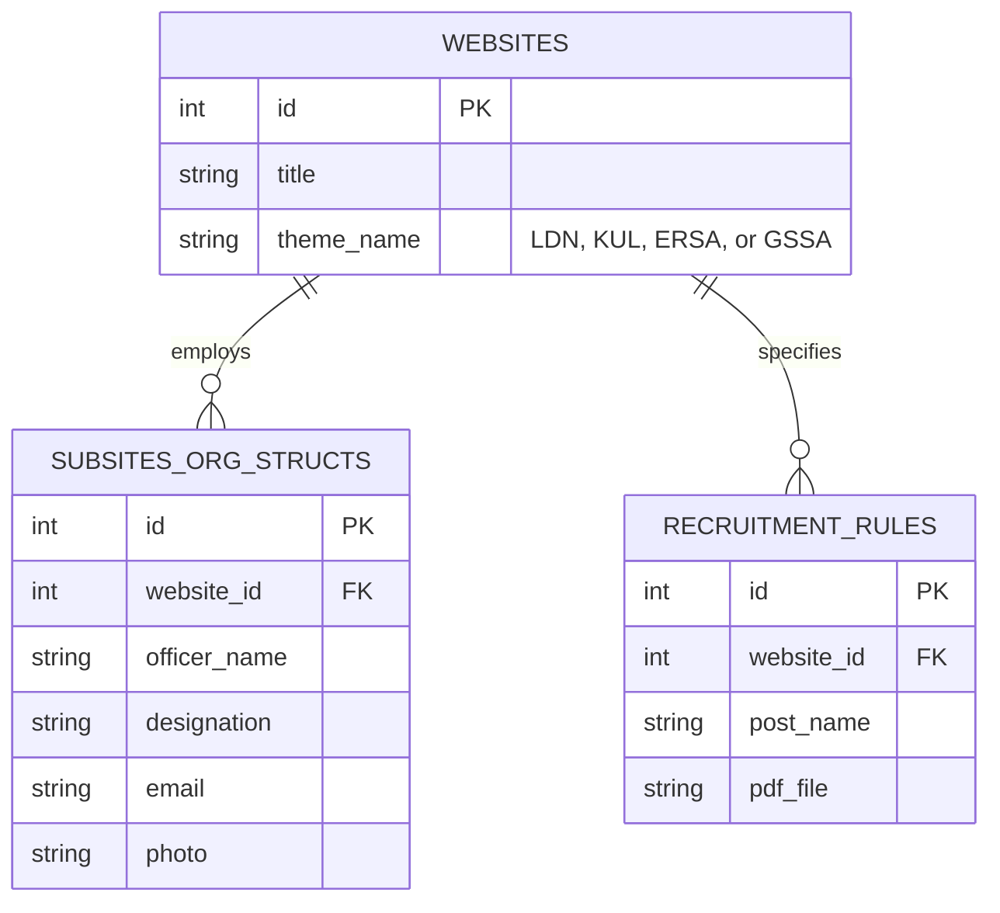
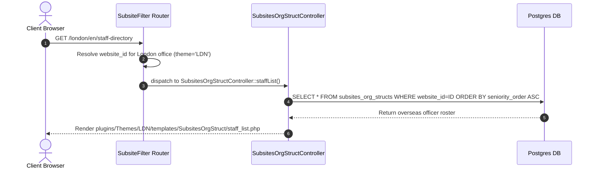

# Overseas & Specialized Audit Portals Architecture Specification (LDN, KUL, ERSA, GSSA Themes)

## 1. Overview & Operational Scope

The Comptroller and Auditor General (CAG) maintains international presence and specialized regional audit offices powered by dedicated lightweight theme engines:
1. **LDN Theme (`plugins/Themes/LDN/`)**: Powers the **India Audit Office in London** (High Commission of India, Aldwych, London).
2. **KUL Theme (`plugins/Themes/KUL/`)**: Powers the **India Audit Office in Kuala Lumpur** (Southeast Asia Regional Audit Headquarters).
3. **ERSA Theme (`plugins/Themes/ERSA/`)**: Powers specialized Regional Audit Offices with integrated **Recruitment Rules** and staff deployment modules.
4. **GSSA Theme (`plugins/Themes/GSSA/`)**: Powers General Social & State Services Audit Office portals.

### Theme Feature Matrix

| Feature / Capability | LDN Theme | KUL Theme | ERSA Theme | GSSA Theme |
| :--- | :--- | :--- | :--- | :--- |
| **Audit Report Slider** | Disabled | Disabled | Enabled (14 folders) | Enabled (15 folders) |
| **Google Maps Integration** | Embedded (London WC2B 4NA) | Embedded (Kuala Lumpur) | Standard | Standard |
| **Staff Org Hierarchy** | `SubsitesOrgStruct/` Module | `SubsitesOrgStruct/` Module | Standard CMS | Standard CMS |
| **Recruitment Rules** | None | None | Dedicated `RecruitmentRules/` | Standard CMS |
| **Folder Count** | 11 Folders | 11 Folders | 14 Folders | 15 Folders |

```
                                  +---------------------------------------+
                                  |         HTTP Request (Overseas)       |
                                  +---------------------------------------+
                                                      |
                                                      v
                                  +---------------------------------------+
                                  |         SubsiteFilter Router          |
                                  |   Matches /london or /kuala-lumpur    |
                                  +---------------------------------------+
                                                      |
                                  +-------------------+-------------------+
                                  |                                       |
                                  v                                       v
                    +---------------------------+           +---------------------------+
                    |   LDN / KUL Portals       |           |   ERSA / GSSA Portals     |
                    |   Minimal Static Theme    |           |   Full Functional Theme   |
                    |   Google Maps + Staff Tree|           |   Reports, Tenders, Rules |
                    +---------------------------+           +---------------------------+
```

---

## 2. Overseas Theme Directory Architecture

### 2.1 LDN / KUL Layout Structure (11 Folders)

```
plugins/Themes/LDN/templates/
├── Element/              # Lightweight Headers & Footer Links
├── Faqs/                 # Diplomatic & Foreign Mission Audit FAQs
├── Home/                 # High Commission Contact Box + Google Maps Embed
├── ImportantLinks/       # MEA & International Audit Links
├── Layout/               # Minimal Layout Shell
├── Pages/                # Static CMS Information Pages
├── PhotoGallery/         # Embassy Event Galleries
├── Sitemap/              # XML & HTML Sitemaps
├── SubsiteWhatsNew/      # Foreign Mission Announcements
├── SubsitesOrgStruct/    # Diplomatic Staff List & Hierarchy Tree
└── VideoGallery/         # International Audit Videos
```

### 2.2 ERSA Layout Structure (14 Folders - Includes RecruitmentRules)

```
plugins/Themes/ERSA/templates/
├── AuditReport/          # Regional Audit Reports
├── Element/              # Header & Navigation Widgets
├── Home/                 # Regional Homepage Slider
├── ImportantLinks/       # Resource Links
├── Layout/               # Default Theme Shell
├── NewsLetter/           # Regional Bulletins
├── Pages/                # Dynamic CMS Pages
├── PhotoGallery/         # Photo Gallery
├── PressRelease/         # Press Releases
├── RecruitmentRules/     # Cadre Recruitment Rules & Qualifications
├── Sitemap/              # Site Navigation Map
├── Tenders/              # Regional Procurement
├── TourProgramme/        # Officer Tour Schedules
└── VideoGallery/         # Media Gallery
```

---

## 3. Complete Overseas Site Menu Tree

### 3.1 London & Kuala Lumpur Overseas Portals

```
India Audit Office, London / Kuala Lumpur (Home)
├── About Us
│   ├── The Office
│   │   ├── Profile of Director General of Audit (London / Kuala Lumpur)
│   │   └── Role in Auditing Indian Foreign Missions & Embassies
│   ├── Mandate & Statutory Authority
│   │   └── Jurisdiction over Indian Embassies across Europe, UK, SE Asia
│   ├── Diplomatic Staff Directory (SubsitesOrgStruct)
│   │   ├── Officer Roster & Designations (staff_list.php)
│   │   └── Detailed Profile View (view.php)
│   └── Right to Information (RTI) Framework
├── Audit Scope & Operations
│   ├── Foreign Mission Expenditure Audit
│   ├── Defense Attaché & Diplomatic Accounts Audit
│   └── Public Sector Undertakings (PSU) Overseas Branches Audit
├── Frequently Asked Questions (Faqs)
│   └── Mission Audit Guidelines & FAQs
└── Contact Us
    ├── Physical Location: High Commission of India, Aldwych, London WC2B 4NA
    ├── Contact Numbers & Direct Lines: +44 20 7632 3053/54
    ├── Official Email: audit.london@mea.gov.in
    └── Interactive Google Maps Navigation
```

---

## 4. Core Controller Implementation & Logic

### 4.1 Diplomatic Staff Organizational Hierarchy (`src/Controller/SubsitesOrgStructController.php`)

For overseas offices, staff profiles and hierarchies are rendered dynamically via `SubsitesOrgStructController`:

```php
namespace App\Controller;

use App\Controller\AppController;

class SubsitesOrgStructController extends AppController 
{
    public function index() 
    {
        $website_id = $this->request->getAttribute('current_website')->id;
        
        $orgStruct = $this->SubsitesOrgStructs->find('all')
            ->where([
                'SubsitesOrgStructs.website_id' => $website_id,
                'SubsitesOrgStructs.status' => 1
            ])
            ->order(['SubsitesOrgStructs.display_order' => 'ASC'])
            ->toArray();

        $this->set(compact('orgStruct'));
    }

    public function staffList() 
    {
        $website_id = $this->request->getAttribute('current_website')->id;
        
        $staffMembers = $this->SubsitesOrgStructs->find('all')
            ->where([
                'SubsitesOrgStructs.website_id' => $website_id,
                'SubsitesOrgStructs.status' => 1
            ])
            ->contain(['Designations'])
            ->order(['SubsitesOrgStructs.seniority_order' => 'ASC'])
            ->paginate();

        $this->set(compact('staffMembers'));
    }
}
```

---

## 5. Frontend DOM Markup & Layout Templates

### 5.1 Overseas Homepage Layout (`plugins/Themes/LDN/templates/Home/index.php`)

```html
<section class="company-address" id="content">
    <div class="container">
        <div class="row">
            <div class="address">
                <p><span><?= __('Office hours'); ?> &nbsp;-</span>09:00 <?= __('AM'); ?>- 5:30 <?= __('PM'); ?> (<?= __('Monday-Friday'); ?>)</p>
                <p><span><?= __('Office'); ?> &nbsp;-</span><?= __('India Audit Office'); ?></p>
                <p><span><?= __('Address'); ?> &nbsp;-</span><?= __('High Commission of India'); ?>, <?= __('Aldwych, London'); ?> <?= __('WC2B 4NA'); ?></p>
                <div class="wc2b">
                    <strong><?= __('Ph.'); ?>-</strong> <a href="tel:+442076323053">+44 20 7632 3053/54</a>
                </div>
                <div class="wc2b">
                    <strong><?= __('Email'); ?>-</strong> <a href="mailto:audit.london@mea.gov.in">audit[dot]london[at]mea[dot]gov[dot]in</a>
                </div>
            </div>
        </div>
    </div>
</section>

<div class="gmap">
    <div class="mapouter">
        <div class="gmap_canvas">
            <iframe class="gmap_iframe" width="100%" height="400px" frameborder="0" scrolling="no" 
                src="https://maps.google.com/maps?width=700&amp;height=400&amp;hl=en&amp;q=india house Aldwych, London WC2B4NA london&amp;t=&amp;z=14&amp;ie=UTF8&amp;iwloc=B&amp;output=embed">
            </iframe>
        </div>
    </div>
</div>
```

---

## 6. Database Schemas (PostgreSQL)

```sql
-- Subsites Organizational Structure Table (Overseas Staff Directory)
CREATE TABLE subsites_org_structs (
    id SERIAL PRIMARY KEY,
    website_id INT NOT NULL,
    officer_name VARCHAR(255) NOT NULL,
    designation VARCHAR(255) NOT NULL,
    email VARCHAR(255) DEFAULT NULL,
    phone VARCHAR(100) DEFAULT NULL,
    photo VARCHAR(255) DEFAULT NULL,
    bio TEXT DEFAULT NULL,
    display_order INT DEFAULT 0,
    seniority_order INT DEFAULT 0,
    status SMALLINT NOT NULL DEFAULT 1,
    created_at TIMESTAMP WITHOUT TIME ZONE DEFAULT CURRENT_TIMESTAMP,
    CONSTRAINT fk_subsites_org_struct_website FOREIGN KEY (website_id) REFERENCES websites(id) ON DELETE CASCADE
);

-- Recruitment Rules Table (ERSA Theme)
CREATE TABLE recruitment_rules (
    id SERIAL PRIMARY KEY,
    website_id INT NOT NULL,
    post_name VARCHAR(255) NOT NULL,
    qualification TEXT NOT NULL,
    pdf_file VARCHAR(255) NOT NULL,
    status SMALLINT NOT NULL DEFAULT 1,
    created_at TIMESTAMP WITHOUT TIME ZONE DEFAULT CURRENT_TIMESTAMP,
    CONSTRAINT fk_recruitment_rules_website FOREIGN KEY (website_id) REFERENCES websites(id) ON DELETE CASCADE
);
```

---

## 7. Entity Relationship Diagram (Mermaid)



---

## 8. Sequence Diagram: Overseas Location & Staff Load



---

## 9. Developer Checklist for Overseas & Specialized Portals

- [ ] **Theme Choice**: Select `theme_name = 'LDN'` or `'KUL'` for minimal static diplomatic contact pages.
- [ ] **Email Obfuscation**: Wrap email addresses in anti-spam notation (`audit[dot]london[at]mea[dot]gov[dot]in`) inside `Home/index.php`.
- [ ] **Google Map Embed**: Verify iframe Embed URL coordinates in `plugins/Themes/LDN/templates/Home/index.php`.
- [ ] **Recruitment Rules PDF Path**: For ERSA theme, verify file storage path in `WWW_ROOT.'uploads/recruitment_rules/'`.
