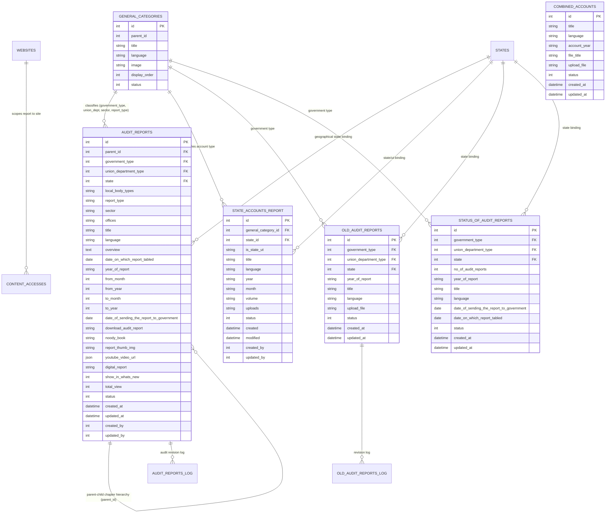
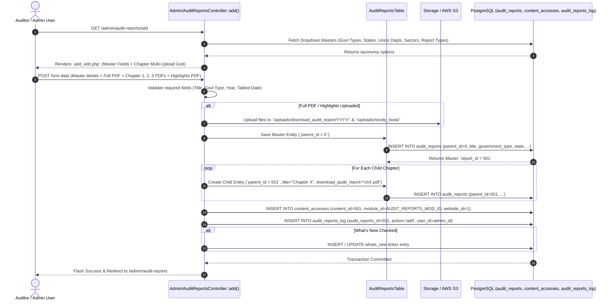
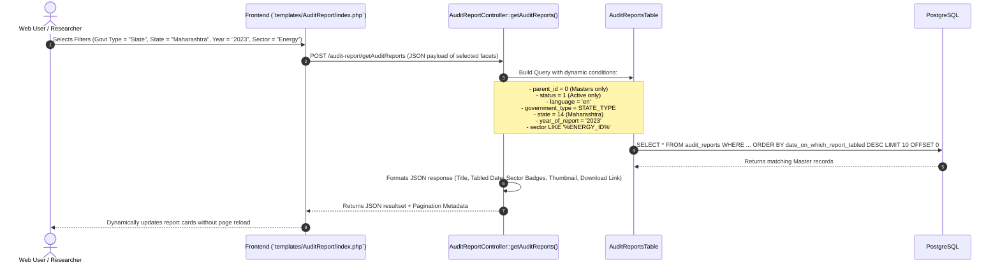
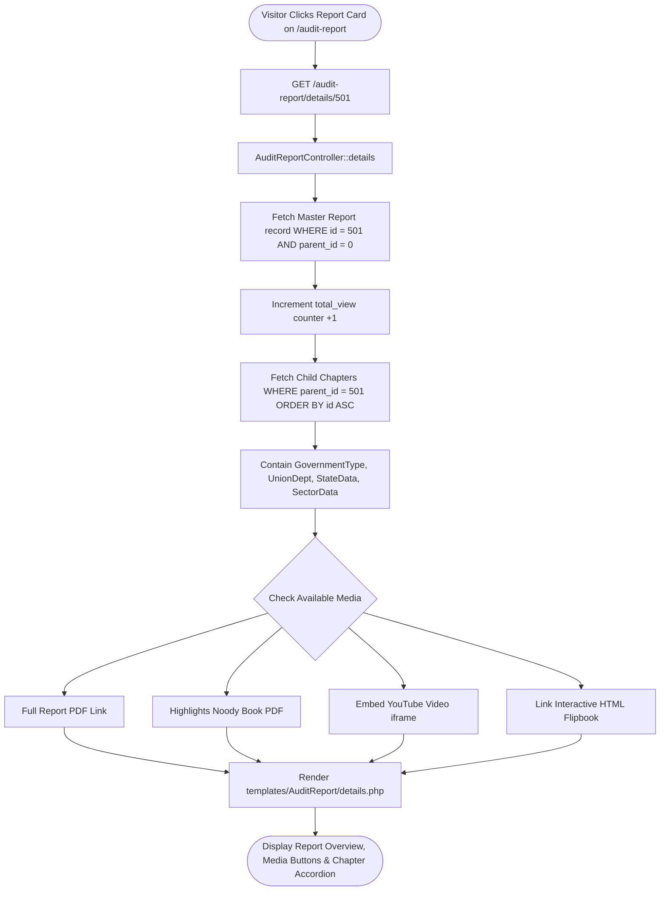

# Reports and Accounts Module: Complete Architecture, Technical Workflow & DB Specification

This document provides an exhaustive, end-to-end technical reference for the **Reports and Accounts** module and all its associated sub-modules within the Comptroller and Auditor General of India (CAG) portal. It details the Admin Panel management, CakePHP 5 backend logic, database tables and schemas, multi-tier query filters, file storage lifecycles, and public frontend reflection pipelines.

---

## 1. Executive Summary & Architectural Overview

The **Reports and Accounts** ecosystem is the primary public accountability engine of the CAG portal. It houses thousands of constitutional audit reports tabled in the Parliament of India and State Legislatures, statutory state accounts (Finance Accounts, Appropriation Accounts, Accounts at a Glance), legacy digitized archives, and legislative tabling tracking.

- **Backend Framework:** CakePHP 5 (MVC / ORM Architecture) running on PHP 8+.
- **Database Engine:** PostgreSQL with relational integrity, JSON columns, CSV-serialized multi-select attributes, and indexing.
- **Tenancy & Scoping:** Scoped across the National Main Portal (`website_id = 1`) and regional state/department subsites via the `content_accesses` matrix and state/department ID matching.
- **Multi-File Hierarchy:** Master-child record modeling where a parent report entity links to chapter-wise and volume-wise child PDF entities.
- **Dynamic Frontend Filtering:** Multi-dimensional AJAX facet filters (Government Type, State/UT, Union Ministry/Department, Sector, Audit Type, Year, Keyword, and Tabled Date).

```
+---------------------------------------------------------------------------------------------------+
|                                      CAG ADMIN CONTROL PANEL                                      |
+---------------------------------------------------------------------------------------------------+
|                                   REPORTS AND ACCOUNTS SUB-MODULES                                |
|                                                                                                   |
|  [1. Union & State Audit Reports]   [2. State Accounts Reports]     [3. Combined Accounts]        |
|  - Financial / Performance / Compl. - Finance Accounts (Vol I/II)   - Consolidated Union & States |
|  - Chapter-wise PDFs & Full Report  - Appropriation Accounts        - Account Years               |
|  - Overview / Video / Highlights    - Accounts at a Glance          - Multi-language Metadata     |
|                                                                                                   |
|  [4. Old Digitized Reports Archive] [5. Status of Audit Reports]    [6. AG Other Reports]         |
|  - Pre-2000s Historical Reports     - Tabling in Parliament / State - Technical Guidance (TGS)    |
|  - Searchable Digitized Catalog     - Sending to President/Governor - Specialized AG Publications |
|                                                                                                   |
|  [7. Performance Activity Reports]  [8. Treasury Inspection Reports][9. Monthly Civil Accounts]   |
|  - Annual IA&AD Department Reports  - Outstanding Treasury Findings - Monthly Key Indicators      |
+---------------------------------------------------------------------------------------------------+
                                                  │
                                      CakePHP ORM & Base Table
                                                  │
                                                  ▼
+---------------------------------------------------------------------------------------------------+
|                                       POSTGRESQL DATABASE                                         |
|  [audit_reports] [audit_reports_log] [state_accounts_report] [combined_accounts]                  |
|  [old_audit_reports] [old_audit_reports_log] [status_of_audit_reports] [ag_other_reports]          |
|  [performance_activity_report] [outstanding_treasury_inspection_report] [ae_state_accounts]        |
|  [general_categories] [states] [content_accesses] [websites]                                      |
+---------------------------------------------------------------------------------------------------+
                                                  │
                                                  ▼
+---------------------------------------------------------------------------------------------------+
|                                         PUBLIC FRONTEND                                           |
|  - Reports & Accounts Mega Menu Navigation (`templates/element/menus_html_render.php`)             |
|  - Dynamic Faceted Search & Filters (`templates/element/audit_reports_filters.php`, AJAX Engine)  |
|  - Interactive Report Reader & Chapter Navigator (`templates/AuditReport/details.php`)            |
|  - State Accounts Portal (`templates/StateAccountsReport/index.php`)                              |
|  - Digitized Archive Search (`templates/OldAuditReports/index.php`)                               |
|  - Status Tracker Matrix (`templates/StatusOfAuditReports/index.php`)                             |
+---------------------------------------------------------------------------------------------------+
```

---

## 2. Deep Breakdown of Sub-Modules

### 2.1 Sub-Module 1: Union & State Audit Reports
- **Admin Controller:** `src/Controller/Admin/AuditReportsController.php`
- **Public Controller:** `src/Controller/AuditReportController.php`
- **Tables:** `audit_reports`, `audit_reports_log`, `general_categories`, `states`, `content_accesses`
- **Functional Hierarchy:**
  - **Master Report Entity (`parent_id = 0`):** Contains master metadata (Title, Government Type, State, Union Ministry, Sector, Tabled Date, Year, Full Report PDF, Overview/Executive Summary, Highlights / Noody Book PDF, Press Release, YouTube video URL, Digital HTML interactive report).
  - **Child Report Entities (`parent_id = master_id`):** Contains chapter-wise and volume-wise PDF slices (e.g., Chapter 1: Introduction, Chapter 2: Financial Performance, Appendices).
- **Taxonomy Bindings (`general_categories`):**
  - **Government Type:** Union (`G_C_GOVERNMENT_TYPE` $\rightarrow$ Union Govt, State Govt, Local Bodies).
  - **Union Department Types:** Civil, Commercial / PSUs, Defence, Railways, Direct Taxes, Indirect Taxes, Scientific Departments, Communications & IT.
  - **Local Body Types:** Panchayati Raj Institutions (PRIs), Urban Local Bodies (ULBs).
  - **Report Types:** Performance Audit, Financial Audit, Compliance Audit, Thematic Audit.
  - **Sectors:** Energy, Transport, Agriculture, Environment, Health, Education, Finance.
- **Admin Capabilities:**
  - Full Report upload (`/uploads/download_audit_report/`) with automatic year-wise subfolder routing.
  - Highlights / Noody Book upload (`/uploads/noody_book/`).
  - Chapter-wise sub-file multi-upload table with sorting and custom titles.
  - What's New integration toggle (`show_in_whats_new`).
  - Revision history logging (`audit_reports_log`).
- **Frontend Views:**
  - Main Filterable Directory: `templates/AuditReport/index.php`
  - Report Detail & Chapter Viewer: `templates/AuditReport/details.php`
  - AJAX Filter Endpoint: `AuditReportController::getAuditReports()`, `getMostViewRecent()`

---

### 2.2 Sub-Module 2: State Accounts Reports
- **Admin Controller:** `src/Controller/Admin/StateAccountsReportController.php`
- **Public Controller:** `src/Controller/StateAccountsReportController.php`
- **Tables:** `state_accounts_report`, `states`, `general_categories`, `content_accesses`
- **Core Publications Managed:**
  1. **Finance Accounts (Volume I & Volume II):** Complete financial statements of state revenue, receipts, capital expenditure, and debt position.
  2. **Appropriation Accounts:** Comparison of actual expenditure against amounts voted by State Legislature.
  3. **Accounts at a Glance:** Reader-friendly summary with visual infographics.
  4. **Monthly Key Indicators:** Monthly state financial indicators.
- **Categorization Dimensions:**
  - State vs Union Territory toggle (`is_state_ut = 's' | 'u'`).
  - Target State / UT selection.
  - Publication Category (`general_category_id`).
  - Financial Year (`year`) and Month (`month`).
  - Volume Number (`volume = 1 | 2`).
- **Frontend View:** `templates/StateAccountsReport/index.php` with state switching, category tabs, and PDF preview/download buttons.

---

### 2.3 Sub-Module 3: Combined Finance & Revenue Accounts
- **Admin Controller:** `src/Controller/Admin/CombinedAccountsController.php`
- **Public Controller:** `src/Controller/CombinedAccountsController.php`
- **Tables:** `combined_accounts`, `content_accesses`
- **Purpose:** Compiles consolidated accounts showing the combined financial transactions of the Central Government and all State Governments across India for each fiscal year.
- **Admin Capabilities:** Title, Account Year (`account_year`), PDF document upload (`/uploads/combined_accounts/`), multi-language metadata, publish status.
- **Frontend View:** `templates/CombinedAccounts/index.php`.

---

### 2.4 Sub-Module 4: Historical / Old Audit Reports Archive
- **Admin Controller:** `src/Controller/Admin/OldAuditReportsController.php`
- **Public Controller:** `src/Controller/OldAuditReportsController.php`
- **Tables:** `old_audit_reports`, `old_audit_reports_log`
- **Purpose:** Catalogs historical audit reports published before the modernization of the digital repository (covering pre-1990s through 2010s).
- **Admin Capabilities:** Title, Government Type, State, Union Ministry, Report Year, digitized PDF upload (`/uploads/old_audit_report/`), log history tracking.
- **Frontend View:** `templates/OldAuditReports/index.php` with multi-category search and PDF preview.

---

### 2.5 Sub-Module 5: Status of Audit Reports (Tabling Tracker)
- **Admin Controller:** `src/Controller/Admin/StatusOfAuditReportsController.php`
- **Public Controller:** `src/Controller/StatusOfAuditReportsController.php`
- **Tables:** `status_of_audit_reports`, `general_categories`, `states`
- **Purpose:** Provides constitutional tracking of audit reports throughout their legislative lifecycle:
  - **Date of Transmission to Executive:** `date_of_sending_the_report_to_government` (Sent to President of India or State Governor).
  - **Date of Tabling in Legislature:** `date_on_which_report_tabled` (Laid on the table of Lok Sabha / Rajya Sabha or State Vidhan Sabha).
  - **Total Report Count:** `no_of_audit_reports`.
- **Frontend View:** `templates/StatusOfAuditReports/index.php`.

---

### 2.6 Sub-Module 6: AG Other Reports & Technical Guidance
- **Admin Controller:** `src/Controller/Admin/AgOtherReportsController.php`
- **Public Controller:** `src/Controller/AgOtherReportsController.php`
- **Tables:** `ag_other_reports`, `general_categories`, `content_accesses`
- **Purpose:** Houses specialized reports produced by state Accountants General, including Technical Guidance and Supervision (TGS) reports for Panchayats and Urban Local Bodies.
- **Admin Capabilities:** Title, Year, Category binding, PDF upload (`/uploads/ag_other_reports/`).
- **Frontend View:** `templates/AgOtherReports/index.php`.

---

### 2.7 Sub-Module 7: Performance and Activity Reports
- **Admin Controller:** `src/Controller/Admin/PerformanceActivityReportController.php`
- **Public Controller:** `src/Controller/PerformanceActivityReportController.php`
- **Tables:** `performance_activity_report`, `content_accesses`
- **Purpose:** Discloses the annual administrative and performance report of the Indian Audit and Accounts Department (IA&AD).
- **Frontend View:** `templates/PerformanceActivityReport/index.php`.

---

### 2.8 Sub-Module 8: Outstanding Treasury Inspection Reports
- **Admin Controller:** `src/Controller/Admin/OutstandingTreasuryInspectionReportController.php`
- **Public Controller:** `src/Controller/OutstandingTreasuryInspectionReportController.php`
- **Tables:** `outstanding_treasury_inspection_report`
- **Purpose:** Publishes consolidated observations and inspection findings across District Treasuries and Sub-Treasuries.
- **Frontend View:** `templates/OutstandingTreasuryInspectionReport/index.php`.

---

## 3. Database Schema & Entity Relationships

### 3.1 Entity Relationship Diagram (ERD)



---

### 3.2 In-Depth Database Table Dictionary & Field Specifications

#### 1. `audit_reports` Table
Stores both master audit reports and child chapter/volume slices.

| Column | Type | Nullable | Key / Constraint | Description / Business Purpose |
| :--- | :--- | :--- | :--- | :--- |
| `id` | `INTEGER` (SERIAL) | No | **PK** | Primary unique identifier for the audit report record. |
| `parent_id` | `INTEGER` | Yes | **FK -> audit_reports(id)** | `0` for Master Report record; points to Master ID for child chapters/volumes. |
| `government_type` | `INTEGER` | Yes | **FK -> general_categories(id)** | Union (`1`), State (`2`), or Local Bodies (`3`). |
| `union_department_type` | `INTEGER` | Yes | **FK -> general_categories(id)** | Ministry/Dept: Civil, Defence, Railways, Commercial, Indirect Taxes, etc. |
| `state` | `INTEGER` | Yes | **FK -> states(id)** | State ID if Government Type is State or Local Bodies. |
| `local_body_types` | `VARCHAR(255)` / `CSV` | Yes | - | Comma-separated category IDs for Panchayati Raj / Urban Local Bodies. |
| `report_type` | `VARCHAR(255)` / `CSV` | Yes | - | Comma-separated IDs: Performance Audit, Compliance, Financial, etc. |
| `sector` | `VARCHAR(255)` / `CSV` | Yes | - | Comma-separated sector IDs (Energy, Transport, Health, etc.). |
| `title` | `VARCHAR(65535)` | No | - | Report title tabled in Parliament / Legislature. |
| `language` | `VARCHAR(5)` | No | Default `'en'` | Language code (`en` or `hi`). |
| `overview` | `TEXT` | Yes | - | Executive Summary / Key Findings formatted HTML. |
| `date_on_which_report_tabled` | `DATE` | Yes | - | Date when the report was tabled in Parliament or State Legislature. |
| `year_of_report` | `VARCHAR(50)` | Yes | - | Reporting year string (e.g., `2023-24` or `2024`). |
| `from_month` / `from_year` | `INTEGER` | Yes | - | Period of audit commencement. |
| `to_month` / `to_year` | `INTEGER` | Yes | - | Period of audit conclusion. |
| `date_of_sending_the_report_to_government` | `DATE` | Yes | - | Date report was submitted to President / Governor. |
| `download_audit_report` | `VARCHAR(255)` | Yes | - | Full report PDF filename in `/uploads/download_audit_report/YYYY/`. |
| `noody_book` | `VARCHAR(255)` | Yes | - | Key Highlights / Brochure PDF in `/uploads/noody_book/`. |
| `report_thumb_img` | `VARCHAR(255)` | Yes | - | Report cover page thumbnail image. |
| `youtube_video_url` | `JSON` | Yes | - | JSON array of YouTube video explainer links. |
| `digital_report` | `VARCHAR(255)` | Yes | - | URL / Path to interactive digital HTML flipbook report. |
| `show_in_whats_new` | `SMALLINT` | No | Default `0` | Homepage What's New syndication toggle (`1` = Active). |
| `total_view` | `INTEGER` | No | Default `0` | Popularity counter incremented on view/download. |
| `status` | `SMALLINT` | No | Default `1` | Publish status (`1` = Published, `0` = Draft). |
| `created_by` / `updated_by` | `INTEGER` | Yes | **FK -> users(id)** | Admin audit tracking. |
| `created_at` / `updated_at` | `TIMESTAMP` | Yes | - | Timestamps. |

---

#### 2. `state_accounts_report` Table
Stores annual and periodic state financial accounts.

| Column | Type | Nullable | Key / Constraint | Description / Business Purpose |
| :--- | :--- | :--- | :--- | :--- |
| `id` | `INTEGER` (SERIAL) | No | **PK** | Primary key. |
| `general_category_id` | `INTEGER` | No | **FK -> general_categories(id)** | Account Category (Finance Accounts, Appropriation Accounts, Accounts at a Glance). |
| `state_id` | `INTEGER` | No | **FK -> states(id)** | Applicable State or Union Territory. |
| `is_state_ut` | `VARCHAR(2)` | No | Default `'s'` | `'s'` = State, `'u'` = Union Territory. |
| `title` | `VARCHAR(500)` | No | - | Publication title. |
| `language` | `VARCHAR(5)` | No | - | Language locale (`en`, `hi`). |
| `year` | `VARCHAR(50)` | No | - | Financial year (e.g. `2022-2023`). |
| `month` | `VARCHAR(50)` | Yes | - | Month for monthly indicators. |
| `volume` | `VARCHAR(50)` | Yes | - | Volume identifier (`Volume I`, `Volume II`). |
| `uploads` | `VARCHAR(255)` | No | - | Uploaded PDF document in `/uploads/state_accounts_report/`. |
| `status` | `SMALLINT` | No | Default `1` | Visibility toggle. |
| `created` / `modified` | `TIMESTAMP` | Yes | - | Timestamps. |

---

#### 3. `combined_accounts` Table
| Column | Type | Nullable | Key / Constraint | Description / Business Purpose |
| :--- | :--- | :--- | :--- | :--- |
| `id` | `INTEGER` (SERIAL) | No | **PK** | Primary key. |
| `title` | `VARCHAR(500)` | No | - | Report title. |
| `language` | `VARCHAR(5)` | No | - | Language code (`en`, `hi`). |
| `account_year` | `VARCHAR(50)` | No | - | Accounting period year string. |
| `file_title` | `VARCHAR(255)` | Yes | - | Display label for the PDF attachment. |
| `upload_file` | `VARCHAR(255)` | No | - | PDF document in `/uploads/combined_accounts/`. |
| `status` | `SMALLINT` | No | Default `1` | Publish status. |

---

#### 4. `old_audit_reports` Table
| Column | Type | Nullable | Key / Constraint | Description / Business Purpose |
| :--- | :--- | :--- | :--- | :--- |
| `id` | `INTEGER` (SERIAL) | No | **PK** | Primary key. |
| `government_type` | `INTEGER` | No | **FK -> general_categories(id)** | Government jurisdiction. |
| `union_department_type`| `INTEGER` | Yes | **FK -> general_categories(id)** | Union ministry (if applicable). |
| `state` | `INTEGER` | Yes | **FK -> states(id)** | State code (if applicable). |
| `year_of_report` | `VARCHAR(50)` | No | - | Historic report year. |
| `title` | `VARCHAR(65535)`| No | - | Digitized report title. |
| `language` | `VARCHAR(5)` | No | - | Language code. |
| `upload_file` | `VARCHAR(255)` | No | - | Digitized PDF archive in `/uploads/old_audit_report/`. |
| `status` | `SMALLINT` | No | Default `1` | Publish status. |

---

#### 5. `status_of_audit_reports` Table
| Column | Type | Nullable | Key / Constraint | Description / Business Purpose |
| :--- | :--- | :--- | :--- | :--- |
| `id` | `INTEGER` (SERIAL) | No | **PK** | Primary key. |
| `government_type` | `INTEGER` | No | **FK -> general_categories(id)** | Jurisdiction. |
| `union_department_type`| `INTEGER` | Yes | **FK -> general_categories(id)** | Ministry / Department. |
| `state` | `INTEGER` | Yes | **FK -> states(id)** | State ID. |
| `no_of_audit_reports` | `INTEGER` | No | Default `1` | Number of reports transmitted/tabled. |
| `year_of_report` | `VARCHAR(50)` | No | - | Year of reporting. |
| `title` | `VARCHAR(500)` | No | - | Report title. |
| `language` | `VARCHAR(5)` | No | - | Language code. |
| `date_of_sending_the_report_to_government` | `DATE` | Yes | - | Submission date to President/Governor. |
| `date_on_which_report_tabled` | `DATE` | Yes | - | Tabling date in Parliament/Legislature. |
| `status` | `SMALLINT` | No | Default `1` | Status. |

---

## 4. End-to-End Workflows & Data Pipelines

### 4.1 Workflow A: Admin Publishing of an Audit Report (Master + Chapters)



---

### 4.2 Workflow B: Frontend Dynamic Faceted Filtering Pipeline



---

### 4.3 Workflow C: Public Chapter Navigation & Report Inspection



---

## 5. Where & How Reports and Accounts Reflect in the Frontend

| Sub-Module / Page | Frontend Route & URL | View Template Location | Frontend UI & Feature Presentation |
| :--- | :--- | :--- | :--- |
| **Audit Reports Hub (All Reports)** | `/{lang}/audit-reports` | `templates/AuditReport/index.php` | Dynamic faceted filter sidebar (Union/State/Local, Year, Sector, Ministry), sorting, keyword search. |
| **Union Audit Reports** | `/{lang}/audit-reports?govt=union` | `templates/AuditReport/index.php` | Filtered list of Union Government reports tabled in Parliament. |
| **State Audit Reports** | `/{lang}/audit-reports?govt=state&state={id}` | `templates/AuditReport/index.php` | State Legislature tabled reports scoped by state. |
| **Report Details & Chapters** | `/{lang}/audit-report/details/{id}` | `templates/AuditReport/details.php` | Master overview, Executive summary, chapter-by-chapter PDF downloads, YouTube video, flipbook. |
| **State Accounts Hub** | `/{lang}/state-accounts-report` | `templates/StateAccountsReport/index.php` | Finance Accounts (Vol I & II), Appropriation Accounts, Accounts at a Glance tabs. |
| **Monthly Key Indicators** | `/{lang}/state-accounts-report?type=monthly` | `templates/StateAccountsReport/index.php` | Monthly state civil accounts and fiscal indicators. |
| **Combined Finance Accounts** | `/{lang}/combined-accounts` | `templates/CombinedAccounts/index.php` | Year-by-year consolidated union & state accounts repository. |
| **Digitized Old Reports Archive** | `/{lang}/old-audit-reports` | `templates/OldAuditReports/index.php` | Historical repository covering pre-modernization digitized reports. |
| **Status of Audit Reports** | `/{lang}/status-of-audit-reports` | `templates/StatusOfAuditReports/index.php` | Tabling status matrix tracking transmission to Governor/President and Parliament laying. |
| **AG Other Reports** | `/{lang}/ag-other-reports` | `templates/AgOtherReports/index.php` | Technical guidance and supervision reports on local bodies. |
| **Performance Activity Report** | `/{lang}/performance-activity-report` | `templates/PerformanceActivityReport/index.php` | Annual performance report of IA&AD. |
| **Treasury Inspection Reports** | `/{lang}/outstanding-treasury-inspection-report` | `templates/OutstandingTreasuryInspectionReport/index.php` | Treasury inspection findings and compliance reports. |
| **Homepage Latest Reports Ticker** | `/{lang}/` (Homepage Section) | `templates/element/homeSectionOne.php` | Latest tabled reports cards carousel powered by `AuditReportsController::getMostViewRecent()`. |

---

## 6. Summary Checklist of Backend & Frontend Files

### Backend Admin Controllers:
- [`AuditReportsController.php`](file:///c:/Users/yokes/OneDrive/Desktop/new%20Analysis/CAG_Website_Test/src/Controller/Admin/AuditReportsController.php)
- [`StateAccountsReportController.php`](file:///c:/Users/yokes/OneDrive/Desktop/new%20Analysis/CAG_Website_Test/src/Controller/Admin/StateAccountsReportController.php)
- [`CombinedAccountsController.php`](file:///c:/Users/yokes/OneDrive/Desktop/new%20Analysis/CAG_Website_Test/src/Controller/Admin/CombinedAccountsController.php)
- [`OldAuditReportsController.php`](file:///c:/Users/yokes/OneDrive/Desktop/new%20Analysis/CAG_Website_Test/src/Controller/Admin/OldAuditReportsController.php)
- [`StatusOfAuditReportsController.php`](file:///c:/Users/yokes/OneDrive/Desktop/new%20Analysis/CAG_Website_Test/src/Controller/Admin/StatusOfAuditReportsController.php)
- [`AgOtherReportsController.php`](file:///c:/Users/yokes/OneDrive/Desktop/new%20Analysis/CAG_Website_Test/src/Controller/Admin/AgOtherReportsController.php)
- [`PerformanceActivityReportController.php`](file:///c:/Users/yokes/OneDrive/Desktop/new%20Analysis/CAG_Website_Test/src/Controller/Admin/PerformanceActivityReportController.php)
- [`OutstandingTreasuryInspectionReportController.php`](file:///c:/Users/yokes/OneDrive/Desktop/new%20Analysis/CAG_Website_Test/src/Controller/Admin/OutstandingTreasuryInspectionReportController.php)

### Public Frontend Controllers:
- [`AuditReportController.php`](file:///c:/Users/yokes/OneDrive/Desktop/new%20Analysis/CAG_Website_Test/src/Controller/AuditReportController.php)
- [`StateAccountsReportController.php`](file:///c:/Users/yokes/OneDrive/Desktop/new%20Analysis/CAG_Website_Test/src/Controller/StateAccountsReportController.php)
- [`CombinedAccountsController.php`](file:///c:/Users/yokes/OneDrive/Desktop/new%20Analysis/CAG_Website_Test/src/Controller/CombinedAccountsController.php)
- [`OldAuditReportsController.php`](file:///c:/Users/yokes/OneDrive/Desktop/new%20Analysis/CAG_Website_Test/src/Controller/OldAuditReportsController.php)
- [`StatusOfAuditReportsController.php`](file:///c:/Users/yokes/OneDrive/Desktop/new%20Analysis/CAG_Website_Test/src/Controller/StatusOfAuditReportsController.php)
- [`AgOtherReportsController.php`](file:///c:/Users/yokes/OneDrive/Desktop/new%20Analysis/CAG_Website_Test/src/Controller/AgOtherReportsController.php)
- [`PerformanceActivityReportController.php`](file:///c:/Users/yokes/OneDrive/Desktop/new%20Analysis/CAG_Website_Test/src/Controller/PerformanceActivityReportController.php)
- [`OutstandingTreasuryInspectionReportController.php`](file:///c:/Users/yokes/OneDrive/Desktop/new%20Analysis/CAG_Website_Test/src/Controller/OutstandingTreasuryInspectionReportController.php)

### Frontend Elements & Templates:
- Faceted Filters: [`audit_reports_filters.php`](file:///c:/Users/yokes/OneDrive/Desktop/new%20Analysis/CAG_Website_Test/templates/element/audit_reports_filters.php)
- Dynamic AJAX Results Renderer: [`ajaxAuditData.php`](file:///c:/Users/yokes/OneDrive/Desktop/new%20Analysis/CAG_Website_Test/templates/element/ajaxAuditData.php)
- Homepage Reports Showcase: [`homeSectionOne.php`](file:///c:/Users/yokes/OneDrive/Desktop/new%20Analysis/CAG_Website_Test/templates/element/homeSectionOne.php)
